# Off we go!
### Aka "Get Started" for dummies

The goal here is to see something interesting, as fast as possible.

This document should help anyone who's not familiar with programming, build, and such technologies.  
If that is not the case, please do let me know, log a bug or a request.

From this page, you will learn:
- how to install the required software
- how to build and run the whole stuff, _from the git repo_.  

In other documents, we will explain how to do a build, and run its result on another (production) machine, without having the production machine to deal with or care about the repo.

There will be a dedicated section, describing the way to _build and deploy_ the result to another machine, _**without**_ having to deal with the repository, which is obviously not required
at runtime.

> _**<big>Note</big>**_:
> - This document is written for RaspiOS, Debian, Ubuntu, and such Linux clones.  
> - The scripts in this repo are written for Bash Shell (`bash`).

# Install required software, clone the repo, build and run a first module.

> _**Note**_: If you are in a real hurry, and want things done like _**NOW**_, just run this from a terminal:
> ```
> wget https://github.com/OlivierLD/ROB/raw/master/start.from.scratch.sh
> chmod +x ./start.from.scratch.sh
> ./start.from.scratch.sh
> ```
> This will install the required missing soft, and run a build, and display a demo menu.  
> All you need to know about is reading english.  
> Start with Option `1` if you're new to this stuff.   
> Enjoy!  
> Do also check out the "[Things to try](#things-to-try)" section.

Otherwise...:

## As software, you will need:
- `git`
- `Java` (JDK 11 or 8)
  - The Java code is JDK 8 compatible, to fit early Raspberry Pis. 
  - `gradle` will also be needed for the build. It will be automatically installed if needed, you do _NOT_ need to worry about it.
- To access Serial Ports (GPS and/or NMEA data), `librxtx-java`
- `Python 3` (in some cases, to access external devices, like sensors, oled screens, etc.)

All the commands described below are to be run from a terminal (unless mentioned otherwise).

> _**Note**_: in the following instructions, make sure you respect the provided syntax.  
> When you see something like 
> ```
> ../../../gradlew shadowJar
> ```
> _**do enter**_ the command's leading `../../../` ! (Thanks to Captain K)  
> 
> Also, when you see a leading `$` in the commands below, this is the console's prompt. Do _**not**_ type it.  
> When it says `$ which git`, what you actually need to type is just `which git`.  
> Depending on your config (in `~/.bashrc`, `~/.bash-profile`, or so), this prompt may vary. It can also give you your current directory
> or other environment data.  
> Cheers!

## Install required software
- To know if `git` is available on your system:
```
$ which git
```
or 
```
$ git --version
```
- If missing, install git:
```
$ sudo apt-get install git-all
```

- To know if `Java` is available on your system:
```
$ which java
```
or
```
$ java -version
```
- If missing, install JDK 11:
```
$ sudo apt-get update 
$ sudo apt-get install openjdk-11-jdk
```
or, if the Raspberry Pi you target does not support JDK 11, install JDK 8
```
$ sudo apt-get update 
$ sudo apt-get install openjdk-8-jdk
```

To install `librxtx-java`:
```
$ sudo apt-get install librxtx-java
```

> _**Note**_: To install the software above, you will need an Internet connection.

## Clone the git repo
From a directory of your choice, like a directory created for your git repositories, named below `repos`, created under your home directory by the following command:
```
$ cd
$ mkdir repos
```
then 
```
$ cd ~/repos
$ git clone https://github.com/OlivierLD/ROB.git
```
This will clone the repo (branch `master`) into a directory named `ROB`.

> _**Note**_: Now your repository is cloned, at any time, to refresh it with its last modifications,
> from _any_ folder under the root (`ROB` in this case), just do a
> ```
> $ git pull
> ```

> _**Note**_: To clone the repo, or do a pull, you need an Internet connection.
 

## Build the `NMEA-multiplexer` module
This step will validate all the required nuts and bolts.  
It requires an Internet connection, as it will need to pull some dependencies from some `maven` repos.

If `gradle` is not on your machine yet, it will be downloaded (from the Internet) and installed (this happens only once).  
From your home directory, do a 
```
$ cd ~/repos/ROB
$ cd raspberry-sailor/NMEA-multiplexer
```
and then:
```
$ ../../gradlew shadowJar
```
> _**Note**_: When building on small board, do not hesitate to exclude some demanding tasks, like
> ```
> $ ../../gradlew shadowJar -x :astro-computer:AstroComputer:compileScala
> ```


This will compile all the required dependencies, and generate a jar (java-archive) named `./build/libs/NMEA-multiplexer-1.0-all.jar`.
It should finish with a 
```
. . .

BUILD SUCCESSFUL in 8s
13 actionable tasks: 1 executed, 12 up-to-date
$
```
If this is the case, try a
```
$ ./mux.sh mux-configs/nmea.mux.replay.big.log.yaml 
```
This would replay an archived log file, and spit out its content on the terminal.  
Stop it with a `[Ctrl C]`.

If you reached this step without error messages, you are in good shape!

You will notice a bunch of other scripts (`log.analyzer.sh`, `log.merge.sh`, `log.shrinker.sh`, `log.to.csv.sh`, 
`log.to.gpx.sh`, `log.to.json.sh`, `log.to.kml.sh`, `log.to.polars.sh`, `mk.link.sh`, ...). We'll come back to them later.

# Other modules
Other modules are based on the same kind of structure, they would be built the same way as above.

## `RESTNavServer`
This `RESTNavServer` module gather a bunch of examples of what can be done from the NMEA-multiplexer and related 
modules, from the smallest implementation showing how to log data when hiking or kayaking (but with a Web UI!), to a bigger
one, with admin features, celestial almanacs and tide tables publication, GRIB and faxes management, etc.

### Build it
From the repo's root:
```
$ cd ~/repos/ROB/raspberry-sailor/MUX-implementations/RESTNavServer
```
do a 
```
$ ../../../gradlew shadowJar -x :astro-computer:AstroComputer:compileScala

> Configure project :
>> From task compileJava (in rob), using java version 11 
>> From task compileTestJava (in rob), using java version 11 

> Configure project :astro-computer:AstroComputer
>> From task compileJava (in AstroComputer), using java version 11 
>> From task compileTestJava (in AstroComputer), using java version 11 

> Configure project :astro-computer:AstroUtilities
>> From task compileJava (in AstroUtilities), using java version 11 
>> From task compileTestJava (in AstroUtilities), using java version 11 

. . .

BUILD SUCCESSFUL in 8s
33 actionable tasks: 1 executed, 32 up-to-date
```
If no error message shows up, you can proceed to the next step.

### Run it
There are a lot of examples in this module. To facilitate the access to those examples, there is a demo script, `demoLauncher.sh`,
to be - like many others - started from a terminal. This script offers the possibility to start a browser
when appropriate. To use this feature, you obviously need to be in a Graphical Desktop Environment; you will then start
a the `demoLauncher.sh` from a terminal open in the desktop.

#### Get to it, fast
After doing the build as explained above, do a
```
$ cd launchers
```
and then, try the following command, to start the server (with a specific config), and open a browser:
```
$ ./demoLauncher.sh --option:1 --nohup:N --browser:Y
```
This will open the browser with a URL like <http://localhost:9999/web/webcomponents/console.gps.html?style=flat-gray&bg=black&border=y&boat-data=n>, with arbitrary position, 
but using the system current time.  

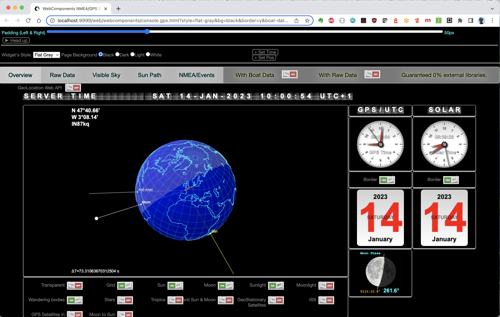

> _**Note**_: to kill the server, use the script `./killns.sh`

Now, try going to <http://localhost:9999/web/index.html>. You would see a page with a hamburger (&#9776;) at the top left, from which you can access to a menu.

| Menu collapsed | Menu opened |
|:----------------------------------:|:-----------------------------:|
|  |  |

To try:
- In the Weather Wizard section, try "2 - Operations" (this requires an Internet connection, for now)

  - As per the request definition (the drop-down list at the top left part, saying "North Atlantic, current analysis (fine, 2-day GRIB)"),
    this shows a GRIB and 4 faxes on the North Atlantic.
  - The orange display show the GRIB data at the position of the mouse on the chart,
    True Wind Speed and Direction, Air Temperature, Atmospheric Pressure, Precipitation Rate.
  - GRIB and faxes can be shown or hidden at will, by using checkboxes on the right pane.
- Various NMEA Consoles
  - This is a bunch of console examples, that can be displayed on several kinds of devices (laptop, tablets, cell-phone, smartwatches) 
- Tides / Select Tide Station
  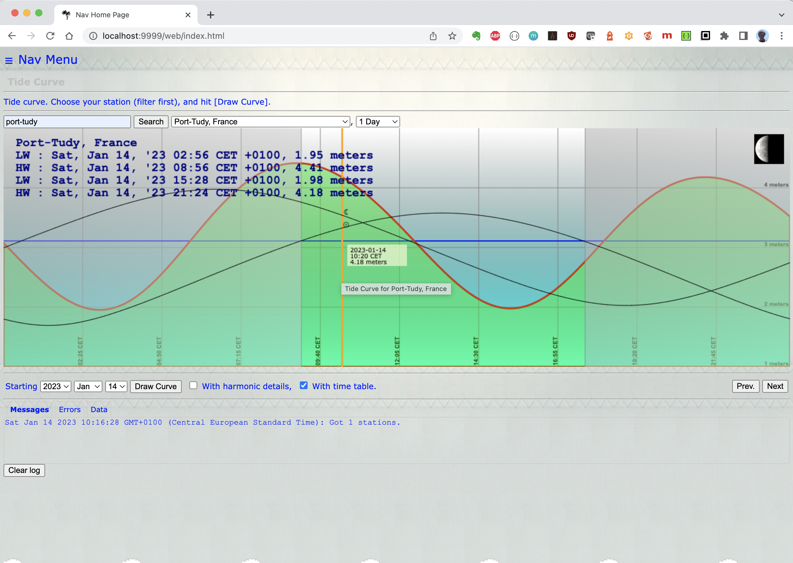
- Tides / Publish tide almanacs

#### Explore the menu
Just type 
```
$ ./demoLauncher.sh
```
... and see for yourself !

The same Web pages can be accessed from other devices on the same network (other laptops, tablets, cell-phones).
To facilitate the URL entry, go to "Nav Menu" (from `http://<your-ip>:9999/web/index.html`), and choose the `QR Codes` entry.  
Make sure you use the server's IP address or name (not "localhost"), and then you can flash
the generated QR Code from any other device.

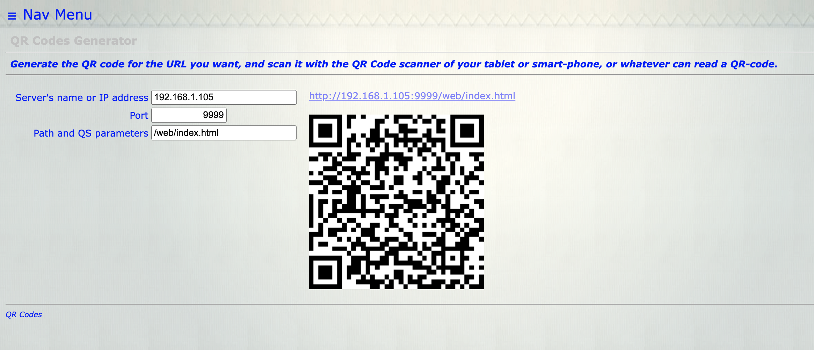

> _**Note**_: to kill the server, run the script `./killns.sh`, or
> use the `K` option in the `demoLauncher.sh`'s menu.

## Things to try

### Example 1 - A GPS, and an ANSI Console
You want the Multiplexer to read a GPS (USB socket), and see the data in an ANSI console,
running in a terminal. In addition, you want to see the same data in a Web page.

- **Step 1 - Find the GPS port name.**
  - Get your GPS ready, **_not plugged_** (yet) in its USB socket
  - Run the script `./raspberry-sailor/NMEA-multiplexer/find.port.sh`:  
    ```
    $ ./raspberry-sailor/NMEA-multiplexer/find.port.sh
     --- Serial port finder ---
     First, UNPLUG the serial device you want the port of from the Raspberry Pi USB port.
     Hit [return] when done.
    
     Now, PLUG IN the serial device you want the port of on one of the Raspberry Pi USB ports.
     Hit [return] when done.
    
     The new port should be listed below:
     66d65
     < /dev/ttyACM0
     Done!
    ```
    &#8680; Your port name is `/dev/ttyACM0` <!-- 8680 (decimal) is 0x21e8 -->  
    > Note: `librxtx` "might" have some issue with this port name...  
    > You may run `mk.link.sh` to map it to `/dev/ttyS80`:   
    > ```
    > ./raspberry-sailor/NMEA-multiplexer/mk.link.sh
    > ```
    > Then, `/dev/ttyS80` is a port you can use.
    > ```
    > $ ll /dev/ttyS*
    > 502 0 lrwxrwxrwx 1 root root    12 Feb  7 11:31 /dev/ttyS80 -> /dev/ttyACM0
    > $
    > ```
    > You can alternatively run the command
    > ```
    > sudo ln -s /dev/ttyACM0 /dev/ttyS80
    > ```
    > 
    > _**Note**_: if this symbolic link is required everytime, you might want to put it in your `/etc/rc.local` file.

- **Step 2**  
  Now, we will use the web `MUX-builder` to generate the `yaml` configuration file.

  - MUX-builder
    - GPS
    - Character-mode Console

> _**Note**_: `yaml` stands for **Y**et **A**nother **M**arkup **L**anguage. Now widely adopted.

If the multiplexer is started (check your `[port]`), from a browser reach out to <http://localhost:[port]/web/muxbuilder/dragndrop/mux-builder.html>, or from the <http://localhost:[port]/web/index.html>, `Nav menu`,
`Mux builder, graphical version`.   
You can also directly open `./raspberry-sailor/MUX-implementations/RESTNavServer/launchers/web/muxbuilder/dragndrop/mux-builder.html`, as it does not require a server to be running.

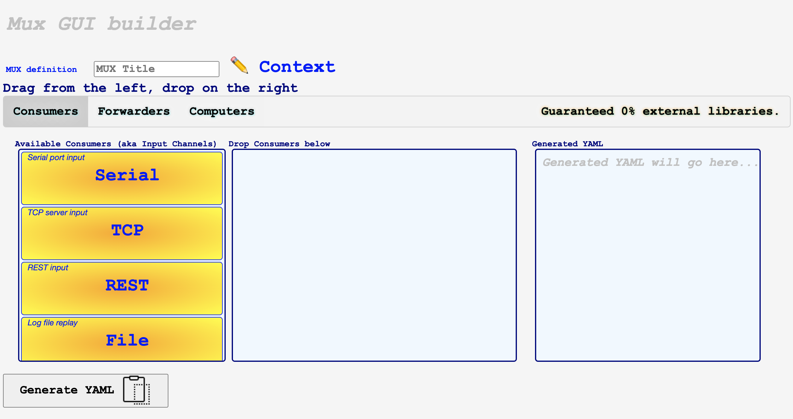

Click the pencil next to the `Context`, and fill out the form the way you like,  
make sure you select `With HTTP/REST Server`.
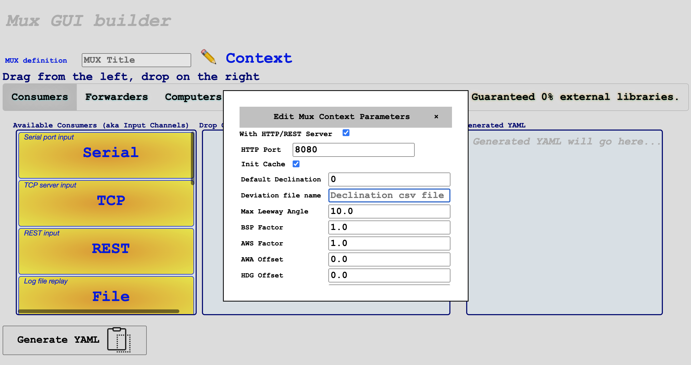
Then, drag a `Serial` Consumer from the left pane to the center pane:
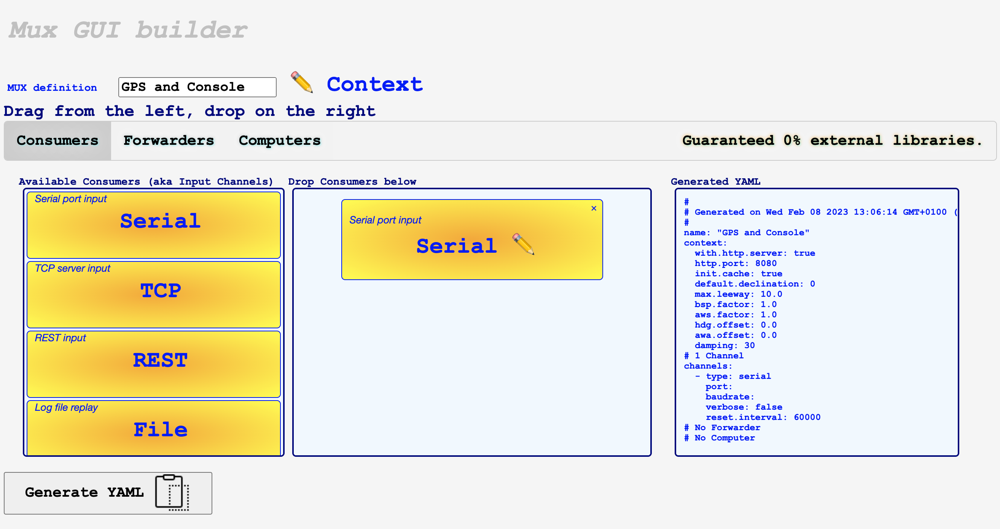
and edit its properties (click the pencil):
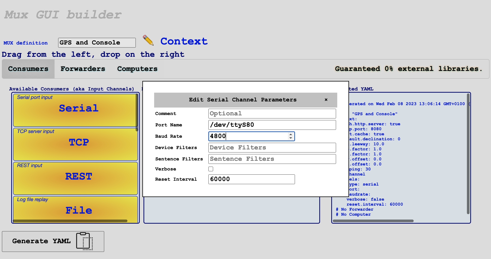
Enter the port name `/dev/ttyS80`, and `4800` for the baud rate.  
Click the &times; to close the dialog.  

Next, select the `Forwarders` tab, and scroll down the left pane, to see the `Dynamic` entry:
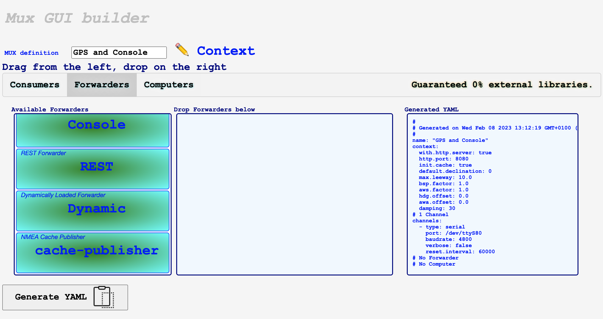
Drag it in the middle, and edit its properties:
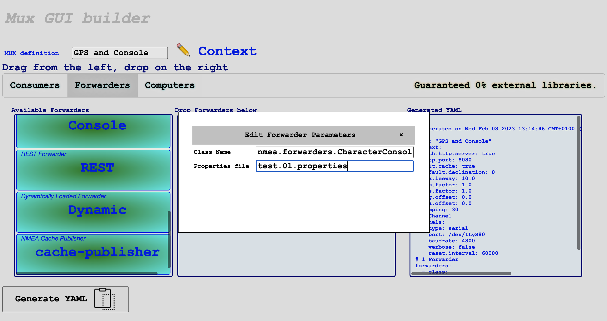
Enter `nmea.forwarders.CharacterConsoleWriter` in Class Name, and 
`test.01.properties` in Properties File (we will generate this file later).  
You can already see your config file generated in the right pane.  
To finish, click the `Generate YAML` button, at the bottom left.
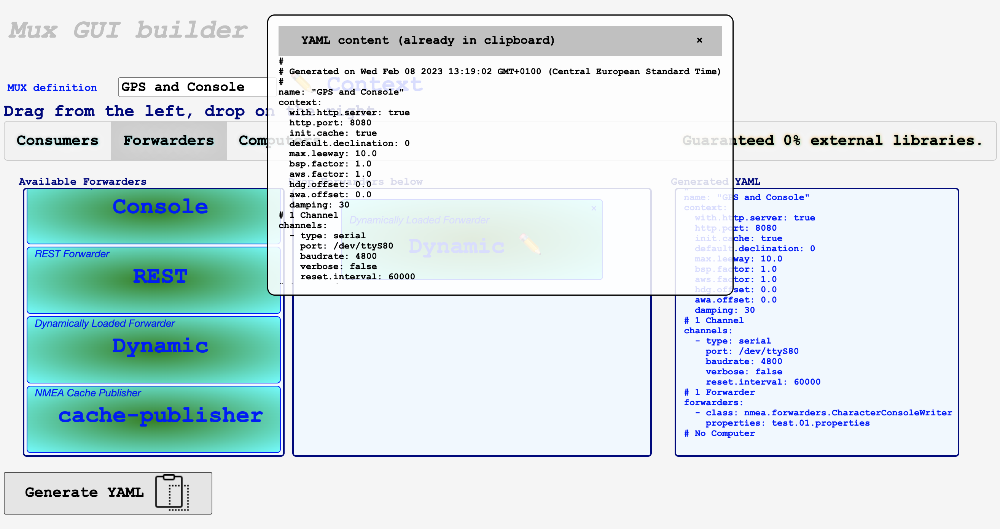
This will put the file's content in your clipboard, you can close the dialog (&times;).

_**Now**_, you need to create a config file in the `launchers` folder, where the script `runNavServer.sh` lives; name it - for example `test.01.yaml`,
and paste the content generated before in it. Any text editor would do it (`vi`, `Visual Code`, `Geany`, ...).  
Here (based on the above), you would have a content like 
```yaml
#
# Generated on Wed Feb 08 2023 13:25:15 GMT+0100 (Central European Standard Time)
#
name: "GPS and Console"
context:
  with.http.server: true
  http.port: 8080
  init.cache: true
  default.declination: 0
  max.leeway: 10.0
  bsp.factor: 1.0
  aws.factor: 1.0
  hdg.offset: 0.0
  awa.offset: 0.0
  damping: 30
# 1 Channel
channels:
  - type: serial
    port: /dev/ttyS80
    baudrate: 4800
    verbose: false
    reset.interval: 60000
# 1 Forwarder
forwarders:
  - class: nmea.forwarders.CharacterConsoleWriter
    properties: test.01.properties
# No Computer
```
> Note: The `Character Console` is to be managed as a Custom Forwarder, hence the `type` and `properties` entries in its definition.


Last step, we must generate the `properties` file named `test.01.properties`, to 
drive the behavior of the `Character Console`. Using - again - your favorite text editor,
next to the `text.01.yaml` generated above (in the same directory), insert a content like
```properties
console.title= - Console - Test 01 -
#
POS=1,1,CYAN,BLACK,CYAN,BLACK
#
GDT=1,2,CYAN,BLACK,CYAN,BLACK
#
SLT=1,3,CYAN,BLACK,CYAN,BLACK
#
COG=1,4,YELLOW,BLACK,GREEN,BLACK
SOG=2,4,YELLOW,BLACK,RED,BLACK
```
This will display `POS` (GPS Position), `GDT` (GPS Date & Time), `SLT` (Solar Time), `COG` (Course Over Ground), and `SOG` (Speed Over Ground).  
For all available options, see the class `CharacterModeConsole.java`, or files like `char.console.2.properties`.

- **Step 3**  
Now, let's start all this!  
From a terminal, in the `launchers` folder, enter
```
$ ./runNavServer.sh --mux:test.01.yaml
```
The MUX should start, and your terminal should display a screen (with colors) like
```
- Console - Test 01 -
POS   47°40.67'N   3°08.13'W              
GDT 08 Feb 2023 11:48:06 UTC                      
SLT 08 Feb 2023 12:32:00 Solar                    
COG     0 t  SOG  0.10 kt           
```
The screen is updated every second.

For the Web interface, open <http://localhost:8080/web/index.html> in a browser (use the IP address if the browser is not on localhost), then  
**&#9776; Nav Menu** > **Various NMEA Consoles** > **GPS Console (Small Screens)** :

| 1 | 2 | 3 | 4 | 5 | 6 |
|:---:|:---:|:---:|:---:|:---:|:---:|
| 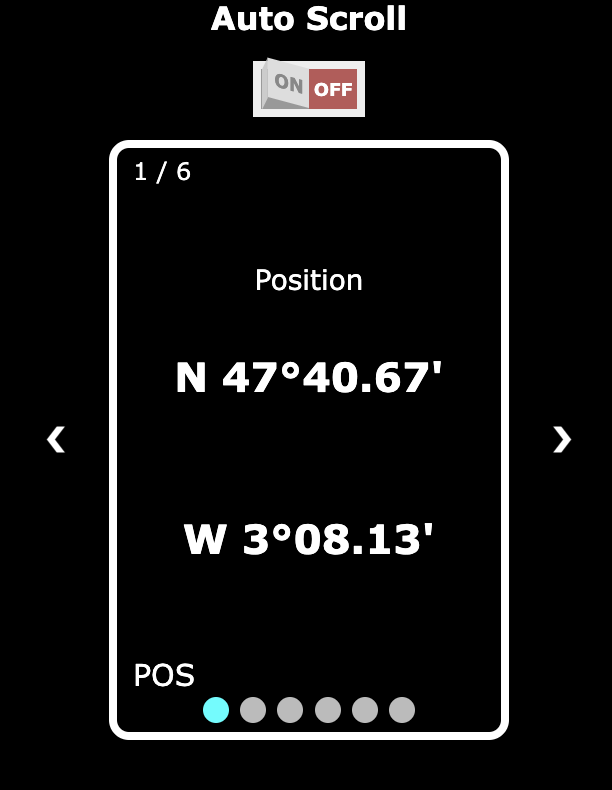 | 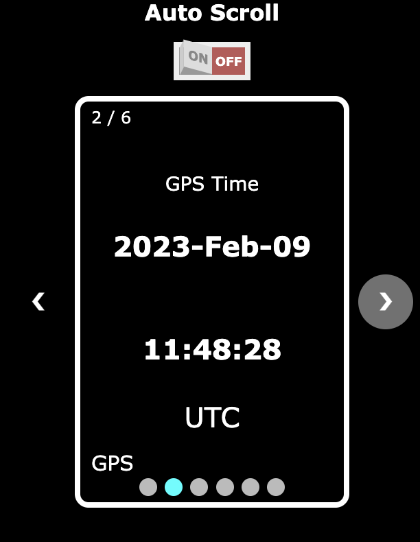 | 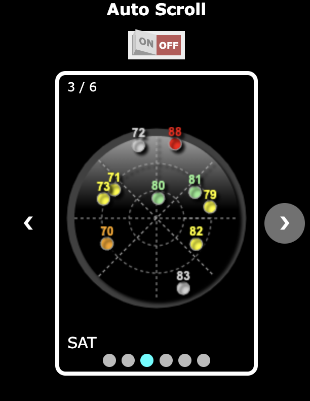 |  | 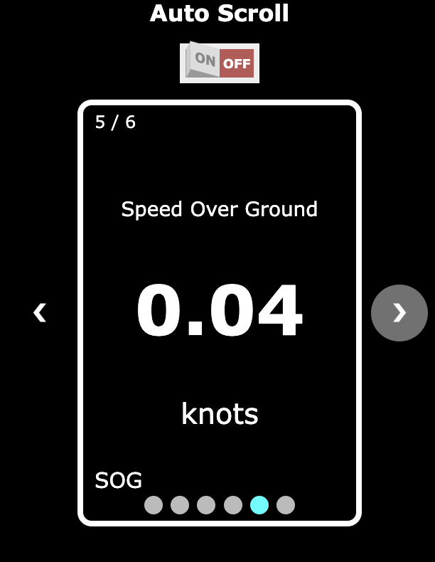 | 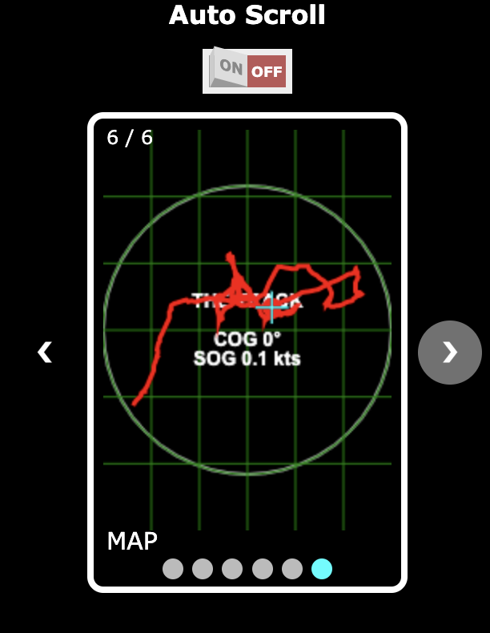 |

You can also take a look at the graphical  _**Admin**_ page,  
**&#9776; Nav Menu** > **Runtime Config Manager**.

Finally, to stop the MUX, hit `[Ctrl-C]` in the console.

### Example 2 - To come.
. . .

# Customize
. . .

# Extra
. . .

---
