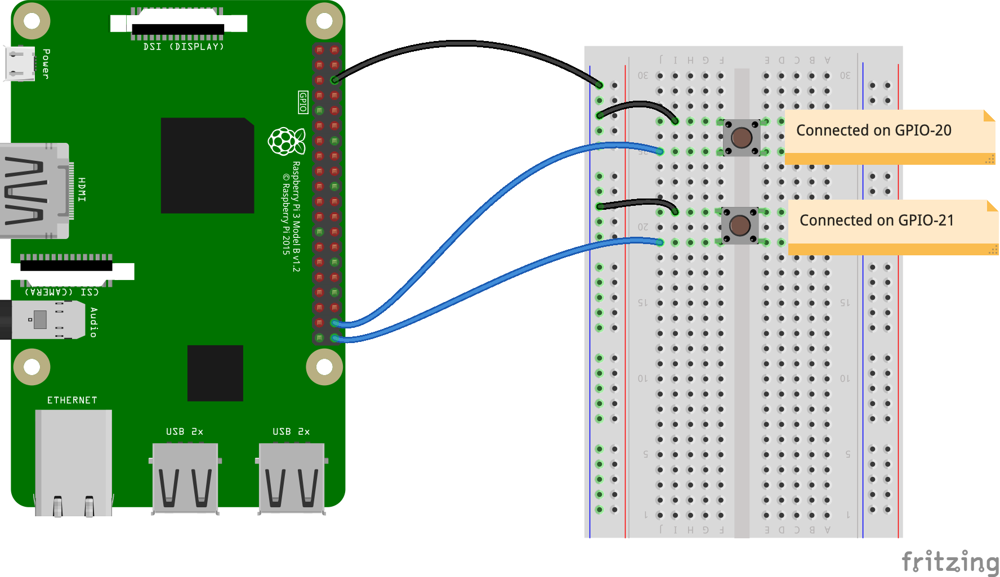
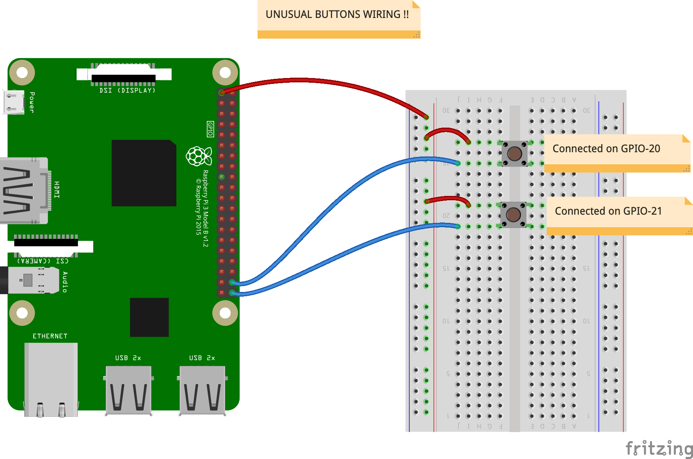

# Push Buttons

> _**Warning**_:   
> Push Buttons: 
> - One pin on a GPIO-XX (`board.DXX`)
> - The other pin on the _**GROUND**_ !

To use with the code in `button_101.py` and `button_listener.py`.

## Unusual wiring
I've also - probably by mistake - tested another button wiring, that seems to work too.

The red wires are connected on the `3V3`.  
The code to use is `button_101_inv.py` in this case.

## Docs to look at
- <https://realpython.com/intro-to-python-threading/>
- <https://www.raspberrypi-spy.co.uk/2012/06/simple-guide-to-the-rpi-gpio-header-and-pins/#:~:text=The%20Raspberry%20header%20is%20the,3.3V%20(on%202%20pins)>
- <https://learn.adafruit.com/circuitpython-on-raspberrypi-linux?view=all>

