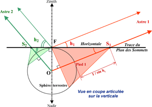

# M&eacute;thode du Plan des Sommets (MPS)
Yves Robin-Jouan,1995-96

This is a workbench... We want to see if this can be done manually.  
Some investigations need to be done.

- See [Haversine Formula](https://en.wikipedia.org/wiki/Haversine_formula)
- See [Navigation aux Astres et aux Satellites](https://navastro.fr/index.html?p659.html)
- See [here](https://les-mathematiques.net/vanilla/discussion/59651/astronomie-plan-des-sommets)

Pour le c&ocirc;ne 1 (le rouge), l'angle en O est `(90&deg; - h1)`.  
La distance (grand cercle) `F - Pied1` est donc `(90&deg; - h1) * 60.0`.

---