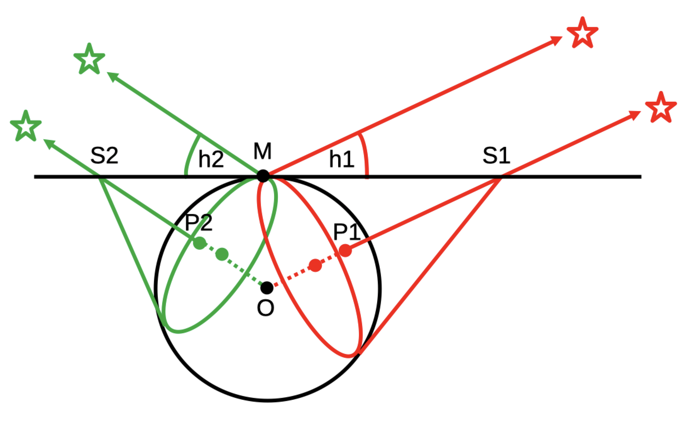
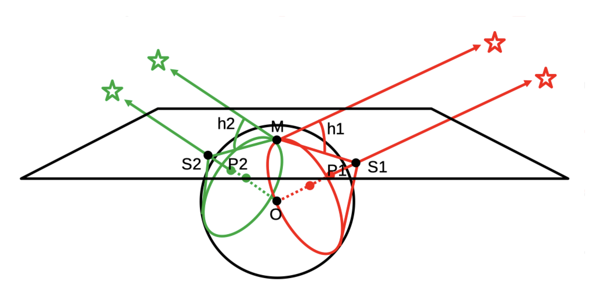
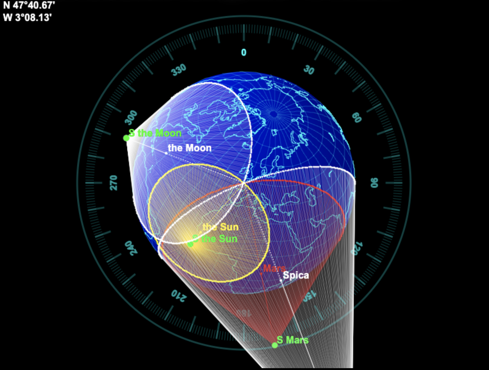
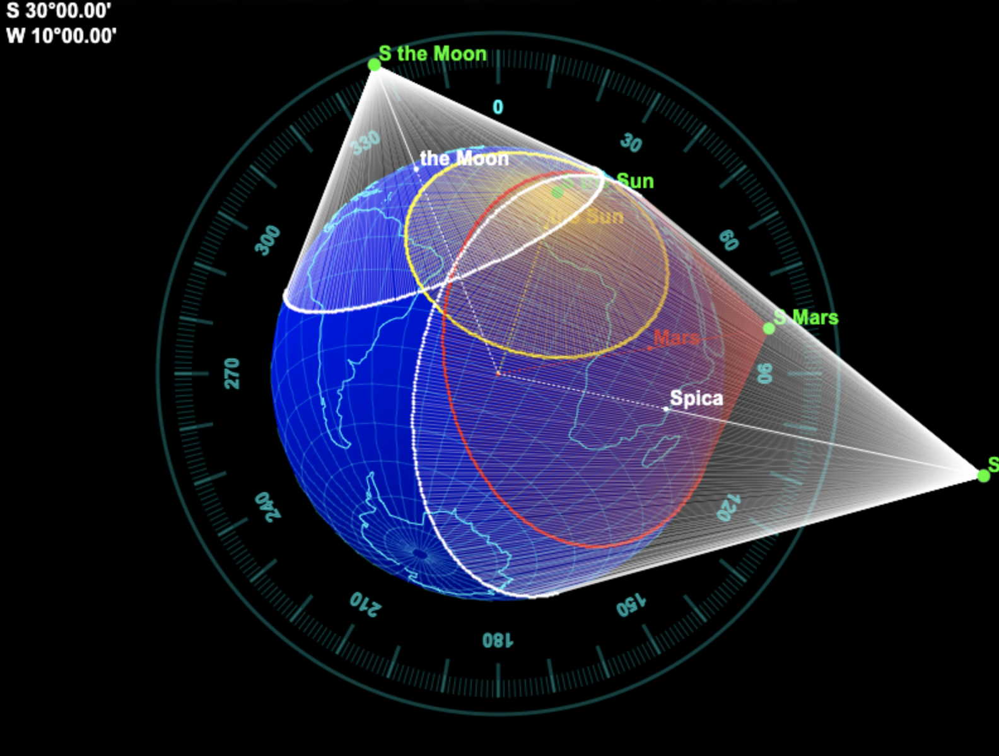
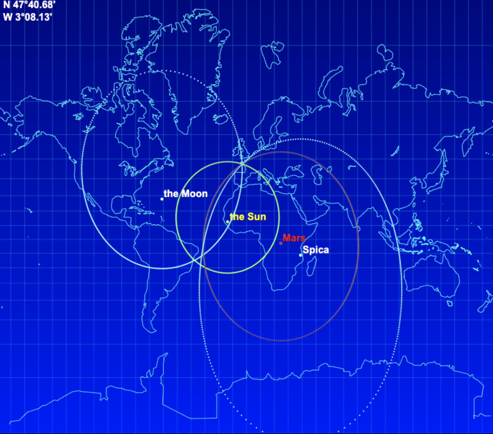
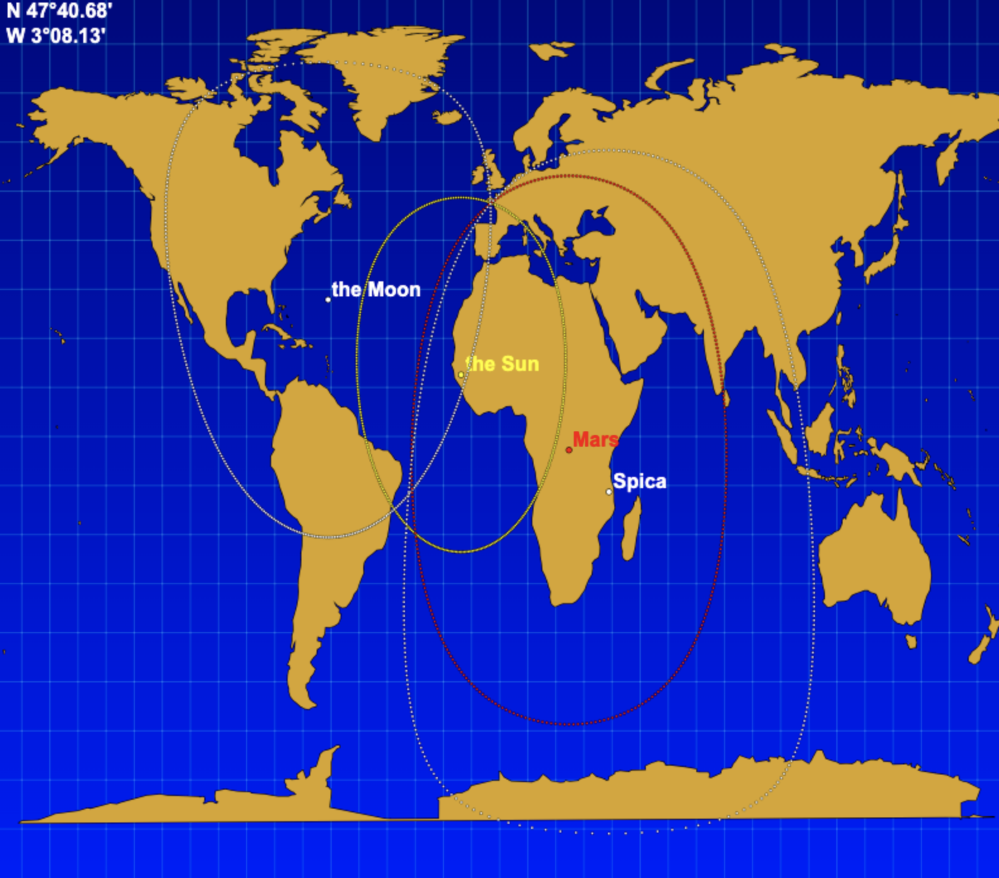
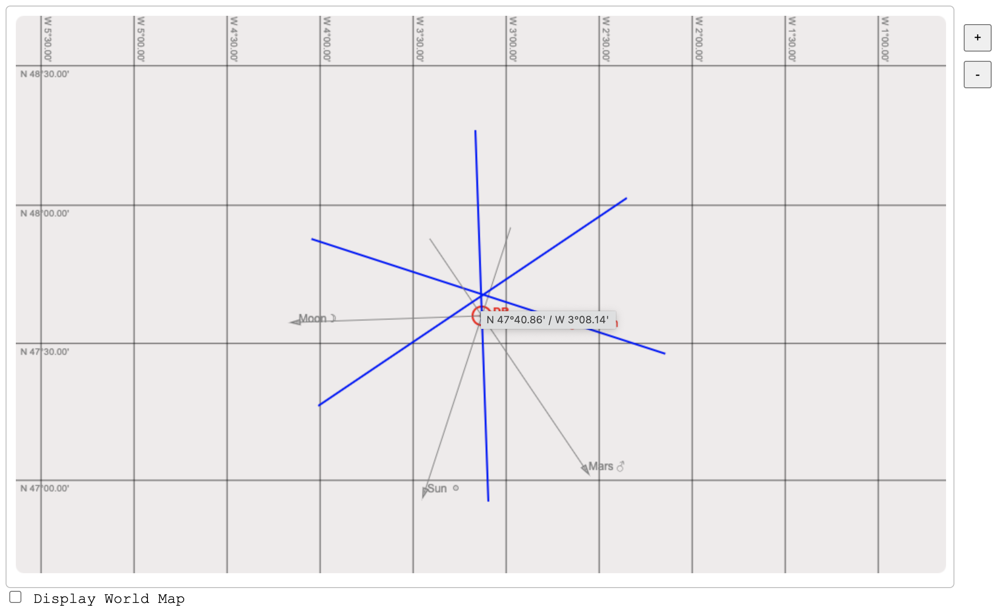
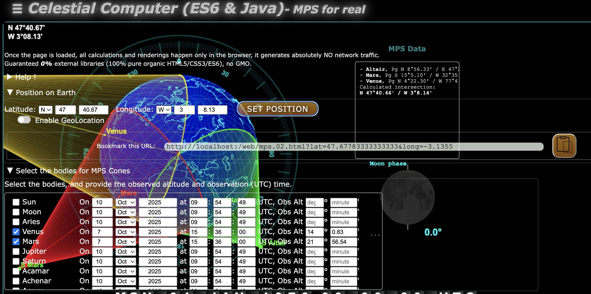
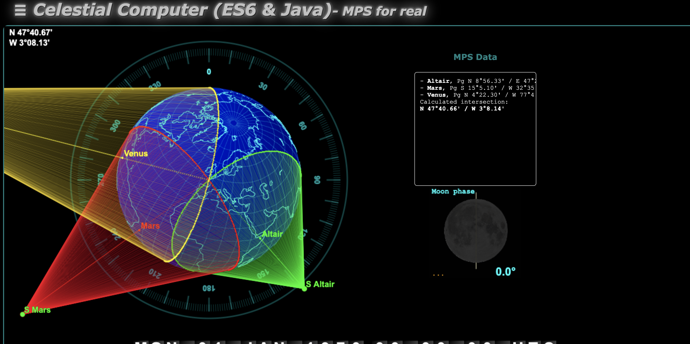

# M&eacute;thode du Plan des Sommets (MPS)
M&eacute;thode &eacute;labor&eacute;e par Yves Robin-Jouan, en 1995-96.

Il s'agit d'une m&eacute;thode de point astronomique destin&eacute;e &agrave; trouver sa position sur la Terre, &agrave; partir de l'observation d'un astre au sextant.  
Ceci n&eacute;cessite - comme dans le cas d'autres m&eacute;thodes - de conna&icirc;tre l'heure exacte - &agrave; la seconde pr&egrave;s - de l'observation, afin d'en d&eacute;duire les coordonn&eacute;es de l'astre observ&eacute;.  

<image src="./images/cone.png" width="40"/> Ce document est en chantier...  

---
**Sommaire**
- [Introduction](#introduction)
- [Rappels](#rappels)
- [Quelques angles utiles pour la suite](#quelques-angles-et-définitions-utiles-pour-la-suite)
- [Le principe](#le-principe)
- [En pratique](#en-pratique)
- [Une approche graphique](#une-approche-graphique-)
- [Approche itérative](#approche-itérative)
- [Résoudre l'équation de la distance entre les points de deux cercles](#résoudre-léquation-de-la-distance-entre-les-points-de-deux-cercles)
---

## Introduction
On veut voir si cette m&eacute;thode est applicable manuellement - sans recours &agrave; l'informatique - pour la partie (de cette m&eacute;thode) applicable aux astres, les satellites ne concernant
gu&egrave;re ceux qui n'ont qu'un sextant &agrave; leur disposition.      
&Agrave; la diff&eacute;rence de la m&eacute;thode des droites de hauteur (Marcq Saint-Hilaire, 1875), cette m&eacute;thode pr&eacute;sente l'avantage de ne pas avoir &agrave; recourir &agrave; une position estim&eacute;e.  
L'inconv&eacute;nient potentiel pourrait &ecirc;tre la quantit&eacute; de calculs &agrave; mettre en &oelig;uvre...  
C'est ce qu'on se propose de voir ici.

Le principe de la m&eacute;thode repose sur les assertions suivantes :
- &Agrave; un instant donn&eacute;, si on a observ&eacute; un astre &agrave; une hauteur donn&eacute;e, on est capable de d&eacute;terminer
le lieu des points qui voient cet astre &agrave; cette hauteur (c'est le tr&egrave;s fameux "cercle d'&eacute;gales hauteurs").
- En observant plusieurs astres, il s'agit de d&eacute;terminer le lieu des points communs (id&eacute;alement **_du_** point commun) aux diff&eacute;rents cercles de hauteur ainsi obtenus, qui 
devrait en toute logique correspondre &agrave; la position de l'observateur.

L'&eacute;quation &agrave; r&eacute;soudre n'est pas triviale..., c'est bien l'objet de ce document.

Mais on voit bien ici que la d&eacute;termination de ces cercles d'&eacute;gales hauteurs ne fait en aucun cas intervenir
une position estim&eacute;e. On a juste besoin ici de conna&icirc;tre :
- La hauteur observ&eacute;e de l'astre
- L'heure de l'observation - destin&eacute;e &agrave; d&eacute;terminer la position de l'astre observ&eacute; (position g&eacute;ographique instantan&eacute;e, aka Pg).

> _Note_ :  
> Toutes les figures de ce document - &agrave; l'exception des trois premi&egrave;res - sont r&eacute;alis&eacute;es
> &agrave; partir de WebComponents, disponibles dans le pr&eacute;sent projet. 

> _Note_ :  
> Dans cet exemple, on utilise Java pour les calculs d'&eacute;ph&eacute;m&eacute;rides en backend. Le code Java
> qui permet ces calculs est disponible dans ce r&eacute;f&eacute;rentiel (voir `astro-computer:AstroComputer`).
> Il l'est aussi dans d'autres langages : 
> - C
> - Golang
> - php
> - Python
> - Scala
> - ES6 (aka JavaScript)
> - Kotlin (en acc&eacute;dant aux classes Java compil&eacute;es)  
> 
> La partie frontend est r&eacute;alis&eacute;e en HTML5/CSS3/ES6, avec des WebComponents, d&eacute;j&agrave; mentionn&eacute;s ci-dessus.

## Rappels...

### Hauteur et azimut d'un astre
> _Attention_ : ce qu'on appelle la **hauteur** d'un astre dans les lignes qui suivent est l'_**angle**_ apparent que fait un astre avec l'horizon,
> vu de la position de l'observateur. Ceci est visible et illustr&eacute; sur les figures qui suivent. `h` est un _**angle**_, est non pas une distance... Il en est pour qui c'est potentiellement ambigu. 

Dans les formules suivantes : 
- `D` est la d&eacute;clinaison de l'astre observ&eacute; (calculée ou trouvée dans les éphémérides)
- `L` est la latitude de l'observateur
- `G` est la longitude de l'observateur
- `AHG` est l'Angle Horaire a Greenwich de l'astre (calculé ou trouvé dans les éphémérides)
- `AHL` est l'Angle Horaire Local de l'astre (lequel d&eacute;pend de `AHG` et `G`)

Calcul de la hauteur d'un astre &agrave; partir de la position de l'observateur :

$$
H = \arcsin \left( (\sin(L).\sin(D)) + (\cos(L).\cos(D).\cos(AHL)) \right) 
$$

Calcul de l'azimut d'un astre &agrave; partir de la position de l'observateur :

$$
Z = \arctan \left( \dfrac{\sin(AHL)}{(\cos(L).\tan(D)) - (\sin(L).\cos(AHL))}\right) 
$$

Voir une impl&eacute;mentation en Java [ici](https://github.com/OlivierLD/ROB/blob/master/astro-computer/AstroUtilities/src/main/java/calc/CelestialDeadReckoning.java).

### Haversine
La formule de haversine permet de conna&icirc;tre, d'un point donn&eacute; &agrave; un autre :
- la distance (GC = Grand Cercle = Great Circle = orthodromique) qui les s&eacute;pare
- l'angle de route initial

- Le point de d&eacute;part est `(L1, G1)`
- Le point d'arriv&eacute;e est `(L2, G2)`

```
a = sin((G2 - G1) / 2)^2 + cos(G1) * cos(G2) * sin((L2 - L1) / 2)^2

distance = 2 * atan2(sqrt(a), sqrt(1 - a))
```
<!-- With LaTeX -->
&eacute;crit aussi <!-- inline LaTeX not well suoppterd in md files... -->

$$
a = sin^2\left(\dfrac{G2 - G1} {2}\right) + cos G1 . cos G2 . sin^2\left(\dfrac{L2 - L1} {2}\right)
$$

$$
c = 2 . atan2(\sqrt{a}, \sqrt{(1-a)})) 
$$

$$
distance = R . c 
$$

o&ugrave; R est le rayon de la Terre.

La formule de haversine _inverse_ permet de conna&icirc;tre la position qu'on atteint :
- en partant d'un point donn&eacute;
- en suivant un arc de grand cercle (aka orthodromie)
- avec un angle de route initial donn&eacute;

Voir une impl&eacute;mentation en Java [ici](https://github.com/OlivierLD/ROB/blob/577f32344e8e486e0d44b7bff9a4a47e100e6551/astro-computer/AstroUtilities/src/main/java/calc/GeomUtil.java#L82) et autour, m&eacute;thode `haversineRaw`.

&Agrave; ce sujet, les documents [Haversine Formula](https://en.wikipedia.org/wiki/Haversine_formula) et [Formule de Haversine](https://fr.wikipedia.org/wiki/Formule_de_haversine) (aka Sinus Verse)
m&eacute;ritent un coup d'&oelig;il.

$$
finalLat = \arcsin(\sin(startLat) * \cos(dist)) + (\cos(startLat) * \sin(dist) * \cos(heading))
$$

$$
finalLng = startLng + atan2(\sin(heading) * \sin(dist) * \cos(startLat), \cos(dist) - (\sin(startLat) * \sin(finalLat)))
$$

_Note:_  
On utilise ici `atan2`, qui restitue des angles entre -&Pi; et +&Pi;, &agrave; la diff&eacute;rence de `atan`, qui restitue des angles entre -&Pi; / 2 et +&Pi; / 2.

---
Des liens&nbsp;:
- Voir [Haversine Formula](https://en.wikipedia.org/wiki/Haversine_formula)
- Voir [Formule de Haversine](https://fr.wikipedia.org/wiki/Formule_de_haversine)
- Voir [La guerre du sinus verse et de l'haversine](https://www.navigare-necesse-est.ch/files/1551171181-85-la-guerre-du-sinus-verse-et-de-l-haversine-929.pdf)
- Voir [ce document](https://www.aftopo.org/download.php?type=pdf&matricule=aHR0cHM6Ly93d3cuYWZ0b3BvLm9yZy93cC1jb250ZW50L3VwbG9hZHMvYXJ0aWNsZXMvcGRmL2FydGljbGUxNzYwNy5wZGY=)
- Voir [Navigation aux Astres et aux Satellites](https://navastro.fr/index.html?p659.html)
<!-- - Voir [ici](https://les-mathematiques.net/vanilla/discussion/59651/astronomie-plan-des-sommets) aussi. -->
- Pour faire des tests avec des donn&eacute;es valides (&eacute;ph&eacute;m&eacute;rides et autres) voir ces pages, avec des composants graphiques.
  - [ES6 Celestial Computer test, with WebComponents](https://olivierld.github.io/web.stuff/astro/index_01.html)
  - [ES6 Celestial Computer - SPA with BG Components](https://olivierld.github.io/web.stuff/astro/index_02.html)
  - [Sight Reduction / Correction des hauteurs](https://olivierld.github.io/web.stuff/astro/index_03.html)

---

#### Quelques angles et d&eacute;finitions utiles pour la suite...

<!--  -->

La figure ci-dessus est faite pour &ecirc;tre aussi simple que possible. Tout est dans le m&ecirc;me plan `MOP` (celui de la feuille).
Et m&ecirc;me les astres.

`M` est la position de l'observateur sur la Terre.  
`P` est le point de la Terre o&ugrave; l'astre est &agrave; la verticale. Ce point est appel&eacute; le "Pied de l'astre", ou aussi la "Position G&eacute;ographique Instantan&eacute;e" de l'astre, souvent not&eacute;e `Pg`.  
La hauteur observ&eacute;e en `M` de l'astre est not&eacute;e `h`. Notez les autres endroits o&ugrave; cette hauteur `h` est reproduite, &agrave; partir de `S`, et &agrave; partir de `M` vers `O`.  
La hauteur observ&eacute;e est l'angle que fait l'astre avec l'horizon.  
L'angle que fait l'astre observ&eacute; avec le z&eacute;nith (la verticale de l'observateur) est le compl&eacute;ment de cette hauteur, `90 - h`, et s'appelle
la Distance Z&eacute;nithale, not&eacute;e aussi &zeta;, la lettre grecque "dzeta" (&ccedil;a commence par "dz"...).  

> _Note_: sur la figure, la direction de l'astre &agrave; partir de M est identique (parall&egrave;le) &agrave; sa direction &agrave; partir de O.
> Ceci convient &agrave; un astre tr&egrave;s &eacute;loign&eacute; de l'observateur. &Ccedil;a ne serait pas applicable pour un satellite.

Pour le c&ocirc;ne, l'angle en O (MOP) est `(90° - h)`.  
La distance (grand cercle) `M - P` est donc `(90° - h) * 60.0` nm.

La distance `MS` est `r * (1 / tg(h))`, o&ugrave; `r` est le rayon de la Terre.  
Le rayon de la base du c&ocirc;ne est `r * cos(h)`.  
La distance du centre le la Terre `O` au sommet `S` est `sqrt(MS^2 + r^2)`, not&eacute; aussi

$$
  \sqrt{MS^2 + r^2}
$$

La distance `OS` est `MS / cos(h)`.   
Comme `MS` = `1 / tg(h)`, `OS` s'&eacute;crit aussi `(cos(h) / sin(h)) / cos(h)`, soit
`1 / sin(h)`.  
`OS` = `1 / sin(h)`.  
La distance `PS` est &eacute;gale &agrave; `OS - r`.    
Donc `PS = (1 / sin(h)) - r`.

Voici le m&ecirc;me sch&eacute;ma (simpliste) avec deux astres. Ici, les astres ne sont pas situ&eacute;s dans le plan de la feuille...
<!--  -->  


On remarque ici que _deux_ cercles (le vert et le rouge) peuvent pr&eacute;senter _deux_ intersections.  
En fait, ils n'en ont qu'une que lorsqu'ils sont tangents l'un &agrave; l'autre, ce qui ne constitue pas - et de loin - 
la majorit&eacute; des cas.

> _Note_ : Sur la figure  ci-dessus, ce qu'on appelle le "Plan des Sommets" est ici perpendiculaire au plan de la feuille.  
> On en voit les points `S1`, `M`, et `S2`, sur "la tranche" du plan, qui ont ici tous la m&ecirc;me cote (z), mais des abscisses (x) et ordonn&eacute;es (y) tr&egrave;s vari&eacute;es.

Voici la m&ecirc;me figure, "pench&eacute;e" vers celui qui la regarde,
ou bien qui s'est lev&eacute; de sa chaise, la figure est vue de plus haut...
<!--  -->   


Le "Plan des Sommets" est celui qui est d&eacute;fini par `S2`, `M` et `S1`, il est tangent &agrave; la Terre en `M`.

---

## Le principe  
- On est capable de d&eacute;terminer les points d'un cercle d&eacute;fini par les points qui voient un astre &agrave; la m&ecirc;me hauteur, &agrave; un instant donn&eacute;.
- Avec plusieurs observations (plusieurs astres), l'observateur se trouve &agrave; l'intersection de ces cercles.
- Pour chaque astre, les param&egrave;tres de l'&eacute;quation sont :
  - La hauteur de l'astre observ&eacute;
  - L'heure de l'observation
- On en d&eacute;duit :
  - Avec les &eacute;ph&eacute;m&eacute;rides, la position du point Pg de l'astre (D&eacute;clinaison et AHG), le centre du cercle.
  - Par le calcul, le lieu des points (un cercle centr&eacute; sur ce Pg) qui voient l'astre &agrave; la m&ecirc;me hauteur (celle qu'on a observ&eacute;e).

Avec plus d'un astre, la position de l'observateur - celle qu'on cherche - est &agrave; l'intersection de ces cercles.

_Note_ : On fait figurer plusieurs astres dans les diagrammes ci-dessous - le Soleil, la Lune, Mars, Spica (&alpha; Libra). C'est juste pour l'exemple. Il est hautement improbable 
de les voir tous en m&ecirc;me temps.

_Une autre Note_ : Le sommet de tous les c&ocirc;nes, et la position de l'observateur, se trouvent tous dans le m&ecirc;me plan.
D'o&ugrave; - sans doute - le nom de la m&eacute;thode...

La position de l'observateur - celle qu'on cherche, donc - est &agrave; l'intersection de la base des c&ocirc;nes, dans les figures qui suivent, 
c'est `47º40.66'N / 3º08.14'W`.



Voici la m&ecirc;me figure, d'un autre point de vue.  
On note que - comme attendu - les g&eacute;n&eacute;ratrices des c&ocirc;nes tangentent la Terre &agrave; la base du c&ocirc;ne, _sur_ le cercle d'&eacute;gales hauteurs.  



Les cercles se croisent &agrave; la position de l'observateur. Ainsi, la position de l'observateur et
toutes celles des sommets des c&ocirc;nes sont dans le m&ecirc;me plan. Et elles ne sont pas - loin de l&agrave; - 
n&eacute;cessairement align&eacute;es.


L'&eacute;chelle des cartes pose ici un premier probl&egrave;me. Voici le contexte ci-dessus repr&eacute;sent&eacute; sur une carte 
Mercator.  
Deux premiers &eacute;l&eacute;ments sont &agrave; noter :
- Les cercles de hauteur ne sont pas ronds sur cette projection.
- Ils peuvent &ecirc;tre &eacute;normes.

Ils ne sont ronds ni sur une carte Mercator :


Ni sur une carte Anaximandre :


En fait, ils ne sont ronds que sur un globe.

## Demo (comme ci-dessus)

### 1 - G&eacute;n&eacute;rer les data
&Agrave; partir du r&eacute;pertoire `MPS` :
```
$ ./generate.cones.sh
```
Ce script execute le code Java de la classe `mps.Context01.java`. Ceux que &ccedil;a int&eacute;resse iront voir le code.   
Ceci g&eacute;n&egrave;re les fichiers `.json` dans le r&eacute;pertoire `web/json`, qui seront utilis&eacute;s &agrave; partir d'une page HTML.

### 2 - Affichage des diagrammes
&Agrave; partir du r&eacute;pertoire `MPS/web` :
````
$ npm start
````
Ceci suppose que `nodeJS` est disponible sur le syst&egrave;me.  
Puis &agrave; partir d'un browser, acc&eacute;der &agrave; `http://localhost:8080/index.html`.  

Les diagrammes ci-dessus sont affich&eacute;s lorsqu'on utilise le bouton `SET POSITION`, visible 
sous la rubrique `Position on Earth`.

## En pratique
Vaste sujet... &Ccedil;a vient !

#### Une remarque &agrave; propos du point par droites de hauteurs, de Marcq Saint-Hilaire
Pour mettre cette m&eacute;thode en &oelig;uvre, on mesure la hauteur d'un astre au sextant, qu'on compare &agrave; ce qu'on
devrait observer si on &eacute;tait l&agrave; o&ugrave; l'estime nous situe, cette hauteur "&eacute;stim&eacute;e" est calcul&eacute;e gr&acirc;ce aux &eacute;ph&eacute;m&eacute;rides et aux tables de Dieumegard, pour l'heure (exacte)
de l'observation.  
La droite de hauteur obtenue est ensuite port&eacute;e sur la carte, perpendiculairement &agrave; l'azimut de 
l'astre observ&eacute;, lequel est _**calcul&eacute;**_ (par les tables de Bataille), _**et non pas observ&eacute;**_ !  
Ceci justifie - entre autres - la raison pour laquelle un intercept de plus de 15 miles est consid&eacute;r&eacute; comme suspect. Le
calcul de l'azimut se faisant &agrave; partir de la position estim&eacute;e, une "mauvaise" estime donne lieu
&agrave; un azimut potentiellement &eacute;rron&eacute;.

### Une premi&egrave;re approche...
On va partir - pour l'instant - d'une position estim&eacute;e, d'o&ugrave; on pourra calculer l'azimut des astres observ&eacute;s &agrave; l'aide des tables de Bataille.  
On pourra alors calculer le point du cercle d'&eacute;gales hauteur (de cet astre) pour cet azimut.

#### Exemple
```
On 2025-Aug-20 10:40:31 UTC: 
the Sun Decl 12º16.80'N, GHA 339º17.40', from 47º40.66'N / 3º08.14'W.
Seeing the Sun at altitude 49º22.52', in the 142.65º
```

### Une approche graphique ?
Le challenge ici est donc de trouver pour _**tous**_ les cercles le (ou les) point(s) commun(s).  
On peut essayer graphiquement, pour la latitude, puis pour la longitude...

Mais le calcul des coordonn&eacute;es de chaque cercle (ou c&ocirc;ne) requiert des ressources et un nombre d'op&eacute;rations consid&eacute;rables (effrayant si on fait &ccedil;a manuellement)...  

On peut cependant facilement calculer le rayon de la base du c&ocirc;ne (du cercle). Les coordonn&eacute;es du centre 
sont restitu&eacute;es par les &eacute;ph&eacute;m&eacute;rides.  
Mais deux probl&egrave;mes se posent alors :
- Le cercle n'est rond que sur une sph&egrave;re (un globe), les cartes dont on dispose (Mercator, Lambert, St&eacute;r&eacute;ographiques, etc) ne permettent certainement 
pas de tracer ces cercles avec un compas, ni avec aucun outil connu.
- Quand bien m&ecirc;me on parviendrait &agrave; tracer ce cercle, il est parfois tellement vaste - &agrave; l'&eacute;chelle de la Terre - que 
les coordonn&eacute;es des intersections avec un autre cercle seraient fort impr&eacute;cises. C'est &agrave; cause de &ccedil;a qu'on a - dans le contexte des droites de hauteur -
&eacute;labor&eacute; Canevas Mercator et autres Plotting Sheets...

Si on part d'une position estim&eacute;e, on revient &agrave; un point par droites de hauteurs classique (Saint-Hilaire).
Si on a trois astres, on a trois droites, et on est &agrave; leur intersection...

D'o&ugrave; la question : _Quel est alors dans ce contexte (graphique) l'int&eacute;ret de la M&eacute;thode du Plan des Sommets ?_

La r&eacute;solution du probl&egrave;me ci-dessus par les droites de hauteur produit la figure suivante :  

Le tooltip sur la figure repr&eacute;sente les coordonn&eacute;es de l'intersection des droites de hauteur (en bleu).  
Et ceci est r&eacute;alisable sans informatique, ni m&ecirc;me &eacute;lectricit&eacute;.

### Approche it&eacute;rative
Le probl&egrave;me est que deux cercles peuvent avoir deux intersections...
C'est ce qui est restitu&eacute; ci-dessous, dans les lignes `1st Position` et 
`2nd Position`.
Il y a un premier test qui semble fonctionner, voir `mps.pg.PlayGround01.java`.  
On proc&egrave;de en plusieurs fois - ambiance [m&eacute;thode de Newton](https://fr.wikipedia.org/wiki/M%C3%A9thode_de_Newton).   
La m&eacute;thode de Newton est fort pratique quand on cherche la solution d'une &eacute;quation (ou d'un syst&egrave;me d'&eacute;quations) 
tr&egrave;s (voire trop) complexe. La solution &agrave; laquelle on arrive n'est pas "exacte", mais on a une id&eacute;e de sa pr&eacute;cision, et c'est d&eacute;j&agrave; pas mal.  
Cette m&eacute;thode est particuli&egrave;rement s&eacute;duisante dans un contexte informatique.

#### La m&eacute;thode de Newton, en deux mots.
La fa&ccedil;on de proc&eacute;der est la suivante&nbsp;:
- Admettons pour cet exemple qu'on cherche la valeur de `x` pour laquelle `y = f(x) = 0`. `f(x)` est cette fonction (pas n&eacute;cessairement une fonction, d'ailleurs, &ccedil;a peut &ecirc;tre une conique, ou n'importe quelle autre acrobatie), dont on a la formule, mais dont l'obtention de la (ou des) racine(s) fait peur.
- On va partir d'une valeur de `x` pour laquelle on sait qu'`y` est d'un c&ocirc;t&eacute; du r&eacute;sultat attendu (qui est donc `0`), qu'on va finir par se retrouver de l'autre en faisant progresser `x` d'une valeur `deltaX`.
- On commence. On part de `x`, on calcule `y`, on trouve une valeur inf&eacute;rieure &agrave; `0`. On note cet `x`.
- On continue, on augmente `x` de `detlaX`. On recalcule `y`.
  - Tant que le signe de `y` ne change pas, on continue.
- Le signe de `y` change ! On note la valeur de `x`, on l'appelle `x2`.
  - Et la pr&eacute;c&eacute;dente valeur de `x`, on l'appelle `x1`.
- On reprend le proc&eacute;d&eacute; au d&eacute;but, mais entre `x1` et `x2`, avec un `deltaX` plus petit (par exemple divis&eacute; par 10).
- Et on arr&ecirc;te - arbitrairement - quand la pr&eacute;cision requise (analogue &agrave; `deltaX`) est atteinte. La racine (le r&eacute;sultat) recherch&eacute;e est entre `x1` et `x2`, lesquels sont
s&eacute;par&eacute;s d'une valeur `deltaX`. Il appartient d&egrave;s lors &agrave; l'utilisateur de savoir si cette pr&eacute;cision est suffisante, ou s'il faut poursuivre les it&eacute;rations.

Dans le cas qui nous occupe, on commencera avec `Z` (`Z` est ici un azimuth, rien &agrave; voir avec la cote d'un rep&egrave;re cart&eacute;sien, qui s'appelle `z` aussi) allant de `0` &agrave; `360`, tous les `0.1` degr&eacute;s.  
Le nombre d'it&eacute;rations correspond au nombre de fois o&ugrave; on divisera cet intervalle de degr&eacute;s par 10 (ce `10` est arbitraire). Ainsi, avec ce `10`,
si on demarre avec un pas de `0.1` (10<sup><small>-1</small></sup>) degr&eacute;, et qu'on proc&egrave;de en 4 it&eacute;rations, on finira avec un pas de 10<sup><small>-4</small></sup > degr&eacute;s, mais sur un intervalle (un arc de cercle)
beaucoup plus restreint que lors de la premi&egrave;re it&eacute;ration (qui faisait tout le cercle). D'o&ugrave; l'int&eacute;r&ecirc;t de la m&eacute;thode, merci Isaac&nbsp;!

#### Exemple (tous les d&eacute;tails sont dans le code)
Dans les exemples ci-dessous, la hauteur des astres est celle observ&eacute;e &agrave; partir de la position `47º40.66'N / 3º08.14'W`.  
Les astres par d&eacute;faut (dans le script) sont la Lune et le Soleil.  
```
$ ./test.one.sh 
OK. Proceeding with user's input.
1st Position between 2º56.79'N / 19º14.49'W and 2º56.79'N / 19º14.49'W, dist 0.00 nm.
2nd Position between 47º40.66'N / 3º08.14'W and 47º40.66'N / 3º08.14'W, dist 0.00 nm.
Done
$ 
```
On peut aussi fournir les param&egrave;tres directement sur la command line:
```
$ ./test.one.sh --time-1:2025-08-20T10:40:31 --gha-1:339º17.40 --decl-1:N12º16.80 --alt-1:49º22.52 --time-2:2025-08-20T10:40:31 --alt-2:66º33.85 --gha-2:13º41.85 --decl-2:N25º46.13 --verbose:false
OK. Proceeding with user's input.
1st Position between 2º56.79'N / 19º14.49'W and 2º56.79'N / 19º14.49'W, dist 0.00 nm.
2nd Position between 47º40.66'N / 3º08.14'W and 47º40.66'N / 3º08.14'W, dist 0.00 nm.
Done
$ 
```
Plusieurs exemples figurent dans le package `mps.pg`, comme `mps.pg.PlayGround08.java`.  
From the `MPSServer` directory:
```
$ ../../gradlew clean shadowJar
$ java -cp build/libs/MPSServer-1.0-all.jar mps.pg.PlayGround08

Calculation launched for 2025-Sep-26 03:15:00 UTC
Sun      :	 ObsAlt: -27º59.56' (-27.992677),	 GHA:  230º54.36' (230.905951),	 Decl: 1º18.81'S (-1.313542)
Moon     :	 ObsAlt: -64º38.88' (-64.647941),	 GHA:  186º45.86' (186.764356),	 Decl: 22º29.58'S (-22.493011)
----------------------------------------------------
Saturn   :	 ObsAlt:  22º16.56' (22.276078),	 GHA:  54º39.20' (54.653345),	 Decl: 3º02.88'S (-3.048023)
Jupiter  :	 ObsAlt:  33º59.69' (33.994908),	 GHA:  300º20.17' (300.336092),	 Decl: 21º40.69'N (21.678212)
Rigel    :	 ObsAlt:  28º51.39' (28.856483),	 GHA:  334º59.47' (334.991105),	 Decl: 8º10.09'S (-8.168236)
Aldebaran:	 ObsAlt:  55º20.72' (55.345321),	 GHA:  344º35.06' (344.584258),	 Decl: 16º33.74'N (16.562267)
1 - Saturn & Jupiter
After 4 iterations:
1st position between 47º40.66'N / 3º08.14'W (47.677668 / -3.135668) and 47º40.66'N / 3º08.14'W (47.677643 / -3.135670), dist 0.00 nm.
2nd position between 10º54.28'S / 13º14.41'E (-10.904689 / 13.240187) and 10º54.28'S / 13º14.41'E (-10.904689 / 13.240187), dist 0.00 nm.
2 - Saturn & Rigel
After 4 iterations:
1st position between 47º40.66'N / 3º08.14'W (47.677668 / -3.135668) and 47º40.66'N / 3º08.14'W (47.677678 / -3.135640), dist 0.00 nm.
2nd position between 63º12.51'S / 12º06.38'W (-63.208440 / -12.106294) and 63º12.51'S / 12º06.38'W (-63.208440 / -12.106294), dist 0.00 nm.
3 - Rigel & Jupiter
After 4 iterations:
1st position between 27º54.85'S / 86º36.17'E (-27.914095 / 86.602860) and 27º54.84'S / 86º36.17'E (-27.914056 / 86.602848), dist 0.00 nm.
2nd position between 47º40.66'N / 3º08.14'W (47.677678 / -3.135640) and 47º40.66'N / 3º08.14'W (47.677678 / -3.135640), dist 0.00 nm.
4 - Rigel & Aldebaran
After 5 iterations:
1st position between 47º35.55'N / 3º20.13'W (47.592451 / -3.335450) and 47º35.51'N / 3º20.09'W (47.591775 / -3.334816), dist 0.05 nm.
2nd position between 48º03.44'N / 2º13.10'W (48.057372 / -2.218396) and 48º03.44'N / 2º13.10'W (48.057372 / -2.218396), dist 0.08 nm.
-----------------------------
Full Intersection Calculation took 5,398 ms (System Time)
-----------------------------
Found intersection at 47º40.66'N / 3º08.14'W
=> Compare to original position: 47º40.66'N / 3º08.14'W
==> Difference/offset: 0.00 nm
------- End of the story -------
```
... Encore un fois, les d&eacute;tails sont dans le code.  
Ceci semble fonctionner comme on l'attend, mais il est pour le moment **_totalement inenvisageable_** de faire
le boulot sans un calculateur - programmable.

#### Une premi&egrave;re approche interactive
Un script interactif, `cones.resolution.sh` :
```
$ ./cones.resolution.sh 

You will be prompted to enter body names, dates, and observed altitudes.

Body name: Mars
Date (duration format): 2025-10-07T15:36:00
Observed Altitude: 21.98
More [n]|y ? > y
Ok, another one.
Body name: Venus
Date (duration format): 2025-10-07T15:36:00
Observed Altitude: 14.014
More [n]|y ? > y
Ok, another one.
Body name: Altair
Date (duration format): 2025-10-07T15:36:00
Observed Altitude: 32º28.63'
More [n]|y ? >  
Now proceeding.
Read line [Body=Mars;Date=2025-10-07T15:36:00;ObsAlt=21.98]
        Body : [Mars]
        Date : [2025-10-07T15:36:00]
        Alt : [21.98] => [21.980000]
Calculation launched for 2025-Oct-07 15:36:00 UTC
For Mars at 2025-Oct-07 15:36:00 UTC, ObsAlt should be 21.942255 ( 21º56.54')
Read line [Body=Venus;Date=2025-10-07T15:36:00;ObsAlt=14.014]
        Body : [Venus]
        Date : [2025-10-07T15:36:00]
        Alt : [14.014] => [14.014000]
Calculation launched for 2025-Oct-07 15:36:00 UTC
For Venus at 2025-Oct-07 15:36:00 UTC, ObsAlt should be 14.013912 ( 14º00.83')
Read line [Body=Altair;Date=2025-10-07T15:36:00;ObsAlt=32º28.63']
        Body : [Altair]
        Date : [2025-10-07T15:36:00]
        Alt : [32º28.63'] => [32.477167]
Calculation launched for 2025-Oct-07 15:36:00 UTC
For Altair at 2025-Oct-07 15:36:00 UTC, ObsAlt should be 32.477156 ( 32º28.63')
We have 3 bodies.
Mars:    ObsAlt:  21º58.80' (21.980000),         GHA:  32º35.17' (32.586194),    Decl: 15º05.10'S (-15.084996)
Venus:   ObsAlt:  14º00.84' (14.014000),         GHA:  77º04.14' (77.068942),    Decl: 4º22.30'N (4.371674)
Altair:  ObsAlt:  32º28.63' (32.477167),         GHA:  312º31.51' (312.525102),  Decl: 8º56.33'N (8.938912)
[0, 1], Mars and Venus
1 - Mars & Venus
After 4 iterations:
1st position between 47º37.75'N / 3º07.46'W (47.629198 / -3.124387) and 47º37.75'N / 3º07.46'W (47.629210 / -3.124347), dist 0.00 nm.
2nd position between 70º06.79'S / 99º21.31'W (-70.113119 / -99.355096) and 70º06.79'S / 99º21.31'W (-70.113119 / -99.355096), dist 0.00 nm.
[0, 2], Mars and Altair
2 - Mars & Altair

. . .

6 - Altair & Venus
After 4 iterations:
1st position between 19º02.37'S / 3º31.58'W (-19.039437 / -3.526361) and 19º02.37'S / 3º31.58'W (-19.039445 / -3.526371), dist 0.00 nm.
2nd position between 47º40.65'N / 3º08.15'W (47.677496 / -3.135769) and 47º40.65'N / 3º08.15'W (47.677496 / -3.135769), dist 0.00 nm.
End of permutations, 6 intersections
-----------------------------
Full Intersection Calculation took 7,348 ms (System Time)
-----------------------------
70º06.78'S / 99º21.30'W too far from 47º38.60'N / 3º09.58'W (8176.094466)
47º40.65'N / 3º08.15'W too far from 70º06.78'S / 99º21.30'W (8178.358130)
. . .
47º38.60'N / 3º09.58'W too far from 48º18.67'S / 41º08.50'E (6212.995889)
19º02.37'S / 3º31.58'W too far from 47º38.60'N / 3º09.58'W (4008.198989)
47º40.65'N / 3º08.15'W too far from 19º02.37'S / 3º31.58'W (4010.258270)
PointMap has 4 entries
Found (avg) intersection at 47º39.00'N / 3º08.38'W
------- End of the story -------
Done
```

#### Une premi&egrave;re impl&eacute;mentation, web front-end et HTTP/REST back-end

Apr&egrave;s avoir d&eacute;marr&eacute; le serveur MPS (voir le project [`MPSServer`](../MPSServer/README.md), jumeau de celui-ci), et charg&eacute; la page web ad&eacute;quate (`mps.02.html`) dans un navigateur, 
l'utilisateur s&eacute;lectionne les corps c&eacute;lestes observ&eacute;s, la date de l'observation, et la hauteur (corrig&eacute;e) de l'astre :




La position calcul&eacute;e apparait dans la bo&icirc;te "MPS Data"

  
Les calculs sont effectu&eacute;s par le serveur, &agrave; l'aide de services REST.

Un exemple plus complet est d&eacute;crit [ici](../MPSServer/HOW_TO.md).

#### Pour les tests
Le script `what.should.i.see.sh` peut aider &agrave; trouver les hauteurs qu'on devrait observer, pour un astre et une heure (date) donn&eacute;s.
```
$ ./what.should.i.see.sh 
You will be prompted to enter the user's position.

Latitude (format like N 47º40.66'):  N 47º40.66'
Longitude (format like W 3º08.14'):  W 3º08.14'

Now, you will be prompted to enter body names, and dates.

Body name: Venus
Date (duration format): 2025-10-07T15:36:00
More [n]|y ? > y
Ok, another one.
Body name: Mars
Date (duration format): 2025-10-07T15:36:00
More [n]|y ? > y
Ok, another one.
Body name: Altair
Date (duration format): 2025-10-07T15:36:00
More [n]|y ? > 
Now proceeding.
Read line [Body=Venus;Date=2025-10-07T15:36:00]
        Body : [Venus]
        Date : [2025-10-07T15:36:00]
Calculation launched for 2025-Oct-07 15:36:00 UTC
For Venus at 2025-Oct-07 15:36:00 UTC, ObsAlt should be 14.013912 ( 14º00.83')
Read line [Body=Mars;Date=2025-10-07T15:36:00]
        Body : [Mars]
        Date : [2025-10-07T15:36:00]
Calculation launched for 2025-Oct-07 15:36:00 UTC
For Mars at 2025-Oct-07 15:36:00 UTC, ObsAlt should be 21.942255 ( 21º56.54')
Read line [Body=Altair;Date=2025-10-07T15:36:00]
        Body : [Altair]
        Date : [2025-10-07T15:36:00]
Calculation launched for 2025-Oct-07 15:36:00 UTC
For Altair at 2025-Oct-07 15:36:00 UTC, ObsAlt should be 32.477157 ( 32º28.63')
We have 3 bodies.
Venus:   At 2025-Oct-07 15:36:00 UTC     ObsAlt:  14º00.83' (14.013912),         GHA:  77º04.14' (77.068942),    Decl: 4º22.30'N (4.371674)
Mars:    At 2025-Oct-07 15:36:00 UTC     ObsAlt:  21º56.54' (21.942255),         GHA:  32º35.17' (32.586194),    Decl: 15º05.10'S (-15.084996)
Altair:  At 2025-Oct-07 15:36:00 UTC     ObsAlt:  32º28.63' (32.477157),         GHA:  312º31.51' (312.525102),  Decl: 8º56.33'N (8.938912)
------- End of the story -------
Done
```

### R&eacute;soudre l'&eacute;quation de la distance entre les points de deux cercles...
Il doit y avoir un - voire deux - point(s) des cercles o&ugrave; cette distance est nulle.

Pour chaque cercle - base du c&ocirc;ne - on a
- La hauteur de l'astre observ&eacute;
- Les coordonn&eacute;es du pied de l'astre (point Pg)

Le rayon du cercle est d&eacute;duit de la hauteur observ&eacute;e `h`, comme d&eacute;j&agrave; vu plus haut,
c'est `r * cos(h)`.

&Agrave; l'aide de la formule de Haversine inverse, on peut d&eacute;terminer les coordonn&eacute;es de chaque point du cercle recherch&eacute;.

$$
finalLat = \arcsin(\sin(pgLat) * \cos(radius)) + (\cos(pgLat) * \sin(radius) * \cos(Z))
$$

$$
finalLng = pgLng + atan2(\sin(Z) * \sin(radius) * \cos(pgLat), \cos(radius) - (\sin(pgLat) * \sin(finalLat)))
$$

<!-- This is not understood by md on git... Too bad. 
$$
\begin{array}{lcl} z & = & a \\ f(x,y,z) & = & x + y + z \end{array}
$$
-->

Dans les formules ci-dessus :
- `pgLat` est la latitude du pied de l'astre
- `pgLng` est la longitude du pied de l'astre
- `radius` est le rayon du cercle
- `Z` est l'azimuth - le rel&egrave;vement - du point recherch&eacute; du cercle, &agrave; partir de son centre (le pied de l'astre).
`Z` va de 0&deg; &agrave; 360&deg;, soit de 0 &agrave; 2&times;&Pi; radians, pour d&eacute;finir un cercle complet.

Tous les angles (y compris `radius`) sont &agrave; exprimer en radians.

Les valeurs `finalLat` et `finalLng` sont ainsi les coordon&eacute;es du point du cercle de centre `Pg`, de rayon `radius`, pour un angle `Z`.

Ces formules sont donc la base de l'&eacute;quation &agrave; r&eacute;soudre.  
Pour trouver les intersections entre deux cercles d&eacute;finis comme ci-dessus, 
le probl&egrave;me &agrave; poser - et r&eacute;soudre - est donc :

- Avec `Pg1` et `Pg2` d&eacute;finis par les &eacute;ph&eacute;merides &agrave; l'heure de l'observation, pour les astres observ&eacute;s,
`radius1` et `radius2` d&eacute;finis par la hauteur des astres observ&eacute;s
- Pour les cercles d&eacute;finis par `Pg1[pg1Lat, pg1Lng]`, `radius1`, et `Pg2[pg2Lat, pg2Lng]`, `radius2`, 
- **_On cherche_** quels sont les points de la Terre o&ugrave; `finalLat1 = finalLat2` et `finalLng1 = finalLng2` !
  - Les variables cruciales sont ici `Z1` et `Z2`, les autres (`Pg1[pg1Lat, pg1Lng]`, `radius1`, et `Pg2[pg2Lat, pg2Lng]`, `radius2`) &eacute;tant invariantes dans le contexte du calcul.

Le syst&egrave;me complet devient ainsi
```
 /
 | finalLat1 = arcsin(sin(pg1Lat) * cos(radius1)) + (cos(pg1Lat) * sin(radius1) * cos(Z1))
 | finalLng1 = pg1Lng + atan2(sin(Z1) * sin(radius1) * cos(pg1Lat), cos(radius1) - (sin(pg1Lat) * sin(finalLat1)))
<  finalLat2 = arcsin(sin(pg2Lat) * cos(radius2)) + (cos(pg2Lat) * sin(radius2) * cos(Z2))
 | finalLng2 = pg2Lng + atan2(sin(Z2) * sin(radius2) * cos(pg2Lat), cos(radius2) - (sin(pg2Lat) * sin(finalLat2)))
 | finalLat1 = finalLat2
 | finalLng1 = finalLng2
 \
```

&Agrave; comparer avec les [formules &agrave; r&eacute;soudre](#hauteur-et-azimut-dun-astre) pour la hauteur et l'azimuth, 
celles auxquelles s'attaquent (avec succ&egrave;s) les tables de Dieumegard et Bataille.

Ce qui est s&ucirc;r, c'est qu'on va bien rigoler !

On va distinguer les &eacute;quations concernant la latitude de celles qui concernent la longitude.  

#### On commence par les latitudes
On obtient alors
```
 /
 | finalLat1 = arcsin(sin(pg1Lat) * cos(radius1)) + (cos(pg1Lat) * sin(radius1) * cos(Z1))
<  finalLat2 = arcsin(sin(pg2Lat) * cos(radius2)) + (cos(pg2Lat) * sin(radius2) * cos(Z2))
 | finalLat1 = finalLat2
 \
```
Ou aussi
```
arcsin(sin(pg1Lat) * cos(radius1)) + (cos(pg1Lat) * sin(radius1) * cos(Z1)) = arcsin(sin(pg2Lat) * cos(radius2)) + (cos(pg2Lat) * sin(radius2) * cos(Z2))
```

Si on pose `A1 = sin(pg1Lat) * cos(radius1)` et `B1 = cos(pg1Lat) * sin(radius1)`, on a alors
```
arcsin(A1) + (B1 * cos(Z1)) = arcsin(A2) + (B2 * cos(Z2))
```
<!--
```
(B1 * cos(Z1)) = arcsin(A2) + (B2 * cos(Z2)) - arcsin(A1)
```

```
          arcsin(A2) + (B2 * cos(Z2)) - arcsin(A1)
cos(Z1) = ----------------------------------------
                          B1
```

```
            / arcsin(A2) + (B2 * cos(Z2)) - arcsin(A1) \
Z1 = arccos | ---------------------------------------- |
            \                B1                        /
```
-->
ou de mani&egrave;re encore plus concise, comme `Z1` et `Z2` sont les seules variables, `A1`, `A2`, `B1` et `B2`
&eacute;tant connus dans ce contexte :
```
f1(z) = arcsin(A1) + (B1 * cos(z))
f2(z) = arcsin(A2) + (B2 * cos(z))
```

On cherche donc les valeurs `Z1` et `Z2` pour lesquelles 
```
f1(Z1) = f2(Z2)
```
... qui constitue donc un syst&egrave;me de **1** &eacute;quation &agrave; **2** inconnues. Ouille.

#### Les longitudes ensuite

```
 /
 | finalLng1 = pg1Lng + atan2(sin(Z1) * sin(radius1) * cos(pg1Lat), cos(radius1) - (sin(pg1Lat) * sin(finalLat1)))
<  finalLng2 = pg2Lng + atan2(sin(Z2) * sin(radius2) * cos(pg2Lat), cos(radius2) - (sin(pg2Lat) * sin(finalLat2)))
 | finalLng1 = finalLng2
 \
```
Ou aussi, comme pr&eacute;c&eacute;demment
```
 pg1Lng + atan2(sin(Z1) * sin(radius1) * cos(pg1Lat), cos(radius1) - (sin(pg1Lat) * sin(finalLat1))) = pg2Lng + atan2(sin(Z2) * sin(radius2) * cos(pg2Lat), cos(radius2) - (sin(pg2Lat) * sin(finalLat2)))
```
On note cette fois que ces formules font intervenir les valeurs `finalLat1`, et `finalLat2`, r&eacute;sultats du syst&egrave;me pr&eacute;c&eacute;dent...
Cette fois-ci, on pose `C1 = pg1Lng`, `C2 = pg2Lng`, `D1 = sin(radius1) * cos(pg1Lat)`, `D2 = sin(radius2) * cos(pg2Lat)`,
`E1 = cos(radius1)`, `E2 = cos(radius2)`.  
Et on a
```
 C1 + atan2(sin(Z1) * D1, E1 - (sin(C1) * sin(finalLat1))) = C2 + atan2(sin(Z2) * D2, E2 - (sin(C2) * sin(finalLat2))) 
```
On d&eacute;finit les m&ecirc;me sortes de fonctions qu'auparavant, `g1` et `g2` :
```
 g1(z, fl) = atan2(sin(z) * D1, E1 - (sin(C1) * sin(fl)))
 g2(z, fl) = atan2(sin(z) * D2, E2 - (sin(C2) * sin(fl)))
```
Avec les `fl` (`finalLat1` et `finalLat2`) trouv&eacute;es pr&eacute;c&eacute;demment, on cherche `Z1` et `Z2` o&ugrave; :
```
 g1(Z1, fl1) = g2(Z2, fl2)
```
qu'on peut donc aussi &eacute;crire
```
 g1(Z1, f1(Z1)) = g2(Z2, f2(Z2))
```
... ce qui ne simplifie gu&egrave;re notre affaire.

---

_&Agrave; suivre..._

---