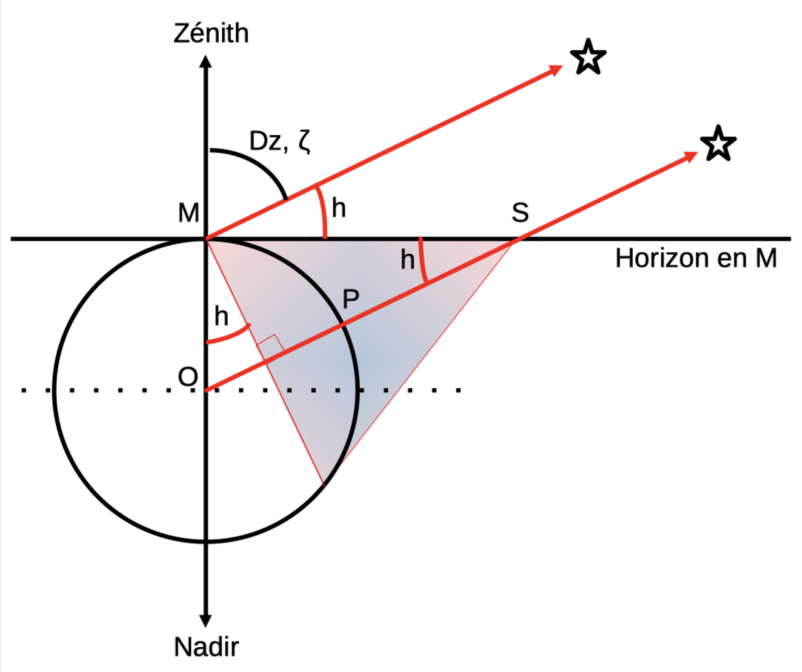
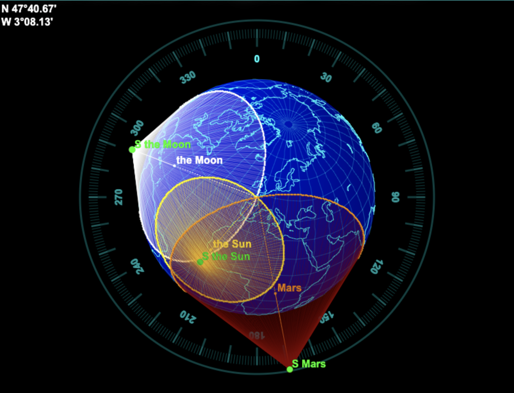
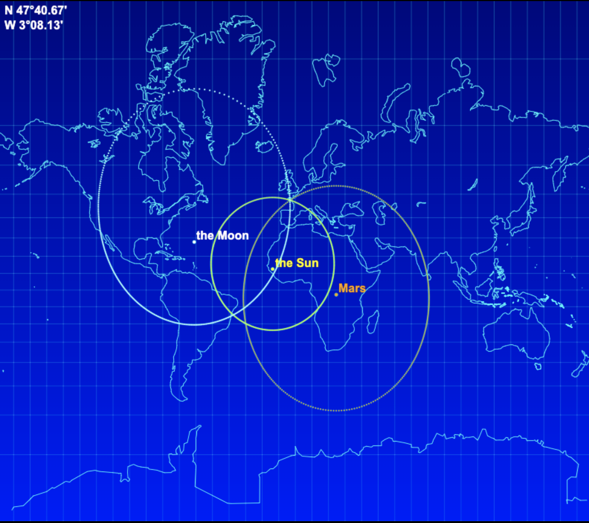
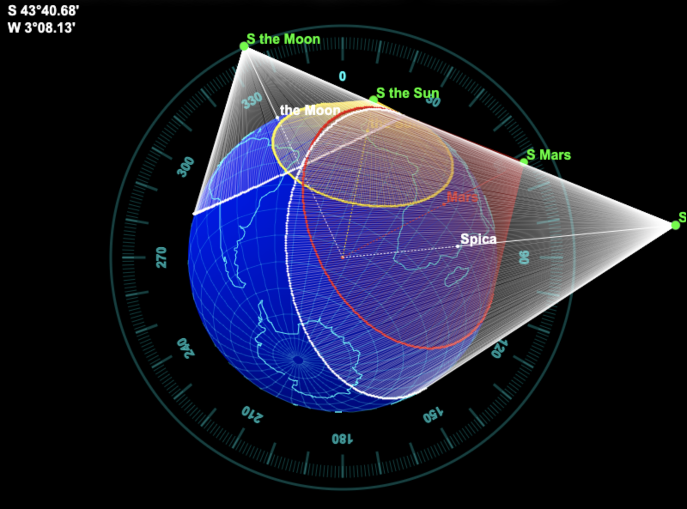
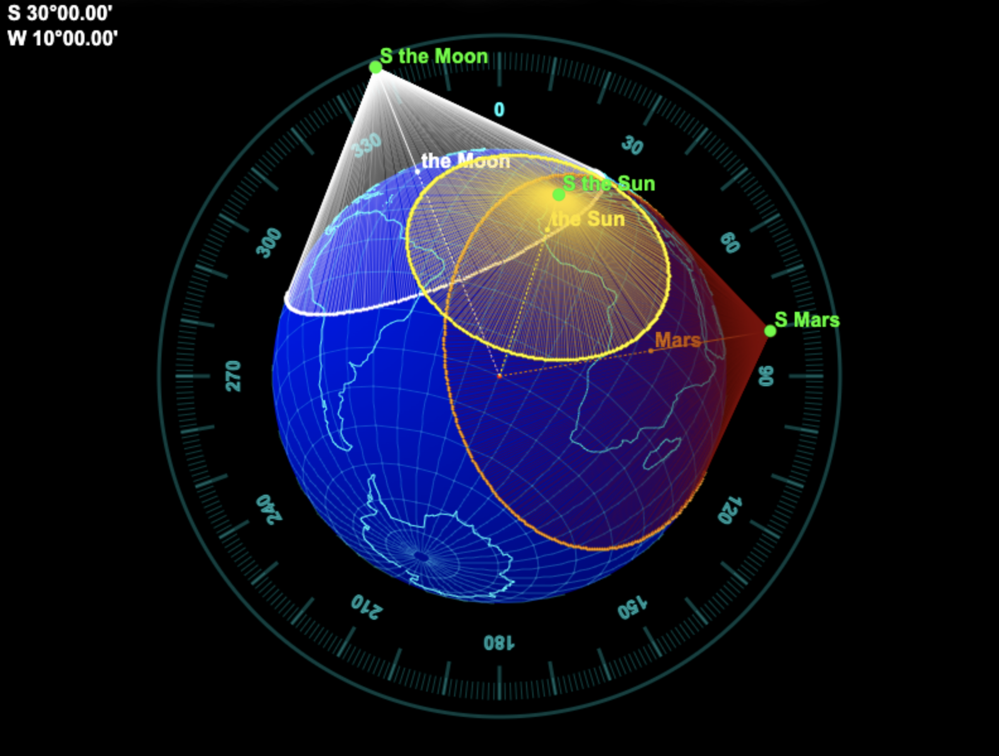
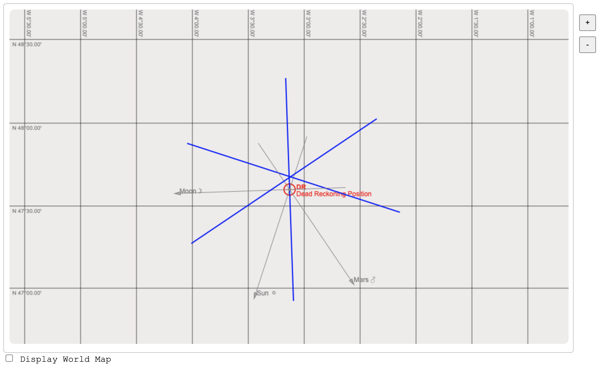

# M&eacute;thode du Plan des Sommets (MPS)
M&eacute;thode &eacute;labor&eacute;e par Yves Robin-Jouan, en 1995-96.

Ceci est un chantier... On veut voir si cette m&eacute;thode est applicable manuellememt - sans recours &agrave; l'informatique.  
&Agrave; la diff&eacute;rence de la methode des droites de hauteur (Marcq Saint-Hilaire, 1875), cette m&eacute;thode pr&eacute;sente l'avantage de ne pas avoir &agrave; recourir &agrave; une position estim&eacute;e. L'inconv&eacute;nient potentiel pourrait &ecirc;tre la quantit&eacute; de calculs &agrave; mettre en &oelig;uvre...  
C'est ce qu'on se propose de voir ici.

Le principe de la m&eacute;thode repose sur les assertions suivantes :
- &Agrave; un instant donn&eacute;, si on a observ&eacute; un astre &agrave; une hauteur donn&eacute;e, on est capable de d&eacute;terminer
le lieu des points qui voient cet astre &agrave; cette hauteur (c'est le tr&egrave;s fameux "cercle d'&eacute;gales hauteurs").
- En observant plusieurs astres, il s'agit de d&eacute;terminer le lieu des points communs (id&eacute;alement **_du_** ppoint commun) aux diff&eacute;rents cercles de hauteur ainsi obtenus, qui 
devrait en toute logique correspondre &agrave; la position de l'observateur.

L'&eacute;quation &agrave; r&eacute;soudre n'est pas triviale..., c'est bien l'objet de ce document.

Mais on voit bien ici que la d&eacute;termination ces cercles d'&eacute;gales hauteurs ne fait en aucun cas intervenir
une position estim&eacute;e. On a juste besoin ici de connaitre :
- La hauteur observ&eacute;e de l'astre
- L'heure de l'observation - destin&eacute;e &agrave; d&eacute;terminer la position de l'astre observ&eacute; (position g&eacute;ographique instantan&eacute;e).

> _Note_ :  
> Toutes les figures de ce document - &agrave; l'exception de la premi&egrave;re - sont r&eacute;alis&eacute;es
> &agrave; partir de WebComponents, disponibles dans le pr&eacute;sent projet. 

> _Note_ :  
> Dans cet exemple, on utilise Java pour les calculs d'&eacute;ph&eacute;m&eacute;rides en backend. Le code Java
> qui permet ces calculs est disponible dans ce r&eacute;f&eacute;rentiel (voir `astro-computer:AstroComputer`).
> Il l'est aussi dans d'autres langages : 
> - C
> - Golang
> - php
> - Python
> - Scala
> - ES6 (aka JavaScript)
> - Kotlin (en acc&eacute;dant aux classes Java compil&eacute;es)  
> 
> La partie frontend est r&eacute;alis&eacute;e en HTML5/CSS3/ES6, avec des WebComponents, d&eacute;j&agrave; mentionn&eacute;s ci-dessus.

## Rappels...

### Hauteur et azimut d'un astre
Dans les formules suivantes : 
- `D` est la d&eacute;clinaison de l'astre observ&eacute;
- `L` est la latitude de l'observateur
- `G` est la longitude de l'observateur
- `AHG` est l'Angle Horaire a Greenwich de l'astre
- `AHL` est l'Angle Horaire Local de l'astre (lequel d&eacute;pend de `AHG` et `G`)

Calcul de la hauteur d'un astre &agrave; partir de la position de l'observateur :

$$
He = \arcsin \left( (\sin(L).\sin(D)) + (\cos(L).\cos(D).\cos(AHL)) \right) 
$$

Calcul de l'azimut d'un astre &agrave; partir de la position de l'observateur :

$$
Z = \arctan \left( \dfrac{\sin(AHL)}{(\cos(L).\tan(D)) - (\sin(L).\cos(AHL))}\right) 
$$

Voir une impl&eacute;mentation en Java [ici](https://github.com/OlivierLD/ROB/blob/master/astro-computer/AstroUtilities/src/main/java/calc/CelestialDeadReckoning.java).

### Haversine
La formule de haversine permet de conna&icirc;tre, d'un point donn&eacute; &agrave; un autre :
- la distance (GC, orthodromique) qui les s&eacute;pare
- l'angle de route initial

- Le point de d&eacute;part est `(L1, G1)`
- Le point d'arriv&eacute;e est `(L2, G2)`

```
a = sin((G2 - G1) / 2)^2 + cos(G1) * cos(G2) * sin((L2 - L1) / 2)^2

distance = 2 * atan2(sqrt(a), sqrt(1 - a))
```
<!-- With LaTeX -->
&eacute;crit aussi <!-- inline LaTeX not well suoopterd in md files... -->

$$
a = sin^2\left(\dfrac{G2 - G1} {2}\right) + cos G1 . cos G2 . sin^2\left(\dfrac{L2 - L1} {2}\right)
$$

$$
c = 2 . atan2(\sqrt{a}, \sqrt{(1-a)})) 
$$

$$
distance = R . c 
$$

o&ugrave; R est le rayon de la Terre.

La formule de haversine _inverse_ permet de conna&icirc;tre la position qu'on atteind :
- en partant d'un point donn&eacute;
- en suivant un arc de grand cercle (aka orthodromie)
- avec un angle de route initial donn&eacute;

Voir une impl&eacute;mentation en Java [ici](https://github.com/OlivierLD/ROB/blob/577f32344e8e486e0d44b7bff9a4a47e100e6551/astro-computer/AstroUtilities/src/main/java/calc/GeomUtil.java#L82) et autour, m&eacute;thode `haversineRaw`.

&Agrave; ce sujet, les documents [Haversine Formula](https://en.wikipedia.org/wiki/Haversine_formula) et [Formule de Haversine](https://fr.wikipedia.org/wiki/Formule_de_haversine) (aka Sinus Verse)
m&eacute;ritent un coup d'&oelig;il.

$$
finalLat = \arcsin(\sin(startLat) * \cos(dist)) + (\cos(startLat) * \sin(dist) * \cos(heading))
$$

$$
finalLng = startLng + atan2(\sin(heading) * \sin(dist) * \cos(startLat), \cos(dist) - (\sin(startLat) * \sin(finalLat)))
$$

_Note:_ 

`atan2` returns an angle between -&Pi; and +&Pi;, as opposed to `atan`, that returns an angle between -&Pi; / 2 and +&Pi; / 2.

---

- Voir [Haversine Formula](https://en.wikipedia.org/wiki/Haversine_formula)
- Voir [Formule de Haversine](https://fr.wikipedia.org/wiki/Formule_de_haversine)
- Voir [ce document](https://www.aftopo.org/download.php?type=pdf&matricule=aHR0cHM6Ly93d3cuYWZ0b3BvLm9yZy93cC1jb250ZW50L3VwbG9hZHMvYXJ0aWNsZXMvcGRmL2FydGljbGUxNzYwNy5wZGY=)
- Voir [Navigation aux Astres et aux Satellites](https://navastro.fr/index.html?p659.html)
- Voir [ici](https://les-mathematiques.net/vanilla/discussion/59651/astronomie-plan-des-sommets) aussi.
- Pour faire des tests avec des donn&eacute;es valides (&eacute;ph&eacute;m&eacute;rides et autres) voir ces pages, avec des composants graphiques.
  - https://olivierld.github.io/web.stuff/astro/index_01.html
  - https://olivierld.github.io/web.stuff/astro/index_02.html
  - https://olivierld.github.io/web.stuff/astro/index_03.html

#### Quelques angles et d&eacute;finitions utiles pour la suite...

<!--  -->

`M` est la position de l'observateur sur la Terre.  
La hauteur observ&eacute;e en `M` de l'astre est not&eacute;e `h`. Notez les autres endroits o&ugrave; cette hauteur `h` est reproduite, &agrave; partir de `S`, et &agrave; partir de `M` vers `O`.  
La hauteur observ&eacute;e est l'angle que fait l'astre avec l'horizon.  
L'angle que fait l'astre observ&eacute; avec le z&eacute;nith (la verticale de l'observateur) est le compl&eacute;ment de cette hauteur, `90 - h`, et s'appelle
la Distance Z&eacute;nithale, not&eacute;e aussi &zeta;, la lettre grecque "dzeta" (&ccedil;a commence par "dz"...).  

> _Note_: sur la figure, la direction de l'astre &agrave; partir de M est identique &agrave; sa direction &agrave; partir de O.
> Ceci convient &agrave; un astre tr&egrave;s &eacute;loign&eacute; de l'observateur. &Ccedil;a ne serait pas applicable pour un satellite.

Pour le c&ocirc;ne, l'angle en O (MOP) est `(90° - h)`.  
La distance (grand cercle) `M - P` est donc `(90° - h) * 60.0` nm.

La distance `MS` est `r * (1 / tg(h))`, o&ugrave; `r` est le rayon de la Terre.  
Le rayon de la base du cone est `r * cos(h)`.  
La distance du centre le la Terre `O` au sommet `S` est `sqrt(MS^2 + r^2)`, not&eacute; aussi

$$
  \sqrt{FS^2 + r^2}
$$

La distance `OS` est `MS / cos(h)`.   
Comme `MS` = `1 / tg(h)`, `OS` s'&eacute;crit aussi `(cos(h) / sin(h)) / cos(h)`, soit
`1 / sin(h)`.  
`OS` = `1 / sin(h)`.  
La distance `PS` est &eacute;gale &agrave; `OS - r`.    
Donc `PS = (1 / sin(h)) - r`.

---

## Le principe  
- On est capable de d&eacute;terminer les points d'un cercle d&eacute;fini par les points qui voient un astre &agrave; la m&ecirc;me hauteur, &agrave; un instant donn&eacute;.
- Avec plusieurs observations (plusieurs astres), l'observateur se trouve &agrave; l'intersection de ces cercles.
- Pour chaque astre, les param&egrave;tres de l'&eacute;quation sont :
  - La hauteur de l'astre observ&eacute;
  - L'heure de l'observation
- On en d&eacute;duit :
  - Avec les &eacute;ph&eacute;m&eacute;rides, la position du point Pg de l'astre (D&eacute;clinaison et AHG), le centre du cercle.
  - Par le calcul, le lieu des points (un cercle centr&eacute; sur ce Pg) qui voient l'astre &agrave; la m&ecirc;me hauteur (celle qu'on a observ&eacute;e).

Avec plus d'un astre, la position de l'observateur - celle qu'on cherche - est &agrave; l'intersection de ces cercles.

_Note_ : On fait figurer plusieurs astres dans les diagrammes ci-dessous - le Soleil, la Lune, Mars, Spica (&alpha; Libra). C'est juste pour l'exemple. Il est hautement improbable 
de les voir tous en m&ecirc;me temps.

_Une autre Note_ : Le sommet de tous les c&ocirc;nes, et la position de l'observateur, se trouvent tous dans le m&ecirc;me plan.
D'o&ugrave; - sans doute - le nom de la m&eacute;thode...



Voici la m&ecirc;me figure, d'un autre point de vue.  
On note que - comme attendu - les g&eacute;n&eacute;ratrices des c&ocirc;nes tangentent la Terre &agrave; la base du c&ocirc;ne, _sur_ le cercle d'&eacute;gales hauteurs.  



Les cercles se croisent &agrave; la position de l'observateur. Ainsi, la position de l'observateur et
toutes celles des sommets des c&ocirc;nes sont dans le m&ecirc;me plan. Et elles ne sont pas - loin de l&agrave; - 
n&eacute;cessairement align&eacute;es.



L'&eacute;chelle des cartes pose ici un premier probl&egrave;me. Voici le contexte ci-dessus repr&eacute;sent&eacute; sur une carte 
Mercator.  
Deux premiers &eacute;l&eacute;ments sont &agrave; noter :
- Les cercles de hauteur ne sont pas ronds sur cette projection.
- Ils peuvent &ecirc;tre &eacute;normes.

Ils ne sont ronds ni sur une carte Mercator :


Ni sur une carte Anaximandre :


En fait, ils ne sont ronds que sur un globe.

## Demo (comme ci-dessus)

### 1 - G&eacute;n&eacute;rer les data
&Agrave; partir du r&eacute;pertoire `MPS` :
```
$ ./generate.cones.sh
```
Ce script execute le code Java de la classe `mps.Context01.java`. Ceux que &ccedil;a int&eacute;resse iront voir le code.   
Ceci g&eacute;n&egrave;re les fichiers `.json` dans le r&eacute;pertoire `web/json`, qui seront utilis&eacute;s &agrave; partir d'une page HTML.

### 2 - Affichage des diagrammes
&Agrave; partir du r&eacute;pertoire `MPS/web` :
````
$ npm start
````
Ceci suppose que `nodeJS` est disponible sur le syst&egrave;me.  
Puis &agrave; partir d'un browser, acc&eacute;der &agrave; `http://localhost:8080/index.html`.  

Les diagrammes ci-dessus sont affich&eacute;s lorsqu'on utilise le bouton `SET POSITION`, visible 
sous la rubrique `Position on Earth`.

## En pratique
Vaste sujet... &Ccedil;a vient !

#### Une remarque &agrave; propos du point par droites de hauteurs, de Marcq Saint-Hilaire
Pour mettre cette m&eacute;thode en &oelig;uvre, on mesure la hauteur d'un astre au sextant, qu'on compare &agrave; ce qu'on
devrait observer si on &eacute;tait l&agrave; o&ugrave; l'estime nous situe, cette hauteur "&eacute;stim&eacute;e" est calcul&eacute;e gr&acirc;ce aux &eacute;ph&eacute;m&eacute;rides et aux tables de Dieumegard, pour l'heure (exacte)
de l'observation.  
La droite de hauteur obtenue est ensuite port&eacute;e sur la carte, perpendiculairement &agrave; l'azimut de 
l'astre observ&eacute;, lequel est _**calcul&eacute;**_ (par les tables de Bataille), _**et non pas observ&eacute;**_ !  
Ceci justifie - entre autres - la raison pour laquelle un intercept de plus de 15 miles est consid&eacute;r&eacute; comme suspect. Le
calcul de l'azimut se faisant &agrave; partir de la position estim&eacute;e, une "mauvaise" estime donne lieu
&agrave; un azimut potentiellement &eacute;rron&eacute;.

### Une premi&egrave;re approche...
On va partir - pour l'instant - d'une position estim&eacute;e, d'o&ugrave; on pourra calculer l'azimut des astres observ&eacute;s &agrave; l'aide des tables de Bataille.  
On pourra alors calculer le point du cercle d'&eacute;gales hauteur (de cet astre) pour cet azimut.

#### Exemple
```
On 2025-Aug-20 10:40:31 UTC: 
the Sun Decl 12º16.80'N, GHA 339º17.40', from 47º40.66'N / 3º08.14'W.
Seeing the Sun at altitude 49º22.52', in the 142.65º
```

### Une approche graphique ?
Le challenge ici est donc de trouver pour _**tous**_ les cercles le (ou les) point(s) commun(s).  
On peut essayer graphiquement, pour la latitude, puis pour la longitude...

Mais le calcul des coordonn&eacute;es de chaque cercle (ou c&ocirc;ne) requiert des ressources consid&eacute;rables (si on fait &ccedil;a manuellement)...

Si on part d'une position estim&eacute;e, on revient &agrave; un point par droites de hauteurs classique (Saint-Hilaire).
Si on a trois astres, on a trois droites, et on est &agrave; leur intersection...

D'o&ugrave; la question : _Quel est alors dans ce contexte l'int&eacute;ret de la m&eacute;thode du plan des sommets ?_

La r&eacute;solution du probl&egrave;me ci-dessus par les droites de hauteur produit la figure suivante :  

Le tooltip sur la figure repr&eacute;sente les coordonn&eacute;es de l'intersection des droites de hauteur (en bleu).  
Et ceci est r&eacute;alisable sans informatique, ni m&ecirc;me &eacute;lectricit&eacute;.

### Approche it&eacute;rative
Le probl&egrave;me est que deux cercles peuvent avoir deux intersections...
C'est ce qui est restitu&eacute; ci-dessous, dans les lignes `1st Position` et 
`2nd Position`.
Il y a un premier test qui semble fonctionner, voir `mps.pg.PlayGround01`.  
On proc&egrave;de en plusieurs fois - ambiance m&eacute;thode de Newton. &Agrave; valider.

#### Exemple (see the code for details)

```
$ ./test.one.sh 
OK. Proceeding with user's input.
1st Position between 2º56.79'N / 19º14.49'W and 2º56.79'N / 19º14.49'W, dist 0.00 nm.
2nd Position between 47º40.66'N / 3º08.14'W and 47º40.66'N / 3º08.14'W, dist 0.00 nm.
Done
$ 
```
On peut aussi fournir les param&egrave;tres directement sur la command line:
```
$ ./test.one.sh --time-1:2025-08-20T10:40:31 --gha-1:339º17.40 --decl-1:N12º16.80 --alt-1:49º22.52 --time-2:2025-08-20T10:40:31 --alt-2:66º33.85 --gha-2:13º41.85 --decl-2:N25º46.13 --verbose:false
OK. Proceeding with user's input.
1st Position between 2º56.79'N / 19º14.49'W and 2º56.79'N / 19º14.49'W, dist 0.00 nm.
2nd Position between 47º40.66'N / 3º08.14'W and 47º40.66'N / 3º08.14'W, dist 0.00 nm.
Done
$ 
```

### &Eacute;quation de la distance entre les points de deux points de deux cercles...
Reste &agrave; faire...  
Il doit y avoir un - voire deux - point(s) ou cette diff&eacute;rence est nulle.

---

_&Agrave; suivre..._

---