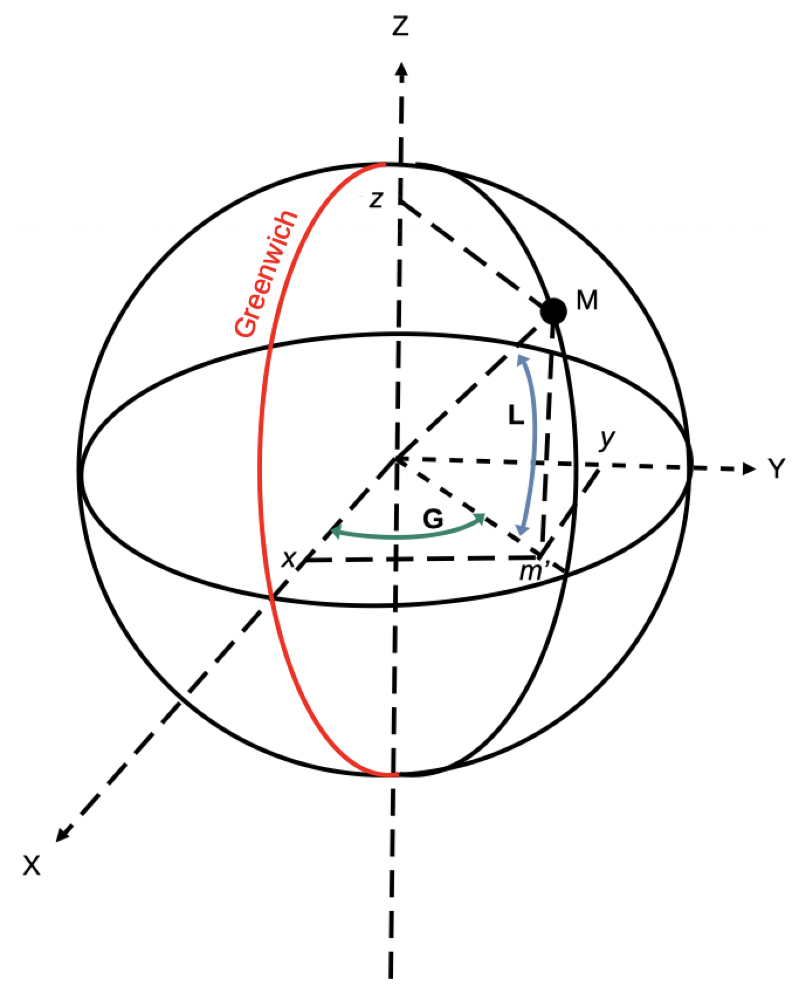

# Jupyter Notebooks

Start the Jupyter server:
```
$ cd notebooks
$ jupyter notebook
```
If you are running from a Graphical Desktop, the last command will open your default browser.

To use the jar generated by the build, the first code line of your notebooks should be like
```
%classpath add jar "../build/libs/MPS-1.0-all.jar"
```

## Rep&egrave;re ECEF (Earth Centered Earth Fixed)

<!--  -->


```
m' = r . cos L
x = r . cos L . cos G
y = r . cos L . sin G
z = r . sin L
```
o&ugrave; :
- r est le rayon de la Terre
- L est la latitude
- G est la longitude

Si on a L = N 47&deg;40.66' (47.677667) et G = W 3&deg;08.14' (-3.135667), on a ainsi
```
x = 1 . cos(47.677667) . cos(-3.135667)
y = 1 . cos(47.677667) . sin(-3.135667)
z = 1 . sin(47.677667)
```
soit
```
x = 1 . 0.67330076 . 0.99850281 = 0.6722927
y = 1 . 0.67330076 . -0.0547004 = -0.03682982
z = 1 . 0.73936871 
```
Et on a bien

$$ 
x^2 + y^2 + z^2 = 1 
$$

```
x^2 + y^2 + z^2 = 1
```


--- 