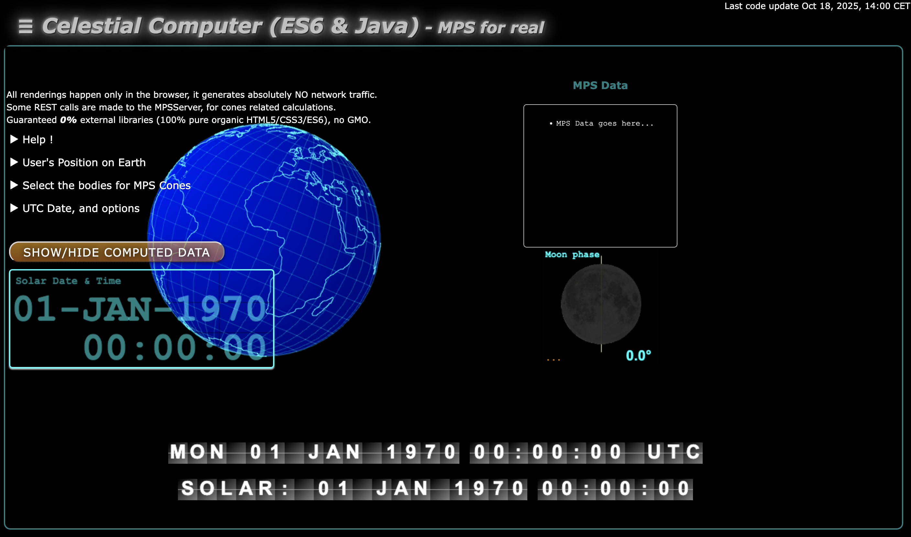
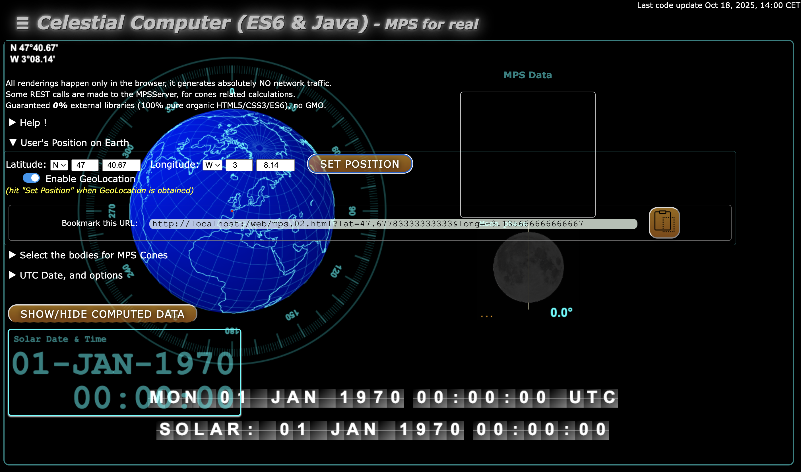
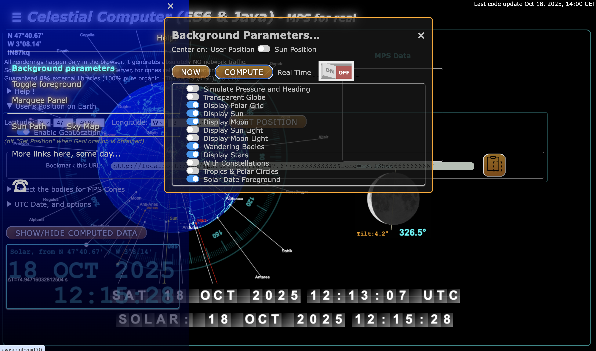
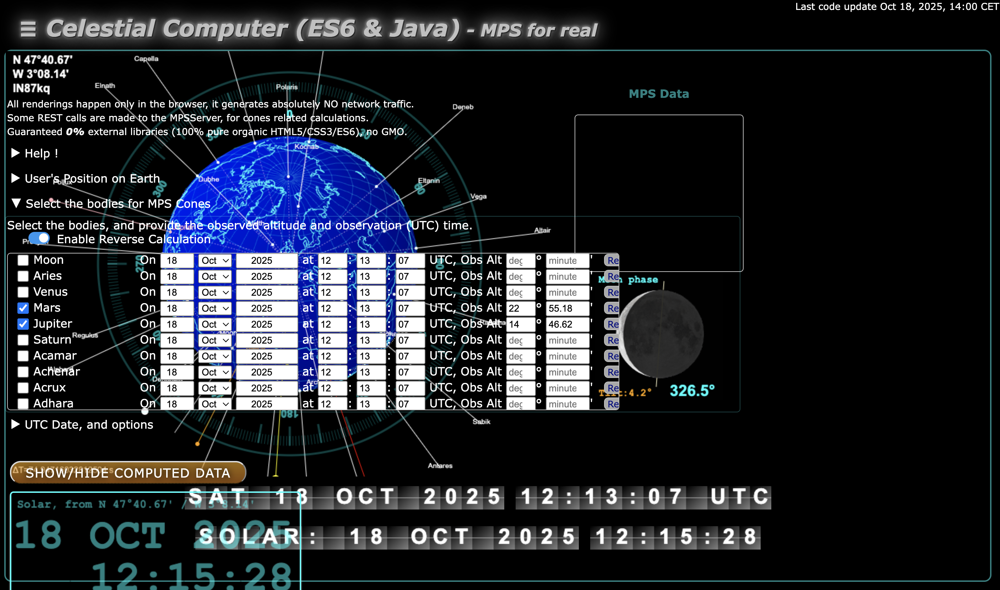
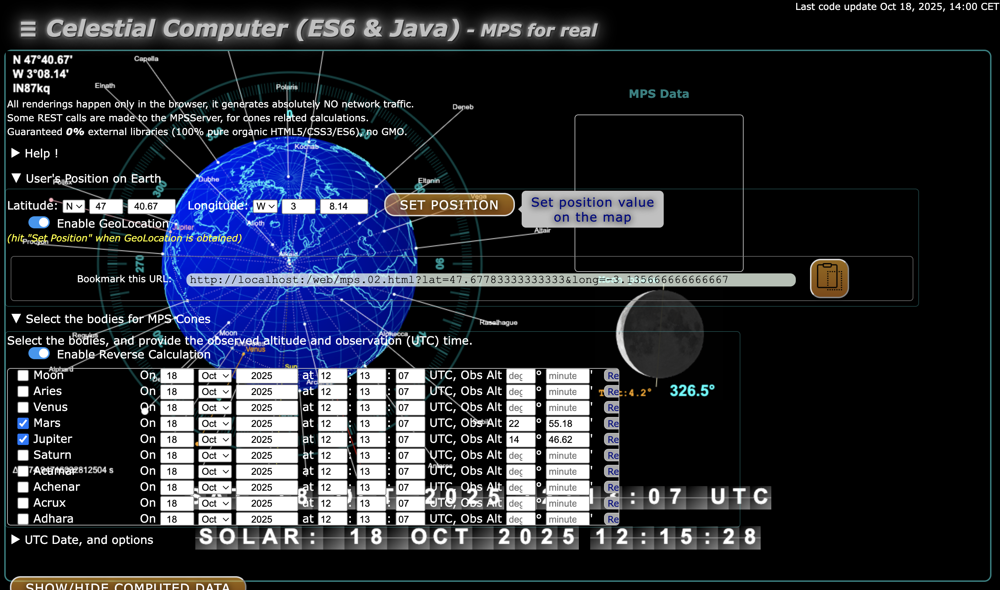
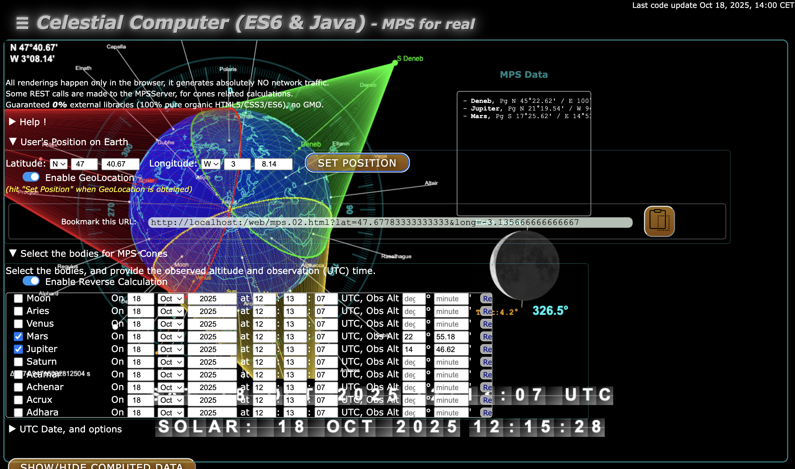
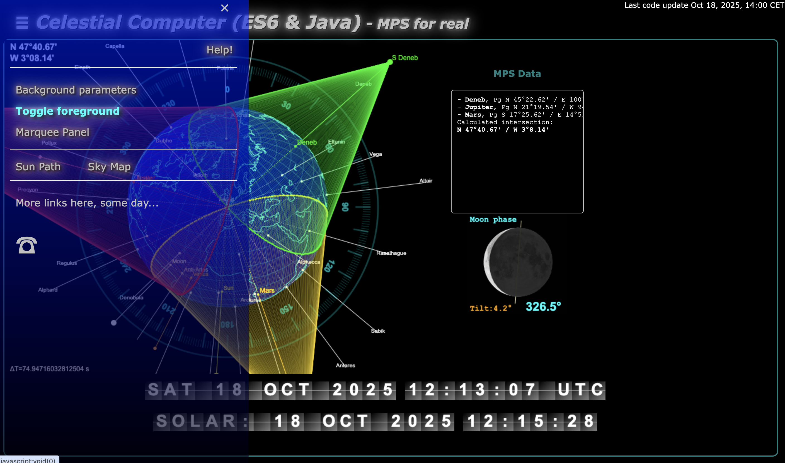
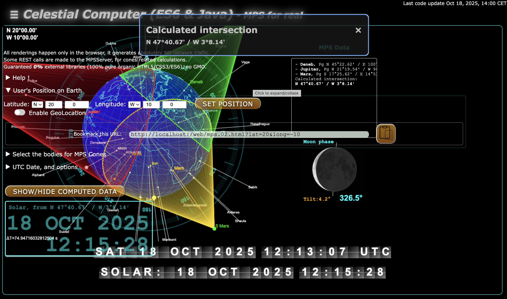

# An example

## Usage of the page `web/mps.02.html`

The code needs to be compiled, and the server needs to be launched (as explained in the [README.md](README.md)).

First, you load the page `mps.02.html`

To have an idea of what's going on, set the user's position (use "Enable GoeLocation" if you have an Internet connection), and hit the "Set Position" button.

To see what bodies would be available, use the "Background parameters" menu available in the sliding navigation bar, hit the "Compute" button. 

Next, you need to choose what body(ies) to use. Here Mars, Jupiter, and Deneb.  
_Note:_ if you enable the "Reverse Calculation", you will have the possibility to calculate what you should observe from the user's position, at the given time.  
Do check the boxes corresponding to the bodies you want to use.

The MPS calculation will be done during a repaint. It can be triggered by the "Set Position" button. 

First, the cones are displayed...

And finally, the calculated position is displayed.

You can toggle the foreground for a better visibility.

And you can change the user's position on Earth, to have another point of view on the cones.

---