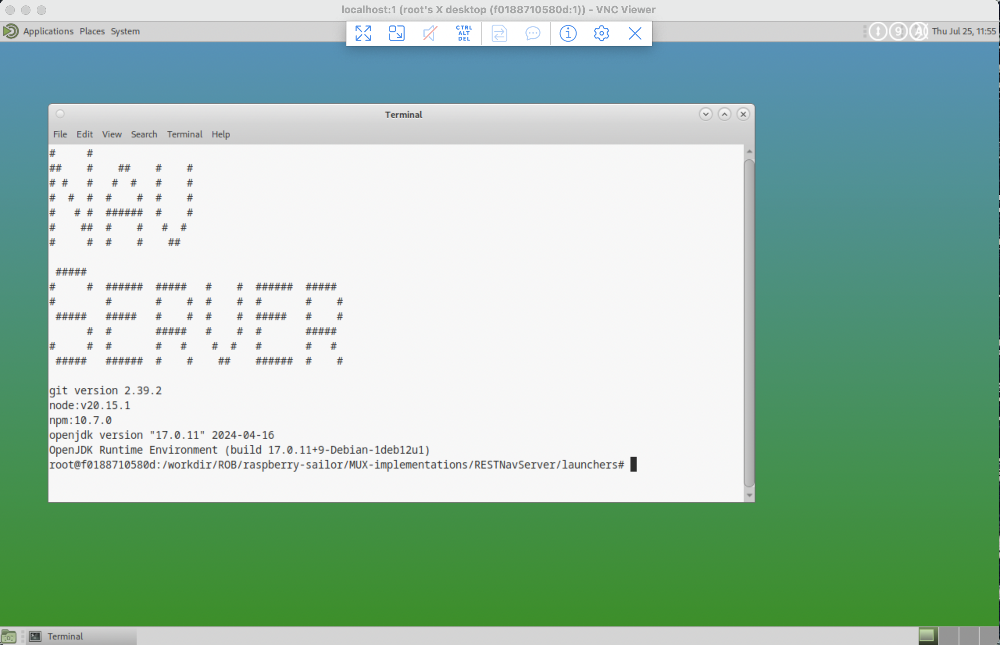

# Docker


Here we build a docker image, to run the demo script, the one available in
`raspberry-sailor/MUX-implementations/RESTNavServer`.

The following instructions require `docker` to be installed on the machine you run them from..., obviously.

## To build the image
Run the script
```
$ ./build.image.sh
```
This builds an image named `mux-sample-vnc:latest`.

## Run a container from the image
From this image, you can run a container:  
```
$ docker run -it --name mux-desktop --rm -p 5901:5901 -p 9999:9999 -e USER=root mux-sample-vnc:latest /bin/bash
```
The container will be here named `mux-desktop`, and you would be seeing a terminal:  
```
#     #
##    #    ##    #    #
# #   #   #  #   #    #
#  #  #  #    #  #    #
#   # #  ######  #    #
#    ##  #    #   #  #
#     #  #    #    ##

 #####
#     #  ######  #####   #    #  ######  #####
#        #       #    #  #    #  #       #    #
 #####   #####   #    #  #    #  #####   #    #
      #  #       #####   #    #  #       #####
#     #  #       #   #    #  #   #       #   #
 #####   ######  #    #    ##    ######  #    #

git version 2.39.2
node:v20.15.1
npm:10.7.0
openjdk version "17.0.11" 2024-04-16
OpenJDK Runtime Environment (build 17.0.11+9-Debian-1deb12u1)
OpenJDK 64-Bit Server VM (build 17.0.11+9-Debian-1deb12u1, mixed mode, sharing)
root@f0188710580d:/workdir/ROB/raspberry-sailor/MUX-implementations/RESTNavServer/launchers# 
```
#### Small extra
You might want to install `netstat:
```
$ apt-get install net-tools
```

### Demo script
From there, you can start the demo script:
```
$ ./demoLaucher.sh
>> Note ⚠️ : Optional Script Parameters : 
    starting the server, like ./demoLauncher.sh --browser:[N]|Y --proxy:[N]|Y --option:1 --nohup:[N]|Y --http-port:9999 --cmd-verbose:[N]|Y --help -h help ?
    --option:X will not prompt the user for his choice, it will go directly for it.
    --nohup:Y will launch some commands with nohup (see the script for details)
+-----------------------------------------------------------------------------------------------------------------------------------------------------------------------------------+
|               N A V   S E R V E R   -   D E M O   L A U N C H E R  🚀                                                                                                             |
+-----------------------------------------------------------------------------------------+-----------------------------------------------------------------------------------------+
|  P. Launch proxy CLI, to visualize HTTP & REST traffic 🔎                               |                                                                                         |
| PG. Launch proxy GUI, to visualize HTTP & REST traffic 🕵️‍                                |                                                                                         |
+------------------------------------+----------------------------------------------------+-----------------------------------------------------------------------------------------+
|  J. JConsole (JVM Monitoring) 📡   |  JV. JVisualVM 📡                                  |                                                                                         |
|                                    | - Note: for remote monitoring, jstatd must be      |                                                                                         |
|                                    |         running on the remote machine.             |                                                                                         |
|                                    |     Enter 'JVH' for some help.                     |                                                                                         |
+------------------------------------+----------------------------------------------------+-----------------------------------------------------------------------------------------+
|  0. Pure ES6 Celestial Context. External (and demanding on the browser). Requires Internet Connection.                                                                            |
+------------------------------------+----------------------------------------------------+-----------------------------------------------------------------------------------------+
|  1. Time simulated by a ZDA generator; HTTP Server, rich Web UI. Does not require a GPS |  1a. Time from a TCP ZDA generator (port 7002), TCP Server, rich Web UI.                |
|                                                                                         |             Does not require a GPS                                                      |
|  2. Interactive Time (user-set), HTTP Server, rich Web UI. Does not require a GPS       |  3. Home Weather Station data                                                           |
|  4. With GPS and NMEA data, waits for the RMC sentence to be active to begin logging    |  5. Like option '1', but with 'Sun Flower' option                                       |
|                     (Check your GPS connection setting in nmea.mux.gps.properties file) |                                                                                         |
|  6. Replay logged kayak data (Drakes Estero)                                            |  6b. Replay logged kayak data (Ria d'Etel. GPS - Satellites - PRMSL, Air Temp, Hum)     |
|  7. Replay logged driving data (with a Maps)                                            |  8.  Replay logged kayak data, ANSI console display                                     |
|  9. Replay logged sailing data (Bora-Bora - Tongareva), TCP & GPSd forwarders (Big file)|  9b. Replay logged sailing data (China Camp - Oyster Point),                            |
|                                                                                         |             (there is some current in that one, it's in the SF Bay)                     |
|  9c. Replay logged sailing data (Nuku-Hiva - Rangiroa), ANSI console display (Big file) |  9d. Replay logged sailing data (Oyster Point), heading back in.                        |
|                                                                                         |             (requires a NodeJS WebSocket server to be running)                          |
|  9e. Replay logged sailing data (Bora-Bora - Tongareva), forwarders TCP, WS, GPSd       |                                                                                         |
| 10. Full Nav Server Home Page. NMEA, Tides, Weather Wizard, Almanacs, etc. Data replay. | 11. Same as 10, with proxy.                                                             |
|     - See or modify nmea.mux.properties for details.                                    |     - See or modify nmea.mux.properties for details.                                    |
| 12. With 2 input serial ports.                                                          | 13. AIS Tests. With markers (Dives).                                                    |
|     - See or modify nmea.mux.2.serial.yaml for details. Or try option H:12              | 13b. GPS, + AIS data from sinagot.net (demanding...).                                   |
|                                                                                         | 13c. GPS, Chartless Map (Etel-Groix).                                                   |
|                                                                                         | 13d. GPS, AIS, Chartless Map (Etel-Groix). (demanding...)                               |
|                                                                                         | 13e. GPS, Chartless Map (La Trinité-Groix).                                             |
+-----------------------------------------------------------------------------------------+-----------------------------------------------------------------------------------------+
| 20.  Get Data Cache (curl)                                                              | 20b. Get REST operations list (curl)                                                    |
+-----------------------------------------------------------------------------------------+-----------------------------------------------------------------------------------------+
|  S. Show NavServer process(es) ⚙️                                                        | SP. Show proxy process(es) ⚙️                                                            |
|  K. Kill all running Multiplexers                                                       |                                                                                         |
+-----------------------------------------------------------------------------------------+-----------------------------------------------------------------------------------------+
| >> Hint: use './killns.sh' to stop any running NavServer 💣                                                                                                                       |
| >> Hint: use './killproxy.sh' to stop any running Proxy Server 💣                                                                                                                 |
+-----------------------------------------------------------------------------------------------------------------------------------------------------------------------------------+
|  >> To get help on option X, type H:X (like H:11, H:20b, etc)                                                                                                                     |
+-----------------------------------------------------------------------------------------------------------------------------------------------------------------------------------+
|  Q. Quit ❎                                                                                                                                                                       |
+-----------------------------------------------------------------------------------------------------------------------------------------------------------------------------------+
 ==> You choose: 
```
And you can choose the option you want!

As seen above, the port `9999` is exposed.  
This means that you can reach it. Depending on the option you chose for the demo, in a browser (from the machine you started docker, for example),
you can run `http://localhost:9999/web/index.html`, and start from there.

### Graphical Desktop
From the same docker terminal as above, you can also start a VNC server, that will give you access to a graphical desktop.  
```
$ vncserver :1 -geometry 1280x800 -depth 24
```
The server is using port `5901`, also exposed.   
`-geometry` can be `1280x800`, `1440x900`, `1680x1050`, etc).  
Then, from a `vncviewer` you can get connected to the server. 
Use - for example - `localhost:1`; password is `mate`.



### And then
See for yourself !  
`http://localhost:9999/web/index.html` is a good way to get started, once the `/demoLauncher.sh` has been executed.

---

