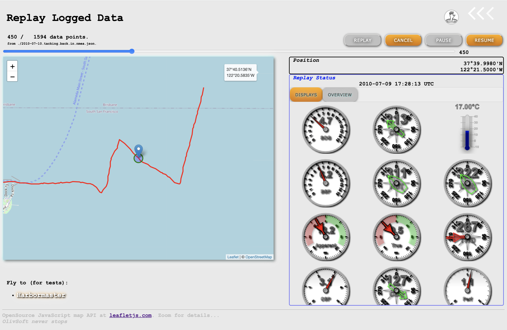
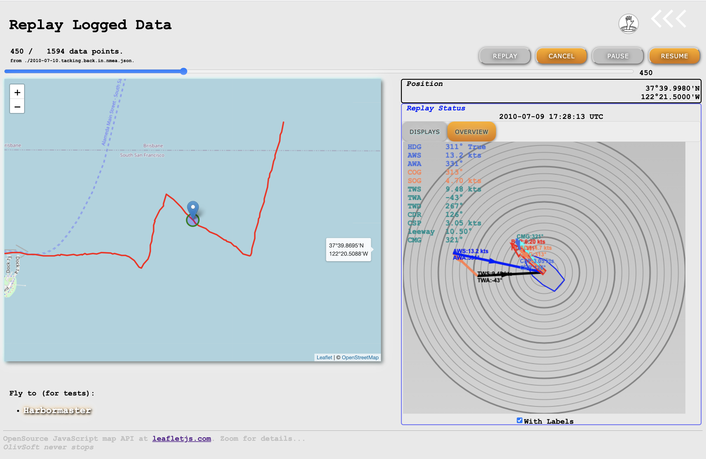

# Miscellaneous Examples
Web Interfaces, REST services, Shell Scripts, etc.

## Leaflet Analysis
A Simple Web UI to visualize data logged when sailing, using [LeafLet.js](http://leafletjs.com/) and WebComponents.

Logged data (NMEA-0183) are transformed using `NMEAtoJSONPosPlus.java`, launched by the script 
`log.to.leaflet.sh`, with possible CLI parameters:
```
$ ./log.to.leaflet.sh --file-name:2010-07-10.tacking.back.in.nmea \
                      --archive-name:~/repos/ROB/raspberry-sailor/NMEA-multiplexer/sample-data/logged.data.zip \
                      --dev-curve:~/repos/ROB/raspberry-sailor/MUX-implementations/RESTNavServer/launchers/dp_2011_04_15.csv \
                      --polar-file:~/repos/ROB/raspberry-sailor/MUX-implementations/RESTNavServer/launchers/sample.data/polars/CheoyLee42.polar-coeff \
                      --current-buffer-length:600000  \
                      --output-file-name:~/repos/ROB/raspberry-sailor/MUX-implementations/MISCSamples/LeafLetAnalysis/2010-07-10.tacking.back.in.nmea.json \ 
                      --max-leeway:12 \
                      --aws-coeff:1.0
```
Explanations about the various parameters can be found in the code.

To define a track, LeafLet expects a JSON structure like
```javascript
let latlngs = [
          [45.51, -122.68],
          [37.77, -122.43],
          [34.04, -118.2]
];
```
or
```javascript
let latlngs = [
          { "lat": 45.51, "lng": -122.68 },
          { "lat": 37.77, "lng": -122.43 },
          { "lat": 34.04, "lng": -118.2 }
];
```

The cool thing is that you can add other members to the elements of those arrays.  
And this is what `NMEAtoJSONPosPlus.java` is doing.  
Look into `MISCSamples/LeafLetAnalysis/2010-07-10.tacking.back.in.nmea.json` for an example, elements look like this:
```json
[
  . . ., {
    "lat": 37.49418333333333,
    "lng": -122.48435,
    "gridSquare": "CM87sl",
    "sog": 2.9,
    "cog": 315,
    "rmcDate": "2014-08-30 22:12:40 UTC",
    "hdt": 302.87324198654164,
    "hdc": 297,
    "cmg": 314.46435190201043,
    "leeway": 11.59110991546882,
    "decl": 15,
    "dev": -9.126758013458364,
    "bsp": 2.9,
    "mwt": 16.5,
    "awa": 345,
    "aws": 10.4,
    "twa": -24.598581351163375,
    "tws": 7.930019063678373,
    "twd": 278,
    "csp": 0.4332719680859111,
    "cdr": 346.02936851584127,
    "perf": 0.9131067216014545
  }, . . .
]
```

To see the Web UI, start a NodeJS server, using `npm start` (from the `MISCSamples` directory),
and reach <http://localhost:8080/LeafLetAnalysis/one.html> from a browser.

The UI should be clear enough for you to deal with it!

| Displays                           | Overview                           |
|:-----------------------------------|:-----------------------------------|
|  |  |

Displays on the left screenshot are:
- `SOG`
- `COG`
- Water Temperature
- `BSP`
- True Heading
- `CMG`
- Apparent Wind Speed and Angle
- True Wind Speed and Angle
- True Wind Direction
- Current Speed
- Current Direction
- Performance

The slider on top of the screen can be manually dragged.

---
