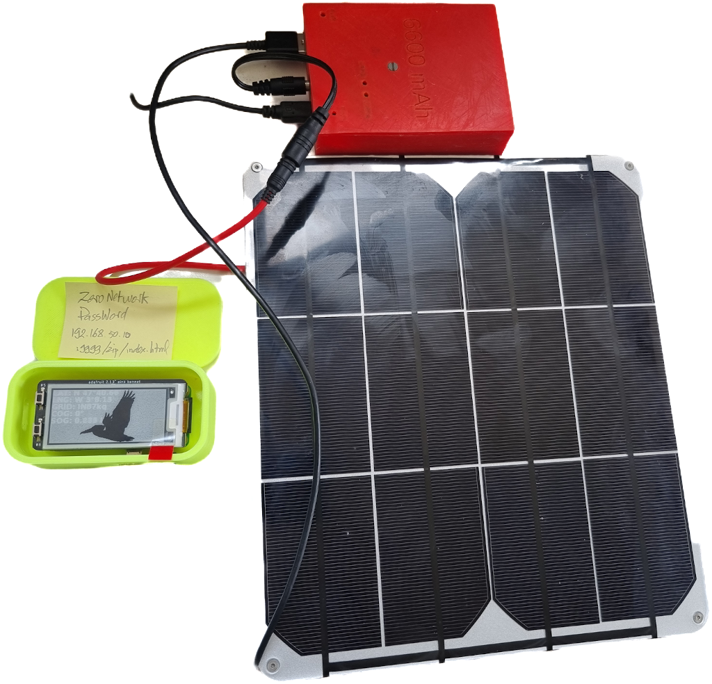
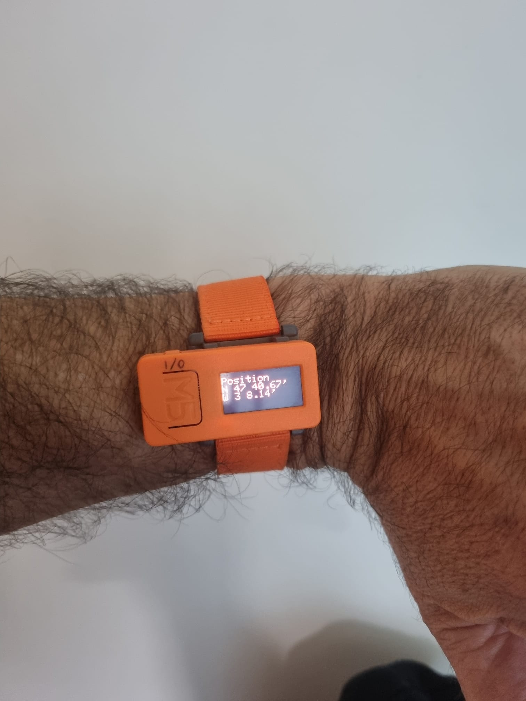

# From scratch
### _An example_: how to setup a new Raspberry Pi for a minimalist Nav Station.
We will be setting up a [Raspberry Pi Zero W](https://www.raspberrypi.com/products/raspberry-pi-zero-w/) with an [e-ink 2.13" bonnet](https://learn.adafruit.com/2-13-in-e-ink-bonnet?view=all).  

The e-ink technology is quite interesting here, in the sense that it consumes energy _**only**_ when updating the screen. Once something
is displayed on the screen, you can pull the plug, whatever's displayed remains displayed.  
As you would see below, there is a web interface that can be used to see - among others - the data displayed on the screen.
But having the screen allows you not to use any other device to get to the data.

In the use-case presented here, the NMEA-multiplexer will:
- Read a GPS
- Log the data into a file
- Display the data on the e-ink screen
  - The two buttons on the screen's bonnet can be used to scroll through the available data
- Broadcast the data on TCP:7001
- Host Web Pages to display the data, manage the system, manage the log files.

The server (aka Mux) will be automatically started when the Raspberry Pi boots. In this example,
the multiplexer is driven by the configuration file `nmea.mux.gps.nmea-fwd.yaml`.

We do the build on one machine, where the git repo has been cloned, and we deploy on the Raspberry Pi
only the parts required at runtime.
The build is a demanding operation, the Raspberry Pi Zero could do it, but it would indeed take quite some time.
A more powerful machine is more suitable for this kind of process.  
The process goes in two main big steps (also summarized [here](use_cases/summary.md)).

- **Step One**: you clone this repo, do the build, and package for deployment.
  - This step requires a bit more resources than the next one.
  - You will need an Internet connection, a keyboard and a screen.
- **Step Two**: you setup the Raspberry Pi, and make it ready for duty.
  - You start from a freshly flashed SD card, setup the system to emit its own network,
    install the required softwares and configure them.
  - Configuration steps will require an Internet connection.
  - Once the configuration is completed, the Internet connection is not required anymore, 
    `ssh` and `scp` will do the job.
    - Note: `VNC` could also be an option to access the Graphical Desktop running on the Raspberry Pi.
      But this could be too demanding for a Raspberry Pi Zero... To enable it, use
      `raspi-config` on the Raspberry Pi, to boot to Desktop, and start the VNC Server.

#### So, let's go.
- Use [Raspberry Pi imager](https://www.raspberrypi.com/software/) to flash a new SD Card
  - Make sure `SSH` is enabled (it's a setting parameter in the Raspberry Pi imager).
  - Create a user named `pi` (this is the name we use below, choose your own if you want to)
- Use the script `./to.prod.sh` to package the current software. This step happens on the machine you've cloned the repo on.
  - _Warning_: For the build, do make sure you use a JDK (Java Development Kit) compatible with your target!  
    If you've installed a JDK8 (see below) on the Raspberry Pi, do the build with a JDK of the same version!  
    Using a JDK11 for the build will not work at runtime on a JDK8.
  - Make sure you package the Python part as well, when prompted.
  - This will prepare a `tar.gz` archive, called - for example - `nmea-dist.tar.gz` (_**you**_ choose the name `nmea-dist` during the build process).
  - Send the archive to the newly flashed Raspberry Pi (change it's IP address at will)
    - ` scp nmea-dist.tar.gz pi@192.168.1.15:~`  
      where `nmea-dist` is a name chosen by _**you**_ during the execution of the `to.prod.sh` script, `pi` is the username _**you**_ chose too, and
      `192.168.1.15` is the IP Address of the Raspberry Pi, obtained with an `ifconfig` on the Raspberry Pi, or a `fing` on any machine on the same network as the Raspberry Pi.
- Log on to the new Raspberry Pi, to prepare the new system. This will require an Internet connection.  
  - Using `sudo raspi-config` (or its desktop equivalent, `Preferences` > `Raspberry Pi Configuration`):
    - Boot to Command Line Interface (CLI), Desktop is not required.
    - Make sure `SSH` is enabled.
    - Enable interfaces `SPI`, `I2C`, `Serial Port`
  - Install Java and other required parts
  ```
  sudo apt-get update
  sudo apt-get install openjdk-8-jdk-headless
  ```
  JDK8 will work on any Raspberry Pi I know.  
  Some Raspberry Pi Zero W would not support JDK11, but as long as you know what you're doing,
  you can install it using:
  ```
  sudo apt-get install openjdk-11-jdk
  ```
  - LibRxTx (optional, skip it if you don't know it)
  ```
  sudo apt-get install librxtx-java
  ```
  - Install required Python modules (if any), like here, for example (for the e-ink bonnet)
  ```
  sudo pip3 install adafruit-circuitpython-epd
  ```
  - Setup Hotspot (if needed), as explained [here](./HOTSPOT.md).
  - Expand the archive, using a command like `tar -xzvf nmea-dist.tar.gz`
  - Modify the `/etc/rc.local` to start the server when the server boots,
    and issue the required command (links, maps, stty, etc). There is an example in `rc.local.use_case.3.sh`.
- Plug in the GPS and the e-ink screen, and give it a try (see for example the script `start.all.sh`)
- Try the web interface
  - From a browser on another machine (laptop, cell-phone, tablet, ...), connected on the Raspberry Pi's network, reach
    `http://192.168.50.10:9999/zip/index.html`, and see for yourself!

Now, you're good to go, the Raspberry Pi should not need an Internet connection anymore.

About the modification of the `/etc/rc.local` script, to start the 
required components when the machine boots,
here are the lines to add to the file, _**before**_ the `exit` statement at the end:
```
#
# "Link" the Serial Port
stty -F /dev/ttyACM0 raw 4800 cs8 clocal
#
# Start MUX and Co on startup
#
# Start the REST Server for EINK2-13
/home/pi/nmea-dist/python/scripts/start.EINK2-13.REST.server.sh --interactive:false  --machine-name:localhost --port:8080 --verbose:false --data:NAV,POS,SOG,COG --screen-saver:on > /home/pi/nmea-dist/eink2-13.python.log 2>&1
sleep 10
# Start the MUX
cd /home/pi/nmea-dist
nohup ./mux.sh nmea.mux.gps.nmea-fwd.yaml &
#
```
As you can tell: it starts the Python server that takes care of the e-ink display, and
starts the mux with the config file `nmea.mux.gps.nmea-fwd.yaml`, provided [here](nmea.mux.gps.nmea-fwd.yaml).

Again, the system is now operational, and can be re-booted.

_**Warning**_: The data read from the GPS are logged into some log-files. Make sure you download and delete them from time to time...,
before they get too big (triggering the message "No space left on device"...). There is a Web page for that (in the embarked Web UI), called "Log Management".  
_**Note**_: For the log-files not to grow too big, we've excluded some strings from the log, see in the `yaml` config file:  
```yaml
sentence.filters: ~GGA,~GSV,~GSA
```
This excludes the sentences concerning the GPS satellites from the log files. They're still available in the cache tough, and can be displayed in some Web UI packaged in the archive we've generated.

### 3D Printed enclosures
STL files available from another repo, [here](https://github.com/OlivierLD/3DPrinting/blob/master/OpenSCAD/RPiDevBoards/ProjectBoxRPiZeroBox.stl), and
[here](https://github.com/OlivierLD/3DPrinting/blob/master/OpenSCAD/RPiDevBoards/ProjectBoxRPiZeroBoxTop.stl), along with the `OpenSCAD` code to generate them.

|                                                 |                                          |
|:------------------------------------------------|:-----------------------------------------|
|        |  | 
| In its box                                      | Connected (Power, GPS)                   |
|  |    | 
| Up and Running                                  | Closed                                   |
|         |   | 
| Phone UI (the pelican is the screen saver...)   | Phone UI                                 |
|           |                                          |
| Solar powered                                   |                                          |


- Other STL files, including a power bank, instead of an external power supply, can be found [here](https://github.com/OlivierLD/3DPrinting/blob/master/OpenSCAD/RPiDevBoards/NavStations/README.md).

_For the phone UI_: the phone is connected to the RPi's network, URL in the browser is <http://192.168.50.10:9999/zip/index.html>  
_Note_: The phone does _**not**_ need to have a SIM card.

Connected from [OpenCPN](https://opencpn.org/) through TCP, from a laptop:       


From a laptop, tablet, or cell-phone, Web UI (100% hosted on the Raspberry Pi):


Once data have been logged, they can be merged and cleaned with scripts like `log.merge.deep.sh` and its neighbors, and `log.to.json.sh`...
Data can be re-played from several web UIs. See in `ROB/raspberry-sailor/MUX-implementations/MISCSamples/LeafLetAnalysis` for examples.

The web UI is customizable at will. Above is _an example_ of the ChartlessMap WebComponent.  
In case this is good enough for you, the e-ink screen can become optional.

And as soon as you have a configuration that fits your needs, do make a backup of your SD card... When you need it,
this is the kind of things you might regret not to have done.

### REST Clients
Small boards that can be wifi-aware can connect to the network emitted by the Raspberry Pi (Huzzah, M5Stick, Arduino, etc, the list is long), using REST or other standard protocols.

|                    Server                    |               M5Stick Client               |
|:--------------------------------------------:|:------------------------------------------:|
|  |  |

Details on those small boards can be found at <https://github.com/OlivierLD/small-boards/>.  
For the M5Stick featured above, see <https://github.com/OlivierLD/small-boards/tree/master/M5StickC>, and the code
itself is [here](https://github.com/OlivierLD/small-boards/blob/master/M5StickC/HttpClient/HttpClient.ino). That would give you an idea.  
The M5Stick is quite affordable (less than $10.00 in 2025), see [here](https://shop.m5stack.com/products/stick-c?variant=43982750843137).

### Consumption
Measured consumption for the config above (**with** an e-ink bonnet):   
> Between `0.18 A` and `0.24 A`

### Summary
So, you now have a system that starts at boot.    
The Raspberry Pi emits its own network, so you can connect to it from other machines or devices,
using `ssh`, `scp`, or just `http` and `tcp`.

> _Note_: There is a network, but _**no**_ Internet.  
> This is not Cloud Computing..., maybe more like "Flake" ❄️ Computing. Very low carbon footprint!
> The consumption of the setting described above is below ridiculous. I power mine with a solar panel, it's happy as a clam!  
> A power bank, or a USB Adapter in a 12v cigarette lighter do the job as well.

Current data are displayed on the e-ink screen (basic UI).  
It comes with a Web UI, to help you to manage the system, and/or visualize the data (using plain `http`, as mentioned above).  
It also broadcasts the data on `tcp`, port 7001, so other software can use them, like OpenCPN, SeaWi, etc.  
Data are logged into some files, so you can analyze, transform (to GPX, KML, etc) or replay them.

And as no one is going to sell your personal data behind your back, the Web UI does not require any cookie.

### Supplies, BOM
- [e-ink bonnet](https://www.adafruit.com/product/4687), $19.95 (Aug-2023)
- [Raspberry Pi Zero W](https://www.adafruit.com/product/3708), $16.00 (Aug-2023). This one has WiFi capabilities, it does not require an extra WiFi dongle.
- [GPS Dongle](https://www.amazon.com/HiLetgo-G-Mouse-GLONASS-Receiver-Windows/dp/B01MTU9KTF/ref=sr_1_3?keywords=usb+gps+dongle&qid=1691564294&sprefix=USB+GPS%2Caps%2C153&sr=8-3), $11.99 (Aug-2023)

The price of the config described here comes to $47.94.  

> _**Note**_: It could be even simpler - and cheaper. The e-ink bonnet is an option. 
> In any case, the system is logging data (in a file), forwarding them (on tcp), 
> and there is a Web interface available through http.  
> The Python part is not necessary if the e-ink screen is not in the picture.  
> Without the e-ink screen, **_the price comes down to $27.99_**.

Price of the wires and SD card is not included here. I know.  
But still 😜.

---
