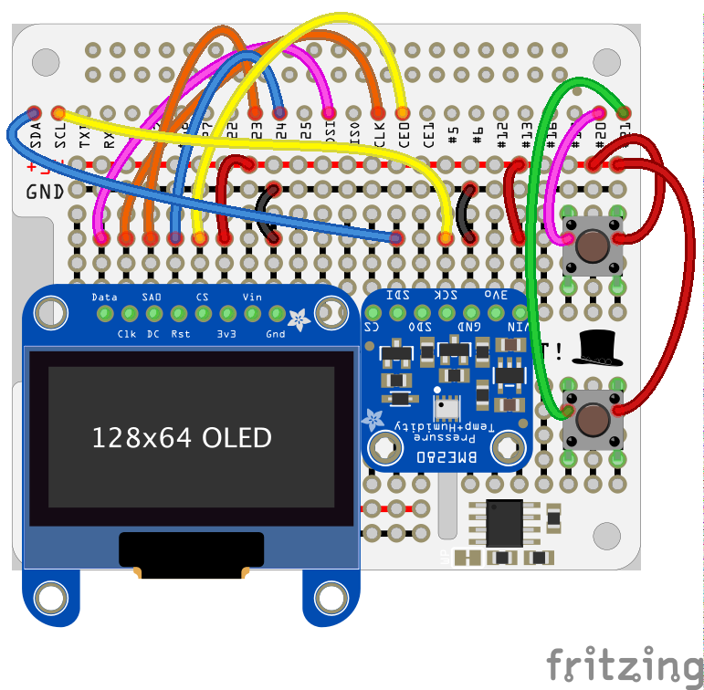
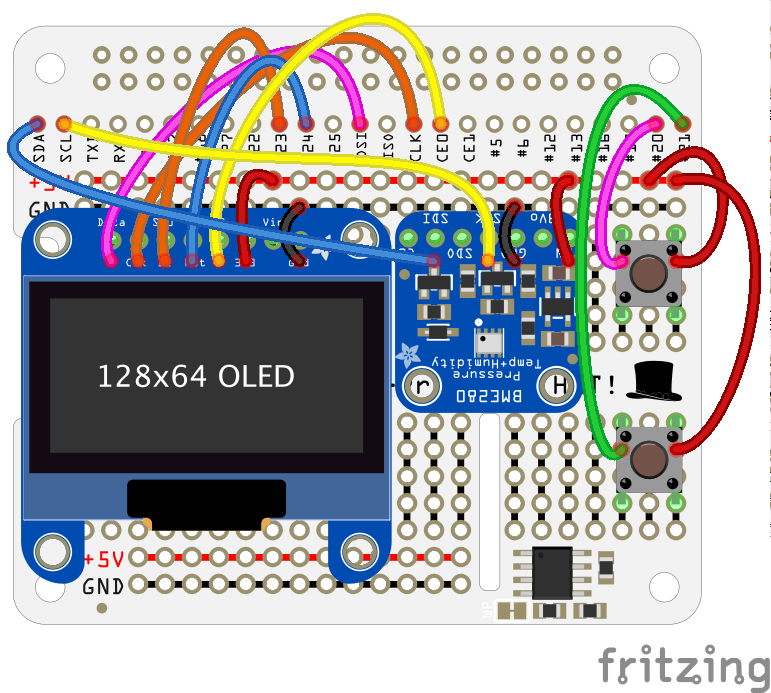
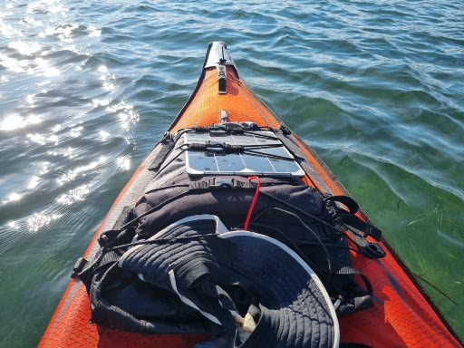

# Some use-cases

First, make sure you've built the soft:
```
$ ../../../gradlew shadowJar -x :astro-computer:AstroComputer:compileScala
```

# Content
- Deploy for prod, [Raspberry Pi and GPS](#use-case-1)
- [A Raspberry Pi A+, with a GPS, a BME280, and a 128x64 SSD1306 (using SPI)](#use-case-2)
- Deploy for prod, [Raspberry Pi, GPS, BME280, SSD1306, push buttons](#use-case-3)

## Use-case 1
### A Multiplexer (and its web interface) on a Raspberry Pi, with a GPS
This is a simple configuration. We will build the project on a machine where the git repo has been cloned.
This machine will be called `Machine A`. From `Machine A`, we will generate an archive that will be pushed on the Raspberry Pi (called `Machine B`).
On the Raspberry Pi, we will expand the archive mentioned before, do a minimal setup, and we will be ready for the real world.

The Raspberry Pi will possibly emit its own HotSpot network.

---
**_To be as clear as possible_**:
- We will build the required soft from a clone of the git repo, on `Machine A`.
- We will deploy the required artifacts on `Machine B` (the Raspberry Pi A+, the one that will do the job).
  - Configure whatever has to be configured on it
  - Take it for a hike!
---
#### Machine A
You need to have cloned the repo, and installed all the requirements for a build.
> The script `start.from.scratch.sh` will help you if needed. Look into it for details.

`Machine A` can be a laptop, running Windows, Mac, Linux..., as well as a Raspberry Pi, strong enough to run the build.  
Assuming that you can run a terminal using `bash`, use `to.prod.sh` to generate the archive to deploy (from `ROB/raspberry-sailor/MUX-implementations/NMEA-multiplexer-basic`).  
Say `n` when it says `Do we package the Python part ? >`.

```
$ ./to.prod.sh 
+----------------------------------------------------------------------------------------------------+
|                          P A C K A G E   f o r   D I S T R I B U T I O N                           |
+----------------------------------------------------------------------------------------------------+
| This is an EXAMPLE showing how to generate a 'production' version, without having the full github  |
| repo on the destination machine. We will deploy only what is needed to run the NMEA Multiplexer,   |
| possibly with several configurations - and its web clients.                                        |
+----------------------------------------------------------------------------------------------------+
| Now you may start a fresh build...                                                                 |
| Make sure the java version is compatible with your target. Current version:                        |
+----------------------------------------------------------------------------------------------------+
| java version "11.0.8" 2020-07-14 LTS
| Java(TM) SE Runtime Environment 18.9 (build 11.0.8+10-LTS)
| Java HotSpot(TM) 64-Bit Server VM 18.9 (build 11.0.8+10-LTS, mixed mode)
+----------------------------------------------------------------------------------------------------+
| Make sure the current Java version is compatible with the target one!!                             |
+----------------------------------------------------------------------------------------------------+

There is an existing jar-file:
147025906 78488 -rw-r--r--  1 olivierlediouris  staff    38M Feb 11 08:40 ./build/libs/NMEA-multiplexer-basic-1.0-all.jar
With the following MANIFEST:
Found ./build/libs/NMEA-multiplexer-basic-1.0-all.jar. Moving on.
~/repos/ROB/raspberry-sailor/MUX-implementations/NMEA-multiplexer-basic/temp ~/repos/ROB/raspberry-sailor/MUX-implementations/NMEA-multiplexer-basic
-------- MANIFEST.MF --------
Manifest-Version: 1.0

-----------------------------
~/repos/ROB/raspberry-sailor/MUX-implementations/NMEA-multiplexer-basic
----------------------------
Do we re-build the Java part ? > y
Rebuilding from source (No Scala)...

> Configure project :
>> From task compileJava (in rob), using java version 11 
>> From task compileTestJava (in rob), using java version 11 

> Configure project :astro-computer:AstroComputer
>> From task compileJava (in AstroComputer), using java version 11 
>> From task compileTestJava (in AstroComputer), using java version 11 

> Configure project :astro-computer:AstroUtilities
>> From task compileJava (in AstroUtilities), using java version 11 
>> From task compileTestJava (in AstroUtilities), using java version 11 

Deprecated Gradle features were used in this build, making it incompatible with Gradle 8.0.

You can use '--warning-mode all' to show the individual deprecation warnings and determine if they come from your own scripts or plugins.

See https://docs.gradle.org/7.6/userguide/command_line_interface.html#sec:command_line_warnings

BUILD SUCCESSFUL in 9s
14 actionable tasks: 2 executed, 12 up-to-date
Which (non existent) folder should we create the distribution in ? > nmea-dist
Creating folder nmea-dist
Copying resources
  adding: admin.html (deflated 89%)
  adding: basic.html (deflated 59%)
  adding: console.html (deflated 79%)
  adding: css/ (stored 0%)
  . . .
  adding: widgets/TWSEvolution.js (deflated 73%)
  adding: wsconsole.html (deflated 50%)
Do we package the Python part ? > n
a nmea-dist
a nmea-dist/nmea.mux.gps.tcp.yaml
a nmea-dist/nmea-to-text.properties
a nmea-dist/nmea.mux.gps.sensor.nmea-fwd.yaml
a nmea-dist/web.zip
a nmea-dist/nmea.mux.kayak.ssd1306.yaml
a nmea-dist/nmea.mux.replay.big.log.yaml
a nmea-dist/REST.ssd1306.dg.properties
a nmea-dist/nmea.mux.big.log.nmea-fwd.yaml
a nmea-dist/mux.sh
a nmea-dist/build
a nmea-dist/build/libs
a nmea-dist/build/libs/NMEA-multiplexer-basic-1.0-all.jar
+--------------------------------------------------------------------------------------------------+
 >> Archive /Users/olivierlediouris/repos/ROB/raspberry-sailor/MUX-implementations/NMEA-multiplexer-basic/nmea-dist.tar.gz ready for deployment.
+--------------------------------------------------------------------------------------------------+
| Send it to another machine, and un-archive it.                                                   |
| Use 'tar -xzvf nmea-dist.tar.gz' to un-archive.                                                   |
| External dependencies like librxtx-java may be needed if you intend to use a serial port,        |
| in which case you may need to run a 'sudo apt-get install librxtx-java' .                        |
| The script to launch will be 'mux.sh'                                                            |
| It is your responsibility to use the right properties file, possibly modified to fit your needs. |
| For the runner/logger, use nmea.mux.gps.tcp.properties                                           |
| Use it - for example - like:                                                                     |
| $ cd nmea-dist                                                                                   
| $ nohup ./mux.sh nmea.mux.gps.tcp.yaml &                                                         |
|  >> Static web resources can be reached like http://<host>:<port>/zip/index.html                 |
+--------------------------------------------------------------------------------------------------+
$
```
The archive was generated.  
Now we need to configure `Machine B`, and send the newly generated archive to it.

#### Machine B
Flash a new SD card (see [here](https://www.raspberrypi.com/documentation/computers/getting-started.html), [Raspberry Pi Imager](https://www.raspberrypi.com/software/) does the job).  
Make sure you enable the `ssh` interface (use `raspi-config`).  
This new image should contain a Java Development Kit (aka JDK). Make sure it's right:
```
$ java version
```
If java is not there (or not in the right version), install JDK 11:
```
$ sudo apt-get update
$ sudo apt-get install openjdk-11-jdk
```

Find the IP address of `Machine B` (I use [`fing`](https://www.fing.com/products/development-toolkit). Make sure you use the [`Fing CLI`](https://www.fing.com/products/development-toolkit) for your system, `dpkg --print-architecture` will tell you what to choose, `lscpu` too.).   
We assume it is `192.168.1.101`.  
From `Machine A`, send the archive to `Machine B`:
```
$ scp nmea-dist.tar.gz pi@192.168.1.101:~
pi@192.168.1.101's password: 
nmea-dist.tar.gz                                                                        100%   37MB 372.6KB/s   01:42    
$
```
We're done with `Machine A`.

Connect on `Machine B` (with `ssh` from `Machine A`, if you want)
```
$ ssh pi@192.168.1.101
```
and unarchive what was received before:
```
$ tar -xzvf nmea-dist.tar.gz
nmea-dist/
nmea-dist/nmea.mux.gps.tcp.yaml
nmea-dist/nmea-to-text.properties
nmea-dist/nmea.mux.gps.sensor.nmea-fwd.yaml
nmea-dist/web.zip
nmea-dist/nmea.mux.kayak.ssd1306.yaml
nmea-dist/nmea.mux.replay.big.log.yaml
nmea-dist/REST.ssd1306.dg.properties
nmea-dist/nmea.mux.big.log.nmea-fwd.yaml
nmea-dist/mux.sh
nmea-dist/build/
nmea-dist/build/libs/
nmea-dist/build/libs/NMEA-multiplexer-basic-1.0-all.jar
$
```
Make sure `librxtx-java` is installed:
```
$ sudo apt-get install librxtx-java
```

Let's move to the newly created directory:
```
$ cd nmea-dist
```
Then, modify the file `/etc/rc.local` (make sure you're super-user), to start the required pieces at boot. Add the following lines, at the end
of the file, _before_ the `exit` statement:
```
# Link the Serial Port
sudo ln -s /dev/ttyACM0 /dev/ttyS80
#
# Start the MUX
cd /home/pi/nmea-dist
nohup ./mux.sh nmea.mux.gps.yaml &
#
```
> Note: the mapping on `/dev/ttyS80` is used in `nmea.mux.gps.yaml`. Make sure it matches your config.

> Note: to _stop_ all the servers started above, run a script like:
> ```
> #!/bin/bash
> ps -ef | grep -Eiw 'java |python3 ' | grep -v grep | awk '{ print $2 }' > km
> NB_L=$(cat km | wc -l)
> if [[ ${NB_L} == 0 ]]; then
>   echo No process found.
> fi
> for pid in $(cat km); do
>   echo -e "Killing process ${pid}"
>   sudo kill -15 ${pid}
> done
> rm km
> ```

Finally, we can set up the hotspot network on the Raspberry Pi.  
Follow the instructions [here](./HOTSPOT.md).

Then you can stop the `Machine B` (the Raspberry Pi), plug in your GPS, and boot it.

Once it is re-started, you should see - from `Machine A` for example - a network named, as above, `NMEANetwork`.
Its password is `PassWord` (see in the [instructions](./HOTSPOT.md)).

Once connected on this new network, from this "other" machine (a cell-phone would work too, just connect from it to the new `NMEANetwork` network), try to reach <http://192.168.50.10:9999/zip/index.html>,
`192.168.50.10` being the address of the machine (Raspberry Pi) the multiplexer runs on.


## Use-case 2
### A Raspberry Pi A+, with a GPS, a BME280, and a 128x64 SSD1306 (using SPI)
> Suitable for hiking, kayaking, this kind of things.  
> Position is read from a Serial GPS, Atmospheric data from a [BME280](https://www.adafruit.com/product/2652).  
> Data are displayed on a [small OLED screen](https://www.adafruit.com/product/326), and logged into a file, to be replayed later.

**We assume below that the address of the board you're running on is `192.168.1.103`.**

First start the Python servers, for the BME280 and the SSD1306.  
Make sure you use the right ports.
```
$ ../../RaspberryPythonServers/python/scripts/start.BME280.TCP.server.sh
~/repos/ROB/raspberry-sailor/NMEA-multiplexer ~/repos/ROB/raspberry-sailor/MUX-implementations/NMEA-multiplexer-basic
Working from /home/pi/repos/ROB/raspberry-sailor/RaspberryPythonServers/python
It worked: 192.168.1.103 
Enter Machine Name - Default [192.168.1.103] > 
Enter HTTP Port - Default [9999] > 8001
Verbose (true or false) ? - Default [false] > 
Running python3 ./TCP_BME280_server.py --machine-name:192.168.1.103 --port:8001 --verbose:false
Done
Use ./scripts/kill.python.tcp.sh to stop the server.

Usage is:
python3 /home/pi/repos/ROB/raspberry-sailor/RaspberryPythonServers/python/scripts/TCP_BME280_server.py [--machine-name:127.0.0.1] [--port:7001] [--verbose:true|false]
	where --machine-name: and --port: must match the context's settings.

Server is listening. [Ctrl-C] will stop the process.
. . .
```
The port above (`8001`) is the one defined in `nmea.mux.kayak.ssd1306.yaml`:
```yaml
channels:
  - . . .
  - type: tcp
    server: 192.168.1.103
    port: 8001
    verbose: false

```

```
$ ../../RaspberryPythonServers/python/scripts/start.SSD1306.REST.server.sh 
~/repos/ROB/raspberry-sailor/NMEA-multiplexer ~/repos/ROB/raspberry-sailor/MUX-implementations/NMEA-multiplexer-basic
Working from /home/pi/repos/ROB/raspberry-sailor/RaspberryPythonServers/python
It worked: 192.168.1.103 
Enter Machine Name - Default [192.168.1.103] > 
Enter HTTP Port - Default [9999] > 8080
Verbose (true or false) ? - Default [false] > 
Screen Height (32 or 64) ? - Default [32] > 64
Wiring Option (I2C or SPI) ? - Default [I2C] > SPI
Running python3 s./REST_SSD1306_server.py --machine-name:192.168.1.103 --port:8080 --verbose:false --height:64 --wiring:SPI
Done
Use ./scripts/kill.python.rest.sh to stop the server.
- Try curl -X PUT http://192.168.1.103:8080/ssd1306/nmea-data -d 'This is|a test.'
- Try curl -X GET http://192.168.1.103:8080/ssd1306/oplist
~/repos/ROB/raspberry-sailor/MUX-implementations/NMEA-multiplexer-basic
Using RESET D24
Using CS D8
Using DC D23
Starting SSD1306 server on port 8080
Try curl -X GET http://192.168.1.103:8080/ssd1306/oplist
or  curl -v -X VIEW http://192.168.1.103:8080/ssd1306 -H "Content-Length: 1" -d "1"
. . .

```
The port `8080` is the one defined in `REST.ssd1306.dg.properties`:
```properties
ssd1306.dg.protocol=http
ssd1306.dg.server-name=192.168.1.103
ssd1306.dg.port=8080
ssd1306.dg.verb=PUT
ssd1306.dg.resource=/ssd1306/nmea-data
ssd1306.dg.verbose=false
```

Now, sensors and actuator are in place, start the multiplexer:
```
$ ./mux.sh nmea.mux.kayak.ssd1306.yaml
Using properties file nmea.mux.kayak.ssd1306.yaml
Running sudo java  -Djava.library.path=/usr/lib/jni -Drmc.decl.only=true -Dscreen.verbose=true -Drest.feeder.verbose=true -Dparse.ais=true -Dmux.props.verbose=true -Dprocess.on.start=true -Dmux.properties=nmea.mux.kayak.ssd1306.yaml -Dno.ais=false -Dcalculate.solar.with.eot=true -Ddefault.mux.latitude=37.8218 -Ddefault.mux.longitude=-122.3112 -Dtry.to.speak=true -Djava.util.logging.config.file=./logging.properties   -cp ./build/libs/NMEA-multiplexer-basic-1.0-all.jar:/usr/share/java/RXTXcomm.jar nmea.mux.GenericNMEAMultiplexer 
{with.http.server=true, http.port=9999, init.cache=true, damping=30}
Definition Name: Logging Data from the Kayak
-- Description --
A GPS on /dev/ttyS80
A BME280 read from a TCP Server in Python, on port 8001
Display on an SSD1306 128x64
Log data in a file
-----------------
Log available in global, level INFO
Log file pattern null
- Start writing to nmea.forwarders.DataFileWriter, ./data.nmea 
Starting new http.HTTPServer (verbose false)
Stable Library
=========================================
Native lib Version = RXTX-2.2pre2
Java lib Version   = RXTX-2.1-7
WARNING:  RXTX Version mismatch
	Jar version = RXTX-2.1-7
	native lib Version = RXTX-2.2pre2
1,675,177,415,348 - Port open: 9999
1,675,177,415,351 - http.HTTPServer now accepting requests
1 client is now connected.
Connected by client <socket.socket fd=9, family=AddressFamily.AF_INET, type=SocketKind.SOCK_STREAM, proto=0, laddr=('192.168.1.103', 8001), raddr=('192.168.1.103', 39686)>
New client listener
Port Ownership of /dev/ttyS80 changed: type=1, Owned (Locked)
This is a serial port
Reading serial port...
/dev/ttyS80:4800  > Port is open...

. . .
```
> _**Note**_: if the Serial port of the GPS is giving you trouble, run the script
> `../RESTNavServer/mk.link.sh` ...

Data are read, displayed and logged.  
And you can see what's going on from a browser (machine name and port "may" change):
- <http://192.168.1.103:9999/web/index.html>

The Web UI available above is designed for all kinds of configurations. For example,
in this case (as you have a GPS and a BME280 to feed the data), you might not be able to see the True Wind Speed 🤔...  
Again, the Web Pages presented here are to be seen as examples of the way to consume the data available from the cache of the Multiplexer, through REST services.
> _**Note**_: The Raspberry Pi can very well emit its own network, onto which you can connect from other devices (laptops, tablets, cell-phones, smartwatches, ...). See
> [here](../../../HintsAndTips.md#ad-hoc--hotspot-networking).  
> Along the same lines, other devices can also `ssh` to the Raspberry Pi.

#### Details
Wiring, Schemas, Components, 3D printed enclosures...

On a [PiHAT](https://www.adafruit.com/product/2310) (HAT: **H**ardware **A**ttached on **T**op):

| Components moved down to show the wiring |
|:-----------------------------------------:|
|  |
| Actual Components Position |
|  |

3D Printed enclosure, available
- [here](https://github.com/OlivierLD/3DPrinting/tree/master/OpenSCAD/RPiA%2BLogger).
- [STL, animated](https://github.com/OlivierLD/3DPrinting/blob/master/OpenSCAD/RPiA%2BLogger/rpi.aplus.enclosure.full.stl).

| On the go |
|:---------:|
|  |
|  |

---

## Use-case 3
### Deploy the config [above](#use-case-2), on a new Raspberry Pi image
We want to deploy the configuration described [above](#use-case-2) on a newly flashed SD Card ([Raspberry Pi Imager](https://www.raspberrypi.com/software/) does the job).  
This config will include
- A Raspberry Pi A+, to host the NMEA-multiplexer
- A BME280 and a 128x64 oled SSD1306, with 2 push buttons to interact with it
- A GPS, with its USB socket

We want to log the data (from the GPS and BME280), so we can replay then, see them in GoogleMaps or Leaflet, etc.

We also want the Raspberry Pi to emit its own hotspot network, so other devices can connect to it and reach 
the multiplexer's web pages.  
And finally, we will need the multiplexer to start when the Raspberry Pi boots.

---
**_To be as clear as possible_**:
- We will build the required soft from a clone of the git repo, on `Machine A`.
- We will deploy the required artifacts on `Machine B` (the Raspberry Pi A+, the one that will do the job).
  - Configure whatever has to be configured on it
  - Take it for a hike!
---

#### Machine A
You need to have cloned the repo, and installed all the requirements for a build.  
> The script `start.from.scratch.sh` will help you if needed. Look into it for details.

`Machine A` can be a laptop, running Windows, Mac, Linux..., as well as a Raspberry Pi, strong enough to run the build.  
Assuming that you can run a terminal using `bash`, use `to.prod.sh` to generate the archive to deploy (from `ROB/raspberry-sailor/MUX-implementations/NMEA-multiplexer-basic`).  
Make sure you say `y` when it says `Do we package the Python part ? >`.
```
$ ./to.prod.sh 
+----------------------------------------------------------------------------------------------------+
|                          P A C K A G E   f o r   D I S T R I B U T I O N                           |
+----------------------------------------------------------------------------------------------------+
| This is an EXAMPLE showing how to generate a 'production' version, without having the full github  |
| repo on the destination machine. We will deploy only what is needed to run the NMEA Multiplexer,   |
| possibly with several configurations - and its web clients.                                        |
+----------------------------------------------------------------------------------------------------+
| Now you may start a fresh build...                                                                 |
| Make sure the java version is compatible with your target. Current version:                        |
+----------------------------------------------------------------------------------------------------+
| java version "11.0.8" 2020-07-14 LTS
| Java(TM) SE Runtime Environment 18.9 (build 11.0.8+10-LTS)
| Java HotSpot(TM) 64-Bit Server VM 18.9 (build 11.0.8+10-LTS, mixed mode)
+----------------------------------------------------------------------------------------------------+
| Make sure the current Java version is compatible with the target one!!                             |
+----------------------------------------------------------------------------------------------------+

There is an existing jar-file:
147025906 78488 -rw-r--r--  1 olivierlediouris  staff    38M Feb 11 08:40 ./build/libs/NMEA-multiplexer-basic-1.0-all.jar
With the following MANIFEST:
Found ./build/libs/NMEA-multiplexer-basic-1.0-all.jar. Moving on.
~/repos/ROB/raspberry-sailor/MUX-implementations/NMEA-multiplexer-basic/temp ~/repos/ROB/raspberry-sailor/MUX-implementations/NMEA-multiplexer-basic
-------- MANIFEST.MF --------
Manifest-Version: 1.0

-----------------------------
~/repos/ROB/raspberry-sailor/MUX-implementations/NMEA-multiplexer-basic
----------------------------
Do we re-build the Java part ? > y
Rebuilding from source (No Scala)...

> Configure project :
>> From task compileJava (in rob), using java version 11 
>> From task compileTestJava (in rob), using java version 11 

> Configure project :astro-computer:AstroComputer
>> From task compileJava (in AstroComputer), using java version 11 
>> From task compileTestJava (in AstroComputer), using java version 11 

> Configure project :astro-computer:AstroUtilities
>> From task compileJava (in AstroUtilities), using java version 11 
>> From task compileTestJava (in AstroUtilities), using java version 11 

Deprecated Gradle features were used in this build, making it incompatible with Gradle 8.0.

You can use '--warning-mode all' to show the individual deprecation warnings and determine if they come from your own scripts or plugins.

See https://docs.gradle.org/7.6/userguide/command_line_interface.html#sec:command_line_warnings

BUILD SUCCESSFUL in 9s
14 actionable tasks: 2 executed, 12 up-to-date
Which (non existent) folder should we create the distribution in ? > nmea-dist
Creating folder nmea-dist
Copying resources
  adding: admin.html (deflated 89%)
  adding: basic.html (deflated 59%)
  adding: console.html (deflated 79%)
  adding: css/ (stored 0%)
  adding: css/black.css (deflated 38%)
  adding: css/night.stylesheet.css (deflated 80%)
  adding: css/stylesheet.css (deflated 80%)
  adding: css/bground.jpg (stored 0%)
  adding: css/white.css (deflated 37%)
  adding: css/web-components.css (deflated 86%)
  adding: css/screen.css (deflated 46%)
  adding: css/graph.ux.01.css (deflated 63%)
  adding: css/graph.ux.02.css (deflated 64)
  . . .
  adding: widgets/TimeDisplay.js (deflated 70%)
  adding: widgets/AnalogDisplay.js (deflated 76%)
  adding: widgets/TWSEvolution.js (deflated 73%)
  adding: wsconsole.html (deflated 50%)
Do we package the Python part ? > y
Copying Python stuff into nmea-dist/python
Done with Python
a nmea-dist
a nmea-dist/nmea.mux.gps.tcp.yaml
a nmea-dist/nmea-to-text.properties
a nmea-dist/nmea.mux.gps.sensor.nmea-fwd.yaml
a nmea-dist/python
a nmea-dist/web.zip
a nmea-dist/nmea.mux.kayak.ssd1306.yaml
a nmea-dist/nmea.mux.replay.big.log.yaml
a nmea-dist/REST.ssd1306.dg.properties
a nmea-dist/nmea.mux.big.log.nmea-fwd.yaml
a nmea-dist/mux.sh
a nmea-dist/build
a nmea-dist/build/libs
a nmea-dist/build/libs/NMEA-multiplexer-basic-1.0-all.jar
a nmea-dist/python/checksum.py
. . .
a nmea-dist/python/scripts/start.Serial.TCP.server.sh
a nmea-dist/python/scripts/test.sh
a nmea-dist/python/scripts/start.BME280.REST.server.sh
+--------------------------------------------------------------------------------------------------+
 >> Archive /Users/olivierlediouris/repos/ROB/raspberry-sailor/MUX-implementations/NMEA-multiplexer-basic/nmea-dist.tar.gz ready for deployment.
+--------------------------------------------------------------------------------------------------+
| Send it to another machine, and un-archive it.                                                   |
| Use 'tar -xzvf nmea-dist.tar.gz' to un-archive.                                                   |
| External dependencies like librxtx-java may be needed if you intend to use a serial port,        |
| in which case you may need to run a 'sudo apt-get install librxtx-java' .                        |
| > For the python scripts, make sure you run (once) the script ./python/scripts/install.all.sh    |
| > after unzipping the archive on the target machine.                                             |
| The script to launch will be 'mux.sh'                                                            |
| It is your responsibility to use the right properties file, possibly modified to fit your needs. |
| For the runner/logger, use nmea.mux.gps.tcp.properties                                           |
| Use it - for example - like:                                                                     |
| $ cd nmea-dist                                                                                   
| $ nohup ./mux.sh nmea.mux.gps.tcp.yaml &                                                         |
|  >> Static web resources can be reached like http://<host>:<port>/zip/index.html                 |
+--------------------------------------------------------------------------------------------------+
$
```
The archive was generated.  
Now we need to configure `Machine B`, and send the newly generated archive to it.

#### Machine B
Flash a new SD card (see [here](https://www.raspberrypi.com/documentation/computers/getting-started.html), [Raspberry Pi Imager](https://www.raspberrypi.com/software/) does the job).  
Make sure you enable the `ssh`, `spi`, `i2c` interfaces (use `raspi-config`).  
This new image should contain a Java Development Kit (aka JDK), and Python 3. Make sure it's right:
```
$ java version
$ python3 -V
```
If java is not there (or not in the right version), install JDK 11:
```
$ sudo apt-get update
$ sudo apt-get install openjdk-11-jdk
```

Find the IP address of `Machine B` (I use [`fing`](https://www.fing.com/products/development-toolkit). Make sure you use the [`Fing CLI`](https://www.fing.com/products/development-toolkit) for your system, `dpkg --print-architecture` will tell you what to choose, `lscpu` too.).   
We assume it is `192.168.1.101`.  
From `Machine A`, send the archive to `Machine B`:
```
$ scp nmea-dist.tar.gz pi@192.168.1.101:~
pi@192.168.1.101's password: 
nmea-dist.tar.gz                                                                        100%   37MB 372.6KB/s   01:42    
$
```
We're done with `Machine A`.

Connect on `Machine B` (with `ssh` if you want):
```
$ ssh pi@192.168.1.101
```
and unarchive what was received before:
```
$ tar -xzvf nmea-dist.tar.gz
nmea-dist/
nmea-dist/nmea.mux.gps.tcp.yaml
nmea-dist/nmea-to-text.properties
nmea-dist/nmea.mux.gps.sensor.nmea-fwd.yaml
nmea-dist/python/
nmea-dist/web.zip
nmea-dist/nmea.mux.kayak.ssd1306.yaml
nmea-dist/nmea.mux.replay.big.log.yaml
nmea-dist/REST.ssd1306.dg.properties
nmea-dist/nmea.mux.big.log.nmea-fwd.yaml
nmea-dist/mux.sh
nmea-dist/build/
nmea-dist/build/libs/
nmea-dist/build/libs/NMEA-multiplexer-basic-1.0-all.jar
nmea-dist/python/checksum.py
. . .
nmea-dist/python/scripts/test.sh
nmea-dist/python/scripts/start.BME280.REST.server.sh
$
```
Make sure `librxtx-java` is installed:
```
$ sudo apt-get install librxtx-java
```

Let's move to the newly created directory:
```
$ cd nmea-dist
```
We now install the required Python modules:
```
$ ./python/scripts/install.all.sh
. . .
$
```
Then, modify the file `/etc/rc.local` (make sure you're super-user), to start the required pieces at boot. Add the following lines, at the end
of the file, _before_ the `exit` statement:
```
# Link the Serial Port
sudo ln -s /dev/ttyACM0 /dev/ttyS80
#
# Start MUX and Co on startup
#
# Start the REST Server for BME280
# /home/pi/nmea-dist/python/scripts/start.BME280.REST.server.sh --interactive:false  --machine-name:$(hostname -I) --port:9876 --verbose:false > /home/pi/bme280.python.log 2>&1
/home/pi/nmea-dist/python/scripts/start.BME280.REST.server.sh --interactive:false  --machine-name:localhost --port:9876 --verbose:false > /home/pi/bme280.python.log 2>&1
sleep 10
# Start the REST Server for SSD1306 (v2)
# /home/pi/nmea-dist/python/scripts/start.SSD1306.REST.server.v2.sh --interactive:false  --machine-name:$(hostname -I) --port:8080 --verbose:false --height:64 --wiring:SPI --data:NAV,POS,SOG,COG,ATM > /home/pi/ssd1306.python.log 2>&1
/home/pi/nmea-dist/python/scripts/start.SSD1306.REST.server.v2.sh --interactive:false  --machine-name:localhost --port:8080 --verbose:false --height:64 --wiring:SPI --data:NAV,POS,SOG,COG,ATM > /home/pi/ssd1306.python.log 2>&1
sleep 10
# Start the MUX
cd /home/pi/nmea-dist
nohup ./mux.sh nmea.mux.gps.sensor.nmea-fwd.yaml &
#
```
> Note: the mapping on `/dev/ttyS80` is used in `nmea.mux.gps.sensor.nmea-fwd.yaml`. Make sure it matches your config.


> Note: to _stop_ all the servers started above, run a script like:
> ```
> #!/bin/bash
> ps -ef | grep -Eiw 'java |python3 ' | grep -v grep | awk '{ print $2 }' > km
> NB_L=$(cat km | wc -l)
> if [[ ${NB_L} == 0 ]]; then
>   echo No process found.
> fi
> for pid in $(cat km); do
>   echo -e "Killing process ${pid}"
>   sudo kill -15 ${pid}
> done
> rm km
> ```

Finally, we can set up the hotspot network on the Raspberry Pi.  
Follow the instructions [here](./HOTSPOT.md).

Then you can stop the `Machine B` (the Raspberry Pi), plug in your GPS, and boot it.

Once it is re-started, you should see - from `Machine A` for example - a network named, as above, `NMEANetwork`.
Its password is `PassWord` (see in the [instructions](./HOTSPOT.md)).

Once connected on this new network, from this "other" machine (a cell-phone would work too, just connect from it to the new `NMEANetwork` network), try to reach <http://192.168.50.10:9999/zip/index.html>,
`192.168.50.10` being the address of the machine (Raspberry Pi) the multiplexer runs on.

---
