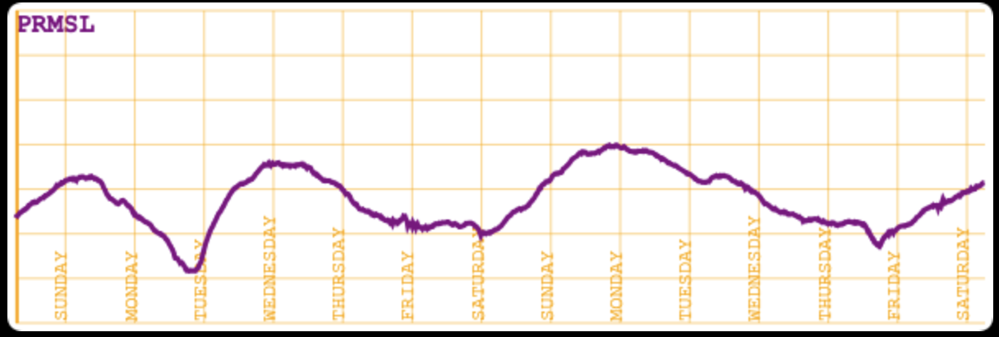
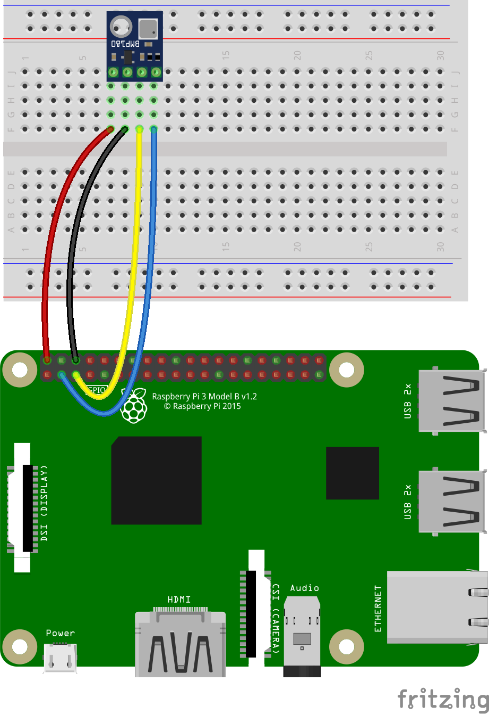

# Use-case 4. Basic Weather Station
### A Raspberry Pi, with a BMP180 (or BMP280, BME280, WiP)

#### Read the sensor Data
```
$ ../../RaspberryPythonServers/python/scripts/start.BMP180.TCP.server.sh
~/repos/ROB/raspberry-sailor/NMEA-multiplexer ~/repos/ROB/raspberry-sailor/MUX-implementations/NMEA-multiplexer-basic
Working from /home/pi/repos/ROB/raspberry-sailor/RaspberryPythonServers/python
It worked: 192.168.1.103 
Enter Machine Name - Default [192.168.1.103] > 127.0.0.1
Enter HTTP Port - Default [9999] > 8001
Verbose (true or false) ? - Default [false] > 
Running python3 ./TCP_BMP180_server.py --machine-name:127.0.0.1 --port:8001 --verbose:false
Done
Use ./scripts/kill.python.tcp.sh to stop the server.

Usage is:
python3 /home/pi/repos/ROB/raspberry-sailor/RaspberryPythonServers/python/scripts/TCP_BMP180_server.py [--machine-name:127.0.0.1] [--port:7001] [--verbose:true|false]
    where --machine-name: and --port: must match the context's settings.

Server is listening. [Ctrl-C] will stop the process.
. . .
```
The port above (`8001`) is the one defined in `nmea.mux.bmp180.yaml`:
```yaml
channels:
  - . . .
  - type: tcp
    server: 127.0.0.1
    port: 8001
    verbose: false
```

#### Specific Requirement: Long Term Data
A Barograph is a very useful instrument for marine weather and forecasts. 
But it can be quite expensive (see [here](https://www.naudet.com/barometre-enregistreur-c102x2726134)). We'll trry to build one with a Raspberry Pi Zero, and a sensor like a BME280 sensor (less that $2.00).  

We want here to be able to display a curve, like the one produced by a barograph, like this one:



It displays data on one week (or more). We would need some server-side component to store those data,
and restore them on demand.  
As the server (mux) is running 24x7, that should not be a problem.  
V1 available. See in the `yaml` file.


#### Details
Wiring, Schemas, Components, 3D printed enclosures...

|      I2C Wiring (VIN, GND, SCL, SDA)      |
|:-----------------------------------------:|
|  |

3D Printed enclosure, see <https://www.thingiverse.com/thing:1067700>

For 3D-printed enclosures for the Raspberry Pi and other components, see [here](https://github.com/OlivierLD/3DPrinting/blob/master/OpenSCAD/RPiDevBoards/NavStations/README.md#with-a-bme280-for-prmsl).

#### Running
TODO I2C address: 0x77, 0x76...
```
../../RaspberryPythonServers/python/scripts/start.BMP180.TCP.server.sh
Enter Machine Name > 127.0.0.1
Enter TCP POrt > 8001
Verbose > false  
. . .
./mux.sh nmea.mux.bmp180.yaml
```

#### More
- `to.prod.sh`
- Barograph, thermograph
- . . .

#### Summary


---
