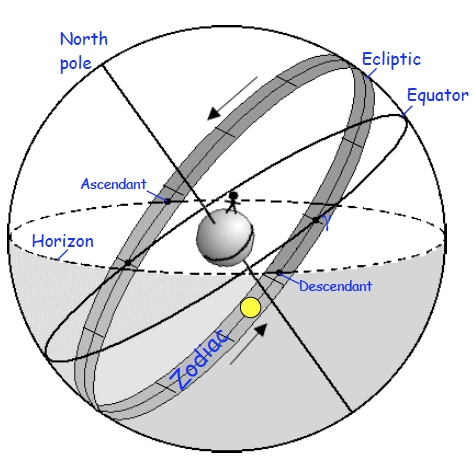

# From Space
WiP. Will need refactoring...
Here WebComponents and Celestial calculation scripts are located under  the `from.space` directory.
All those could be reused from higher in the tree.

Entry point is `FromSpace.html`.

Used with a `RESTNavServer`, to display the celestial configuration at the GPS time and
position returned by the server (Use the script `demoLauncher.sh`, in the `launchers` folder).

For an example, try the option `13e` in the `demoLauncher.sh`, and use the
<http://localhost:9999/web/index.2.html> menu.

Southern hemisphere: use `9e` (for example).

## Three Circles...

## Other apps to check out
- [Stellarium](https://stellarium-web.org/)
- [Star Walk](https://starwalk.space/)

---