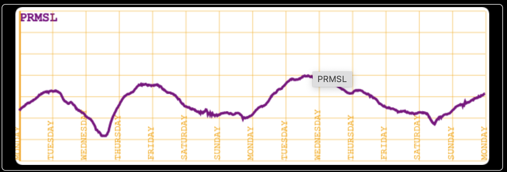

# Extract Custom Data from Log-Files

## Extract data, and render them your own way

Several utilities are available in this project, to turn the logged data into CSV, GPX, KML, JSON, etc.

Now, it is also easy to extract the data you want from a log file, in order to render them the way you want.

An example of such a code is given in the class named `util.NMEAtoJSONTimeAndPRMSL`.  
This code will extract the Atmospheric Pressure data from a log file, along with the corresponding date, in order to - eventually - display
those data, as it would be done on a barograph.

On the logging device (the one the NMEA-multiplexer runs on), there is a `BMP180`, or a `BME280`, that provides atmospheric data, among which we have the 
atmospheric pressure, returned in a NMEA `XDR` sentence. A GPS is also plugged in, and will provide UTC date and time, returned in an NMEA `RMC` sentence.  

The game, here, is to extract the XRD/Pressure data, along with their corresponding UTC time and date.

If we have data spawned into several log files, we can merge them using the `log.merge.sh` script.  
We will - in our case - end up with a log-file like
```
. . .
$CCMWD,178.0,T,,M,1.0,N,0.5,M*60
$GPRMC,064440.00,A,4740.66783,N,00308.13379,W,0.035,,110323,,,A*6B
$CCMWV,178.0,T,001.0,N,A*34
$CCVWT,178.0,R,1.0,N,0.5,M,1.9,K*4D
$CCMWD,178.0,T,,M,1.0,N,0.5,M*60
$GPVTG,,T,,M,0.035,N,0.064,K,A*27
$GPGGA,064440.00,4740.66783,N,00308.13379,W,1,06,1.55,34.4,M,49.4,M,,*7E
$GPGSA,A,3,13,14,17,15,24,05,,,,,,,2.49,1.55,1.96*04
$GPGSV,3,1,12,05,22,188,17,10,07,329,,12,02,202,,13,64,106,26*76
$GPGSV,3,2,12,14,37,056,24,15,82,262,19,17,15,097,20,18,04,271,23*79
$GPGSV,3,3,12,19,05,125,,23,32,306,,24,41,263,26,30,12,071,*72
$GPGLL,4740.66783,N,00308.13379,W,064440.00,A,A*76
$PYMTA,28.3,C*05
$PYMMB,29.6386,I,1.0036,B*74
$PYXDR,H,27.6,P,0,C,28.3,C,1,C,7.8,C,DEWP,P,100356,P,3,P,1.0036,B,4*7D
$CCMWV,178.0,T,001.3,N,A*37
$CCVWT,178.2,R,1.3,N,0.7,M,2.4,K*40
$CCMWD,178.0,T,,M,1.3,N,0.7,M*61
$GPRMC,064441.00,A,4740.66876,N,00308.13420,W,0.318,,110323,,,A*68
$CCMWV,178.0,T,001.3,N,A*37
. . .
```
Notice the `XDR`, and `RMC` sentences

In order not to have too many points, we want to get the Atmospheric Pressure every 15 minutes.  
Look into the code to see how this is done.

After running the `util.NMEAtoJSONTimeAndPRMSL` on the log-file mentioned above, you
end up with a JSON file, containing data like
```json
{
  "x": [
    1.0,
    2.0,
    3.0,
    4.0,
    5.0,
    6.0,
    7.0,
    8.0,
    9.0,
    .
    .
    .
  ],
  "y": [
    1003.58,
    1003.83,
    1003.84,
    1004.16,
    1004.27,
    1004.44,
    1004.74,
    1004.79,
    1004.87,
    1005.07,
    .
    .
    .
  ]
}
```
The data we are interested in to visualize them in a [graph WebComponent](https://github.com/OlivierLD/WebComponents/tree/master/oliv-components/widgets/graph) are in the `"y"` array.  
They can be extracted from the above, and rendered as follow:



---
> _**Note**_: many other web components are available in the repo mentioned above, they can be visualized at 
> <https://olivierld.github.io/webcomponents/gallery.html>.
---
