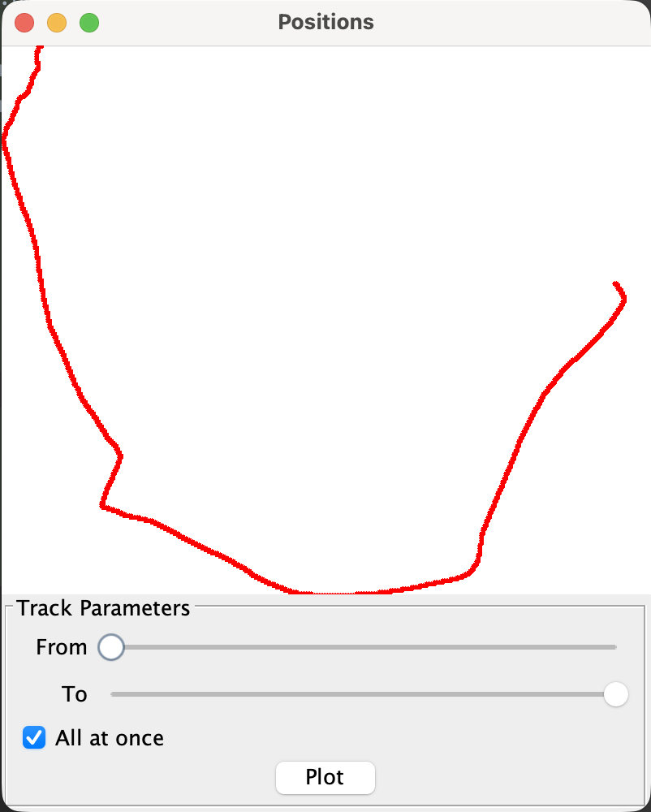
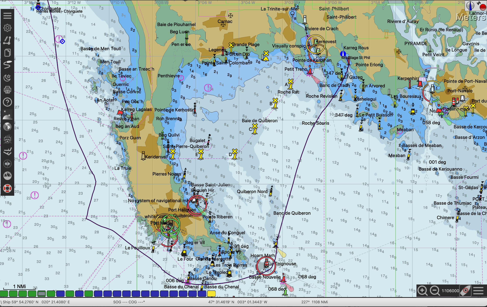

# Log file management.

Here is a full example. We will start from the log-file(s) on the Raspberry Pi, and will end up with the data displayed on a chart, on a web page.

---

We will proceed in several steps:
- Download the files
- Merge them
- Filter the data - if needed (remove unwanted sentences)
- Shrink them (remove unwanted records, before the real start, an/or after arriving)
- Process the data - into the expected format
- Display them!

## 1 - Download the files
The file where logged on the Raspberry Pi, using a forwarder defined like this:
```yaml
forwarders:
  . . .
  - type: file
    verbose: false
    timebase.filename: true
    filename.suffix: _LOG
    log.dir: logged
    split: hour
    sentence.filters: ~GGA,~GSV,~GSA
  ```
This means that file log files will be stored in a folder name `logged`, and split every hour.

### To download the files
From another machine (or not!), we are going to copy those files.  
connected (with ssh) on the Rapsberry Pi, we can see the files:
```commandline
pi@rpi-a-plus:~/nmea-dist/logged [10.42.0.1] $ tree -hpu .
[drwxr-xr-x root     4.0K]  .
├── [drwxr-xr-x root     4.0K]  2026-05-08_07-21-29
│   ├── [-rw-r--r-- root     919K]  2026-05-08_07-21-29_UTC_LOG.nmea
│   ├── [-rw-r--r-- root     1.4M]  2026-05-08_08-00-00_UTC_LOG.nmea
│   ├── [-rw-r--r-- root     1.4M]  2026-05-08_09-00-00_UTC_LOG.nmea
│   ├── [-rw-r--r-- root     1.4M]  2026-05-08_10-00-00_UTC_LOG.nmea
│   ├── [-rw-r--r-- root     1.4M]  2026-05-08_11-00-00_UTC_LOG.nmea
│   ├── [-rw-r--r-- root     1.4M]  2026-05-08_12-00-00_UTC_LOG.nmea
│   ├── [-rw-r--r-- root     1.4M]  2026-05-08_13-00-00_UTC_LOG.nmea
│   ├── [-rw-r--r-- root     1.4M]  2026-05-08_14-00-00_UTC_LOG.nmea
│   ├── [-rw-r--r-- root     1.4M]  2026-05-08_15-00-00_UTC_LOG.nmea
│   ├── [-rw-r--r-- root     1.4M]  2026-05-08_16-00-00_UTC_LOG.nmea
│   ├── [-rw-r--r-- root     1.4M]  2026-05-08_17-00-00_UTC_LOG.nmea
│   └── [-rw-r--r-- root     176K]  2026-05-08_18-00-00_UTC_LOG.nmea
└── [drwxr-xr-x root     4.0K]  2026-05-08_18-07-55

3 directories, 12 files
pi@rpi-a-plus:~/nmea-dist/logged [10.42.0.1] $ 
```
First, we are going to get them, with a scp (Secured CoPy) command. On the laptop (or whatever machine) we want to get those files,
let's do it:
```commandline
$ mkdir logged
$ cd logged
$ scp -r pi@10.42.0.1:~/nmea-dist/logged .
pi@10.42.0.1's password: 
2026-05-08_07-21-29_UTC_LOG.nmea                                                                                                                                                                                                100%  919KB   2.5MB/s   00:00    
2026-05-08_17-00-00_UTC_LOG.nmea                                                                                                                                                                                                100% 1447KB   2.9MB/s   00:00    
2026-05-08_11-00-00_UTC_LOG.nmea                                                                                                                                                                                                100% 1444KB   2.0MB/s   00:00    
2026-05-08_09-00-00_UTC_LOG.nmea                                                                                                                                                                                                100% 1444KB   3.9MB/s   00:00    
2026-05-08_10-00-00_UTC_LOG.nmea                                                                                                                                                                                                100% 1444KB   2.1MB/s   00:00    
2026-05-08_16-00-00_UTC_LOG.nmea                                                                                                                                                                                                100% 1445KB   4.3MB/s   00:00    
2026-05-08_15-00-00_UTC_LOG.nmea                                                                                                                                                                                                100% 1446KB   3.4MB/s   00:00    
2026-05-08_13-00-00_UTC_LOG.nmea                                                                                                                                                                                                100% 1440KB   2.2MB/s   00:00    
2026-05-08_14-00-00_UTC_LOG.nmea                                                                                                                                                                                                100% 1446KB   3.5MB/s   00:00    
2026-05-08_12-00-00_UTC_LOG.nmea                                                                                                                                                                                                100% 1438KB   3.4MB/s   00:00    
2026-05-08_18-00-00_UTC_LOG.nmea                                                                                                                                                                                                100%  176KB   1.6MB/s   00:00    
2026-05-08_08-00-00_UTC_LOG.nmea                                                                                                                                                                                                100% 1444KB   2.2MB/s   00:00    
$ 
```
### 2 - Merge the files
The script `log.merge.sh` will merge all the `*.nmea` files present in a designated folder.  
The script `log.merge.deep.sh` will merge all the `*.nmea` files present in a designated folder **_and in its sub-folders_**.  
We will use tha `log.merge.deep.sh` script:
```commandline
$ ./log.merge.deep.sh sample-data/May-2026-Etel-StPhil/ ./sample-data/full-may-2026.nmea
Usage is:
./log.merge.deep.sh nmea-path final-file-name
It will merge all the *.nmea in {nmea-path} into {final-file-name}
Merging nmea data into ./sample-data/full-may-2026.nmea
Adding sample-data/May-2026-Etel-StPhil/logged/2026-05-08_07-21-29/2026-05-08_11-00-00_UTC_LOG.nmea
Adding sample-data/May-2026-Etel-StPhil/logged/2026-05-08_07-21-29/2026-05-08_12-00-00_UTC_LOG.nmea
Adding sample-data/May-2026-Etel-StPhil/logged/2026-05-08_07-21-29/2026-05-08_14-00-00_UTC_LOG.nmea
Adding sample-data/May-2026-Etel-StPhil/logged/2026-05-08_07-21-29/2026-05-08_09-00-00_UTC_LOG.nmea
Adding sample-data/May-2026-Etel-StPhil/logged/2026-05-08_07-21-29/2026-05-08_17-00-00_UTC_LOG.nmea
Adding sample-data/May-2026-Etel-StPhil/logged/2026-05-08_07-21-29/2026-05-08_16-00-00_UTC_LOG.nmea
Adding sample-data/May-2026-Etel-StPhil/logged/2026-05-08_07-21-29/2026-05-08_08-00-00_UTC_LOG.nmea
Adding sample-data/May-2026-Etel-StPhil/logged/2026-05-08_07-21-29/2026-05-08_18-00-00_UTC_LOG.nmea
Adding sample-data/May-2026-Etel-StPhil/logged/2026-05-08_07-21-29/2026-05-08_15-00-00_UTC_LOG.nmea
Adding sample-data/May-2026-Etel-StPhil/logged/2026-05-08_07-21-29/2026-05-08_13-00-00_UTC_LOG.nmea
Adding sample-data/May-2026-Etel-StPhil/logged/2026-05-08_07-21-29/2026-05-08_10-00-00_UTC_LOG.nmea
Adding sample-data/May-2026-Etel-StPhil/logged/2026-05-08_07-21-29/2026-05-08_07-21-29_UTC_LOG.nmea
Done
Now you might want to run a ./log.shrinker.sh ./sample-data/full-may-2026.nmea
```
Here is what the result looks like:
```
$PYMMB,30.3356,I,1.0272,B*76
$PYXDR,H,40.0,P,0,C,35.6,C,1,C,19.9,C,DEWP,P,102716,P,3,P,1.0272,B,4*4D
$GPGLL,4732.23537,N,00311.85933,W,122000.00,A,A*7F
$CCMWV,330.0,T,001.3,N,A*39
$CCVWT,29.8,L,1.3,N,0.7,M,2.4,K*61
$CCMWD,330.0,T,,M,1.3,N,0.7,M*6F
$GPRMC,122001.00,A,4732.23475,N,00311.85912,W,2.226,163.08,230526,,,A*75
$CCMWV,330.0,T,001.3,N,A*39
$CCVWT,30.0,L,1.3,N,0.7,M,2.4,K*61
$CCMWD,330.0,T,,M,1.3,N,0.7,M*6F
$GPVTG,163.08,T,,M,2.226,N,4.123,K,A*31
$GPGLL,4732.23475,N,00311.85912,W,122001.00,A,A*7A
$CCMWV,326.0,T,001.6,N,A*3B
$CCVWT,34.4,L,1.6,N,0.8,M,2.9,K*66
$CCMWD,325.0,T,,M,1.6,N,0.8,M*61
$GPRMC,122002.00,A,4732.23410,N,00311.85876,W,2.452,158.94,230526,,,A*7E
$CCMWV,326.0,T,001.6,N,A*3B
$CCVWT,34.3,L,1.6,N,0.8,M,2.9,K*61
$CCMWD,325.0,T,,M,1.6,N,0.8,M*61
$GPVTG,158.94,T,,M,2.452,N,4.541,K,A*39
$GPGLL,4732.23410,N,00311.85876,W,122002.00,A,A*79
$PYMTA,35.6,C*0C
$PYMMB,30.3362,I,1.0272,B*71
$PYXDR,H,39.6,P,0,C,35.6,C,1,C,19.7,C,DEWP,P,102718,P,3,P,1.0272,B,4*45
$CCMWV,324.0,T,001.3,N,A*3C
. . .
```

### 3 - Filter
In case we want to exclude sentences and/or talkers:
```commandline
$ ./log.filter.sh --input-data-file:sample-data/full-may-2026.nmea --output-data-file:sample-data/filtered-may-2026.nmea --exclude-talkers:CC --exclude-sentences:TXT,VTG
Invalid Checksum for [$GPRMC,192719.00,A,4734.08890,N,00259.17063,W,0.129,,230526,,,A$CCVWT,98.0,L,3.1,N,1.6,M,5.7,K*67], line # 266811
Read 403,258 lines, written 132,012 lines.
```

### See what's in there
```commandline
./log.analyzer.sh sample-data/full-may-2026.nmea 
Analyzing sample-data/full-may-2026.nmea.
Valid Strings:
VWT : 72,877 element(s) (Wind Data)
MMB : 17,088 element(s) (Atm Pressure)
GLL : 36,438 element(s) (Geographical Lat & Long)
XDR : 17,088 element(s) (Transducer Measurement)
VTG : 36,438 element(s) (Track made good and Ground speed)
RMC : 36,438 element(s) (Recommended Minimum Navigation Information, C)
MWD : 72,877 element(s) (Wind Direction & Speed)
MTA : 17,088 element(s) (Air Temperature, Celsius)
MWV : 72,876 element(s) (Wind Speed and Angle)
Valid Devices:
CC : 218,630 element(s)
GP : 109,314 element(s)
PY : 51,264 element(s)
Started 23-May-2026 09:20:01 GMT, at N  47°38.90' / W 003°12.62' (IN87jp) (8CVRJQXQ+8R) (idx 3)
Arrived 23-May-2026 19:27:18 GMT, at N  47°34.09' / W 002°59.17' (IN87mn) (8CVVH297+7G) (idx 379197)
Used 36,438 record(s) out of 379,208. 
Total distance: 24.474 (24.428) nm, in 10 hour(s) 7 minute(s) 17.0 sec(s). Avg speed:2.418 kn
Max Speed (SOG): 5.309 kn
Min Speed (SOG): 0.028 kn
Top-Left    :N  47°38.90' / W 003°13.34' (IN87jp) (8CVRJQXH+83) (47.648261 / -3.222329)
Top-Right   :N  47°38.90' / W 002°58.94' (IN87mp) (8CVVJ2X9+83) (47.648261 / -2.982355)
Bottom-Right:N  47°26.86' / W 002°58.94' (IN87mk) (8CVVC2X9+23) (47.447608 / -2.982355)
Bottom-Left :N  47°26.86' / W 003°13.34' (IN87jk) (8CVRCQXH+23) (47.447608 / -3.222329)
Min Lat (47°26.86'N) record idx (in sample-data/full-may-2026.nmea): 265229, at 23-May-2026 16:24:47 GMT
Max Lat (47°38.90'N) record idx (in sample-data/full-may-2026.nmea): 2, at 23-May-2026 09:20:01 GMT
Min Lng (3°13.34'W) record idx (in sample-data/full-may-2026.nmea): 28673, at 23-May-2026 10:05:56 GMT
Max Lng (2°58.94'W) record idx (in sample-data/full-may-2026.nmea): 371924, at 23-May-2026 19:15:39 GMT

Max Calc Speed: 3.145 ms
Bottom-Left to top-right: 15.472 nm
Top-Left to bottom-right: 15.472 nm
Tooltip: idx 0, (rec #3)
Tooltip: idx 36433, (rec #379197)
+---------------------------------------+
| Checkout the spreadsheet /Users/olivierlediouris/repos/ROB/raspberry-sailor/NMEA-multiplexer.sample-data/full-may-2026.nmea.csv.
| Use ONLY 'TAB' as separator !!!       |
| Use Unicode (UTF-8) as character set. |
+---------------------------------------+
Size 400 x 338
Size 400 x 338

```
And this also displays a little Swing UI:  
  
And a `csv` file has been generated, it can be used as a spreadsheet, and displayed as such.

### 4 - Shrink the file

### 5 - Process the data
Data can now be transformed into different formats. `GPX` for example, would be understood by 
several other software ,like OpenCPN - among many others.
```commandline
$ ./log.to.gpx.sh sample-data/filtered-may-2026.nmea

Generated file sample-data/filtered-may-2026.nmea.gpx is ready.
MMB: 18172 records
GLL: 38748 records
XDR: 18172 records
RMC: 38748 records
MTA: 18172 records

```

In OpenCPN:  


---