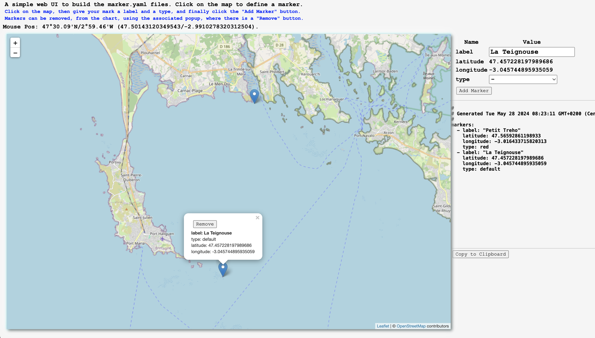

# NMEA Multiplexer - Technical Manual

[<< Back](./README.md)

The following sections will make references to several resources (Java classes, properties files, etc).
They are all part of this project, so you can refer to them if needed for more details.

The program to start is `nmea.mux.GenericNMEAMultiplexer`, it is driven by a `properties` or `yaml` file,
describing the features required by an instance of the Multiplexer (channels, forwarders, computers, http server, etc).

- [Properties](#properties)
- [Pre-defined channel types](#pre-defined-channel-types)
- [Forwarders](#forwarders)
- [Pre-defined forwarder types](#pre-defined-forwarder-types)
- [Pre-defined computer type(s)](#pre-defined-computer-types)
- [Other properties](#other-properties)
- [Chartless Maps](#chartless-maps-markers-and-borders)
- [Example](#example)
- [Minimal](#minimal)
- [And then...](#and-then)
- [To summarize](#to-summarize)
- [Other resources](#other-resources)


### Properties
Here is a brief description of the properties managed by the `nmea.mux.GenericNMEAMultiplexer`, the ones
present in the file `nmea.mux.properties`, or in the file named as set in the System variable `mux.properties`.

Property names of channels, forwarders and computers follow this pattern:
```
 [element-type].[index].[attribute]
```

Element types can take three values: `mux`, `forward`, or `computer`:

- Whatever begins with `mux.` is a channel
- Whatever begins with `forward.` is a forwarder
- Whatever begins with `computer.` is a computer

For the three categories above, the second item is the index of the element.
Indexes are numbers, mentioned on two digits. Indexes _must_ start at `01` and be
after that incremented by `1`.

For example, `mux.01.xxx`, followed by `mux.02.yyy`.

> _Quick explanation_: To find the first channel, the program looks for a `mux.01.*`.
> If no such entry is found, that would mean for the program that there is no channel to deal with.
> After finding and evaluating `mux.01.xxx`, the program looks for `mux.02.*`. If no
> such channel is found, the program understands that the list of the channels is terminated.
> This is the same for channels, forwarders and computers.

The third part of the property name (the `type` in `mux.0X.type` for example) is the attribute.
_**ALL**_ elements _have_ a mandatory `type` attribute, the other attributes depend on this `type`.

> _**Exception**_: if an element does _not_ have a `type` attribute, then it is a custom element, it _must_ have a _cls_ attribute
> containing the name of the Java `class` to load dynamically, with a `Class.forName`.
> For example, a line like that one
```properties
 forward.02.class=nmea.forwarders.LedBlinker
```
> would tell the Multiplexer to load a forwarder defined in the class `nmea.forwarders.LedBlinker`.
> If the loaded class does not extend the right `superclass` or implement the right `interface`, an error
> will be raised.

#### YAML
> _Note_: Since October 2019, a `yaml` format is also supported for the properties of the multiplexer.
> It's a bit easier than the `properties` syntax.
>
> Example:
```yaml
 #
 # This is an example of the way a MUX could be defined with YAML.
 #
 name: "NMEA with GPS, BME280, LSM303 through TCP"
 description:
   - "Part 1"
   - "Part 2"
   - "Etc..."
 context:
   with.http.server: true
   http.port: 5678
   init.cache: true
   default.declination: 14
   deviation.file.name: dp_2011_04_15.csv
   # Leeway = max.leeway * cos(awa)
   max.leeway: 10
   bsp.factor: 1.0
   aws.factor: 1.0
   awa.offset: 0
   hdg.offset: 0
   damping: 30
   markers: markers.yaml
 channels:
   - type: serial
     port: /dev/ttyS80
     baudrate: 4800
     verbose: false
   - type: tcp
     port: 7001
     verbose: false
   - type: tcp
     port: 7002
     verbose: false
     sentence.filters: HDM,XDR
     heading.offset: 0
 forwarders:
   - type: file
     timebase.filename: true
     filename.suffix: _LOG
     log.dir: logged
     split: hour
   - type: tcp
     port: 8001
 computers:
   - type: tw-current
     prefix: CC
     time.buffer.length: 30, 60, 600
```

Channel `properties` like: 
```properties                                       
mux.01.type=tcp           
mux.01.verbose=false
mux.01.sentence.filters=HDM,XDR
```
are equivalent to `yaml` like
```yaml
channels:
 - type: tcp           
   verbose: false
   sentence.filters: HDM,XDR
```  
> Notice that the yaml does not require `mux.01.xxx` and `mux.02.xxx` as the `properties` do. That 
> makes it a bit more convenient and flexible to use.

#### Pre-defined channel types
> Note: There is a default REST channel type available when `with.http.server` is set to `true`. See below.

- `serial`
    - Serial port input.
    ```properties
    mux.01.type=serial
    mux.01.port=/dev/ttyUSB0
    mux.01.baudrate=4800
    mux.01.verbose=false
    mux.01.reset.interval=60000
    ```
    > The optional `reset.interval` is in milliseconds. It closes and re-opens the Serial port as mentioned.  
    It happens to be useful on some devices...  

> ### _**Note**_: _Reading a Serial port through `stty`_.   
> Reading the serial ports relies on the `librxtx-java` library. I came across
> several wierd behaviors, like when reading `/dev/ttyUSB0` with a baud rate of `38400`... without being able to find the root cause of the problem,
> or being able to reproduce it on another machine.  
> A solution would be to map the port using a command like `stty -F /dev/ttyUSB0 raw 38400 cs8 clocal`,
> and then read the port using a `file` channel, defined like
> ```yaml
> - type: file
>   filename: /dev/ttyUSB0
>   verbose: false
> ```
> This turned out to fix the problem.  
> And also, that sounds like a possible way not to depend on `librxtx-java`, which remains an external library.

- `tcp`
    - TCP input
    ```properties
    mux.01.type=tcp
    mux.01.server=ais.exploratorium.edu
    mux.01.port=80
    mux.01.verbose=false
    ```
  
- `file`
    - Log file replay (or stream reading)
    ```properties
    mux.01.type=file
    mux.01.filename=./sample.data/archived.logged.data.zip
    mux.01.zip=true
    mux.01.path.in.zip=2010-11-08.Nuku-Hiva-Tuamotu.nmea
    mux.01.loop=true             # Default true
    mux.01.between-records=500   # Default 500ms
    ```
    > The `filename` can be an archive (zip) or a text file (containing NMEA sentences)
    >
    > If the file is a zip, you set the `zip` property to `true` (default is `false`), and possibly 
    > the `path.in.zip`. If `path.in.zip` is null or invalid, the first entry in the archive will be used.
    > This can be usefull, as the archive may very well contain several log files.
- `ws`
    - WebSocket input. This is acting as a WebSocket _client_. 
    ```properties
    mux.02.type=ws
    mux.02.wsuri=ws://192.168.1.136:9876/
    ```
    > See the examples of WebSocket servers suitable for this channel (like `wsnmea.js`, running on NodeJS).  
      The server is designed to push to every connected client the NMEA data pushed to it (see the `ws` forwarder about that).
- `rnd`
    - Random data generator (for debug)
    ```properties
    mux.04.type=rnd
    ```
- `zda`
    - ZDA Sentence generator (UTC day, month, and year, and local time zone offset)
    ```properties
    mux.01.type=zda
    ```
- `rest`
  - Work in Progress
  - The `jqs` parameter below intends to work like the `jq` utility, on a returned JSON payload 
    - See the [JQ](https://stedolan.github.io/jq/) repo 
    - For JQ (**J**SON **Q**uery) Syntax, see <https://lzone.de/cheat-sheet/jq>, and <https://github.com/eiiches/jackson-jq>
  - For `GET` queries only (...for now)  
    ```properties
    mux.01.type=rest
    mux.01.protocol=http
    mux.01.machine-name=192.168.1.102
    mux.01.http-port=8080
    mux.01.query-path=/mux/cache
    mux.01.query-string=?query=string  # Must include the leading ?, and subsequent &...
    mux.01.jqs=".NMEA_AS_IS | { RMC, GLL }"  # jq-like expression
    mux.01.between-loops=1000   # Default is 1000ms
    mux.01.verbose=false
    ```
    or in `yaml`:
    ```yaml
    channels:
    . . .
    - type: rest
      protocol: http
      machine-name: 192.168.1.105
      http-port: 8080
      query-path: /mux/cache    # /bme280/nmea-data
      query-string: ?query=string  # Must include the leading ?, and subsequent &...
      jqs: ".NMEA_AS_IS | { RMC, GLL }"  # null
      between-loops: 2000  # in ms (default 1000)
      verbose: false
    ```
    <!-- This one is more designed to be extended. -->  
    Look into the repo for more examples.    
    The tricky point is that this has to generate a _valid_ NMEA String, and that requires
    a knowledge of the structure of the payload returned by the service, if not some post-processing.
  
    As it is now, we can deal with REST services returning in the response's payload:
    - A JSON Map
    - A plain object (as a String in `plain/text`)
    
    If it is a map like `{ "one": "$IDAAA,aaaaa*FF", "two": "$IDBBB,bbbbb*FF" }`, the Consumer will
    assume that the values `"$IDAAA,aaaaa*FF"` and `"$IDBBB,bbbbb*FF"` are NMEA 
    valid strings, and will be managed as such. If invalid, they'd be lost (See in `nmea.api.NMEAParser`, method `interesting()`).  
    If it is a plain object, it will be managed as usual, if NMEA-valid.
---

- _**Note**_: there is an "Implicit" REST input (to feed the cache)
    - Like a `rest` input channel (consumer)
    - If the `with.http.server` is running, then there is REST resource
    ```
    POST /mux/nmea-sentence -h "Content-Type: plain/text" -d "$GPRMC,....."
    ```
    - This can be used to feed the cache "by hand".
    - Use system variable `-Drest.feeder.verbose=true` to see the output.

You can also define your own channels (extending `NMEAClient` and with a `reader` attribute in the properties, like `mux.02.reader=nmea.consumers.reader.ReaderSkeleton`).  
Look for `mux.01.class=nmea.consumers.client.WeatherStationWSClient`.  
Do also take a look at the class `nmea.consumers.dynamic.TXTExample`, it shows how to implement your own custom Consumer, along
wit a `yaml` using it, `nmea.mux.dyn.consumer.yaml`.

Channels can use those three attributes: `properties`, `device.filters`, `sentence.filters`:
```properties
mux.01.properties=weather.station.properties
mux.01.device.filters=II, GP
mux.01.sentence.filters=MMB, XDR, MDA
```
`device.filters` and `sentence.filters` both support positive (inclusive) and negative (exclusive) filters.
Negative filters are prefixed with `~`.

A line like
```properties
mux.01.sentence.filters=~MMB, ~GGA, ~GSV
```
means "_everything, but no MMB, no GGA, no GSV_".

A line like
```properties
mux.01.sentence.filters=RMC, XDR, MDA
```
means "_only RMC, XDR or MDA_".

> _Note_: a line like `~RMC, MDA` does not mean much, as it would mean [`no RMC` and `just MDA`]. 
> A line like `MDA` would mean the same thing.

##### A Convention
If a channel definition has a `properties` member, and if there is a `janitor` member in those properties like this:
```yaml
channels:
  - type: zda
    properties: mux-configs/dummy.zda.properties
. . .
```
and
```properties
janitor=default
dummy=stuff
whatever=itizz
```
then:  
If `janitor` is set to `default`, then the default `nmea.consumers.client.Janitor.executeOnClose()` will be executed, with the properties as parameter of the method.  
Otherwise, the `janitor` will be dynamically loaded, and its `executeOnClose(Properties prop)` method will be executed, with the properties as parameters.  
All you need to do is to implement your own `Janitor`, and have it in the classpath. It could then
be mentioned like this:
```properties
janitor=my.own.CustomJanitor
dummy=stuff
whatever=itizz
```
The property values required at runtime (on close) by the `Janitor` would here be the values of `dummy` and `whatever`.


#### Forwarders

_**ALL**_ forwarders can use 2 _optional_ attributes, `subclass` and `properties`:
```properties
forward.XX.type=file
forward.XX.subclass=nmea.forwarders.ExtendedDataFileWriter
forward.XX.properties=validlogger.properties
. . .
```
The lines above means that:
- The `nmea.forwarders.ExtendedDataFileWriter` is a `file` Forwarder (it extends `DataFileWriter`)
- Required extra properties are in a file named `validlogger.properties`.

> _Note_: if `ExtendedDataFileWriter` happens not to extend the class anticipated by the `type`, a runtime error will be raised.

> _**Dynamic loading versus sub-classing**_:
> We've seen before that you have the possibility - using a `class` attribute - to define your own
> elements (Channel, Forwarder or Computer) and dynamically load it at runtime. Here we see the possibility to `extend` a given element type.
> A dynamically loaded element gives the programmer more flexibility and room for invention, but it _cannot_
> be managed by the `admin` web page. A sub-class of a given type of element can be much lighter to write,
> and _is_ manageable by the `admin` web page.

> See `ExtendedDataFileWriter.java` for details.
 
Several "dynamic" forwarders are provided, as examples. See - among others
- `CharacterConsoleWrite.java`
- `SQLitePublisher.java`
- . . .

#### Pre-defined forwarder types

- `serial`
    - Write to a serial port
    ```properties
    forward.02.type=serial
    forward.02.port=/dev/ttyS88
    forward.02.baudrate=9600
    ```
- `tcp`
    - TCP Server
    ```properties
    forward.01.type=tcp
    forward.01.port=7001
    ```
  > _Note_: using `forward.XX.properties`, you can refer to a properties file containing a `with.ais` properties.
  > Default value is `true`, it can be set to `false` to prevent the AIS strings to be re-broadcasted.
  >
  > Along the same lines, there is a `put.ais.in.cache` property defaulted to `true`. Set it to `false` if you do not need the 
  > parsed AIS data to end up in the NMEA Cache. 
  >
- `udp`
  - UDP Client
  ```properties
  forward.01.type=udp
  forward.01.port=8002
  ```
- `rest`
    - Forward the NMEA data (string by string) to a REST endpoint (WiP).
    - Can be used - for example - to push data to the implicit REST channel (see above)
    ```properties
    forward.02.server.name=192.168.42.6
    forward.02.server.port=8080
    forward.02.rest.resource=/mux/nmea-sentence
    forward.02.rest.verb=POST
    forward.02.rest.protocol=http
    forward.02.http.headers=Content-Type:plain/text,Whatever:whateverYouLike
    ```                                                                                                      
- `gpsd`
    - GPSD Server
    ```properties
    forward.06.type=gpsd
    forward.06.port=2947
    ```
- `file`
    - Log file output
    ```properties
    forward.XX.type=file
    # Option 1
    forward.XX.filename=./data.nmea
    # Option 2
    forward.XX.timebase.filename=true
    forward.XX.filename.suffix=_LOG
    forward.XX.log.dir=logged
    forward.XX.split=min|hour|day|week|month|year
    #
    forward.XX.append=true
    forward.XX.flush=true
    #
    forward.XX.sentence.filters=~GSA,~GGA,~GSV

    ```
    > _Explanations_:
    > - `timebase.filename` default value is `false`
    > - if `timebase.filename` is `false` then a `filename` is expected to be provided (default is `data.nmea`).
    > - if `timebase.filename` is `true` then log file name will be based on the time the logging was started, like `2018-10-22_20:04:00_UTC.nmea`.
    >   - if `filename.suffix` exists (default is an empty string) like `LOG_`, then log file name will be `LOG_2018-10-22_20:04:00_UTC.nmea`.
    >   - if `log.dir` exists (default is `.`) log files will be generated in this directory (located under the working directory).
    >   - if `split` exists (default is `null`) and one of `min`, `hour`, `day`, `week`, `month`, `year`, then a new log file will generated every `min`, `hour`, `day`, `week`, `month`, or `year`.
    > - `flush` will write to the disk every time a record is written. Default is `false`.
    > - `sentence.filters`, default `null`. Allows to log _only_ some sentences, or exclude some sentences.
    >   - A filter like `RMC,GLL` would log only the `RMC` and `GLL` sentences
    >   - A filter like `~GSA,~GGA,~GSV` will exclude `GSA`, `GGA` and `GSV` from the log.
    
- `ws`
    <!-- TODO: See https://www.baeldung.com/java-websockets -->
    - WebSocket server. 
    > Pushes NMEA data to an _**external**_ WebSocket server (NodeJS for example, does the job). Unlike for `tcp` where the NMEA-multiplexer acts as a TCP server,
    the NMEA-multiplexer is _**not**_ acting as a WebSocket server.  
    For a NodeJS server example, see `wsnmea.js`. Can be started with an `npm start`.
    ```properties
    forward.07.type=ws
    forward.07.wsuri=ws://localhost:9876/
    ```
- `wsp`
    - WebSocket Processor.  
    > This is more like an example of a transformer.    
    To be used with other apps, like the pebble one.  
    The transformer turns the content of the NMEA Cache into the expected format.    
    _May require some customization!!!_    
    See <https://github.com/OlivierLD/SmartWatches/tree/master/pebble/NMEA>
    ```properties
    forward.07.type=wsp
    forward.07.wsuri=ws://localhost:9876/
    ```
- `console`
    - Console output
    ```properties
    forward.01.type=console
    ```
- `rmi`
    - RMI Server
    ```properties
    forward.05.type=rmi
    forward.05.port=1099
    forward.05.name=RMI-NMEA
    ```
- `nmea-cache-publisher`
  - Can be used to PUT/POST the full cache (in JSON format) to a REST server.
  ```yaml
  - type: nmea-cache-publisher
    between-loops: 1  # in seconds
    rest.protocol: http
    rest.machine-name: 192.168.1.103
    rest.port: 8080
    rest.resource: /ssd1306/nmea-data
    rest.verb: PUT
    # rest.query.string: ""
    verbose: true
  ```
  - The config above tells the multiplexer to `PUT` the cache (JSON-formatted, with a `Content-Type: application/json` header) to `http://192.168.1.103:8080/ssd1306/nmea-data` every 1 second.
  Then it is the server's (the one running on `192.168.1.103:8080` here) job to do what has to be done with the data.  
  See such an example in `REST_SSD1306_server_v2.py`, it is a REST server written in Python, displaying data on an SSD1306 oled screen.

You can also implement your own forwarder (implementing the `Forwarder` interface).

Look for `forward.02.class=nmea.forwarders.RESTIoTPublisher`

##### ⚠️ An interesting forwarder use-case ⚠️
There is in the code a `nmea.forwarders.NMEAtoTextProcessor`, that is not to be mentioned by its type, but as a custom Forwarder, like in
```yaml
forwarders:
  - class: nmea.forwarders.NMEAtoTextProcessor   # An interesting use-case.
    properties: mux-configs/nmea-to-text.properties
```
As you would see in the code, this forwarder translates the NMEA content stored in the cache in to
human-readable strings, to be displayed "somewhere".  
The strings to display are defined in the properties file attached to the forwarder,
`mux-configs/nmea-to-text.properties` in the above:
```properties
#
# display.time is the amount of seconds a given value remains displayed before switching to the next one.
#
display.time=10
screen.verbose=false
#
# The DelegateConsumer
data.consumer=nmea.forwarders.delegate.SSD1306RESTConsumer
consumer.properties=mux-configs/REST.ssd1306.dg.properties
#
# Available data:  See in NMEAtoTextProcessor, DisplayOptions.
#
to.display=POS,AWS,TWS,BSP,BSP_KMH,SOG,HDG,COG,GPS
```
This tells the forwarder to display strings named  as in the property `to.display`.  
The default behavior for `nmea.forwarders.NMEAtoTextProcessor` is to display the required text in the console:
```
Definition Name: Replay big log file.
-- Description --
Forward data to "NMEA to Text"
Work in Progress
-----------------
Log available in global, level INFO
Log file pattern mux.log
nmea.computers.current.LongTimeCurrentCalculator is starting...
nmea.computers.current.LongTimeCurrentCalculator is starting...
nmea.computers.current.LongTimeCurrentCalculator is starting...
Starting new http.HTTPServer (verbose false)
POSITION:
RMC not ready yet!
---------------
1,674,916,654,786 - Port open: 8080
1,674,916,654,786 - http.HTTPServer now accepting requests
POSITION
9°06.46'S
140°12.52'W
---------------
POSITION
9°06.46'S
140°12.52'W
---------------
POSITION
9°06.46'S
140°12.53'W
---------------
POSITION
9°06.47'S
140°12.54'W
---------------
. . .
```
The displayed data changes every 10 seconds, as defined in the property `display.time`.  
This default behavior is coded in a `Consumer<List<Stgring>>`, defaulted in the code to
```java
    // Default Consumer.
    private final Consumer<List<String>> DEFAULT_DISPLAY_CONSUMER = (dataList) -> {
        dataList.forEach(line -> System.out.println(line));
        System.out.println("---------------");
    };

    private Consumer<List<String>> displayConsumer = DEFAULT_DISPLAY_CONSUMER;
```
This behavior can be overridden, by supplying the name of a `DelegateConsumer` in the properties file, as done above in
the properties `data.consumer`, optionally `consumer.properties`.  
The `data.consumer` mentions `nmea.forwarders.delegate.SSD1306RESTConsumer`, available in this repository.  
Look into it for details.  
This class is using properties described in `consumer.properties`, `mux-configs/REST.ssd1306.dg.properties`:
```properties
ssd1306.dg.protocol=http
ssd1306.dg.server-name=192.168.1.101
ssd1306.dg.port=8080
ssd1306.dg.verb=PUT
ssd1306.dg.resource=/ssd1306/nmea-data
ssd1306.dg.verbose=false
```
This `DelegateConsumer` is doing a REST PUT request to some REST server, connected to an oled screen SSD1306, that will
display the required data. This REST server is in this case written in Python,
the code is in `REST_SSD1306_server.py`, in this repository.

| POS | AWS | BSP |
|:---:|:---:|:---:|
|  |  |  | 


#### Pre-defined computer type(s)

- `tw-current`
  - One computer, to calculate both True Wind and Current (GPS Based, with possibly several time buffers).
- `dew-point-computer`
  - Calculate the dew point temperature if relative humidity and air temperature are available. 
- `long-term-storage`
  - Example
  ```yaml
  computers:
    - type: "long-term-storage"
      ping-interval: 900   # in seconds, 15 minutes
      max-length: 672      # One week
      data-path: "Barometric Pressure,value"
      # Try curl -X GET http://localhost:9876/mux/cache | jq '."PRMSL-buff"'
      object-name: "PRMSL-buff"
      verbose: true
  ```
  This computer is dedicated to long storage. For example, the above
  will read the cache every 900 seconds (15 minutes), get to the data with a path like `["Barometric Pressure"]["value"]`,
  and store it into a buffer that will not be more than 672 elements long (672 quarters of an hour is one week).  
  This buffer is then stored in the cache, as a JSON element name - here - `PRMSL-buff`. This way,
  a regular request to the cache (`GET /mux/cache`) will retrieve the values it contains.  
  It's been originally designed to get the data for a barograph display, over one week. It could be
  use for any data you want to see the evolution of, over a given period of time.
- `ais-manager`
  - Manage AIS Collisions
- `border-manager`
  - Manage border collisions
- `next-waypoint-manager`
  - Set (or remove) the next waypoint
  
> _Important_: Computers may need data coming from the various channels. Those data will
be stored in a cache _if the property `init.cache` is set to `true`_. See below.

You can also define your own computers (extending `Computer`).

Look for `computer.02.class=nmea.computers.ComputerSkeleton`

See also the computer `nmea.computers.AISManager`. It is a computer to load as in (`yaml` version)
```yaml
computers:
  - class: nmea.computers.AISManager
    properties: ais.mgr.properties
    verbose: false
```
It's an example/WiP of the way to use AIS data to detect collision threats.
> The properties file (`properties` member in the `yaml` above) can also include a `collision.threat.callback` property.
> - If it is missing, nothing will be done when a collision threat is detected.
> - If it is set to `default`, the warning message will be displayed in the console
> - If it is set to a class name, like in:  
> ```
> collision.threat.callback=nmea.computers.SpeakingCallback
> ```
> the class name _must_ implement a `Consumer<String>`.
> - If the class is not found, then nothing happens.
> - Same if the class is not a `Consumer<String>`.
> - See a valid _example_ in `nmea.computers.SpeakingCallback.java`, that will <u>speak out loud</u> the warning message.

#### Other properties

```properties
name=Basic MUX configuration.
description.01=Basic MUX Config
description.02=HTTP port is 9999
with.http.server=yes
http.port=9999
#
init.cache=true
deviation.file.name=dp_2011_04_15.csv
# Leeway = max.leeway * cos(awa)
max.leeway=10
#
bsp.factor=1.0
aws.factor=1.0
awa.offset=0
hdg.offset=0
#
default.declination=14
damping=30
markers=markers.yaml
```

`with.http.server` is set to `no` by default. `yes` means that you will have access to
some `REST` services, for admin and other purposes.

If `with.http.server` is set to `yes` (or `true`), the default http port is `9999`. It can be overridden by `http.port` if needed.

> _Note_: with `with.http.server` set to `true` comes a REST channel: `POST /mux/nmea-sentence -d '$GPRMC,165007.445,A,3806.5201,N,12251.7777,W,001.7,192.6,200818,,,A*7B'`
> 
> This allows you to insert NMEA or IAS Data in the cache through a REST endpoint. 

`init.cache` is set to `false` by default. A cache - accessible by `Computers` will be initialized if
`init.cache` is set to `true`.
The cache is a `Map<String, Object>`, see `context.NMEADataCache` for details.

> _Note_: If the property `with.http.server` is set to `true`, then the cache might also be accessible through a REST interface, as a `json` object reflecting the `Map` above
> (also see in the `RESTNavServer` for details).
```
 GET /mux/cache
```

If `init.cache` is set to `true` or `yes`, the following parameters will be taken in account when inserting data in the cache:
- `bsp.factor` Boat Speed Factor, number, `0` to `n`
- `aws.factor` Apparent Wind Speed Factor, number, `0` to `n`
- `awa.offset` Apparent Wind Angle offset in degrees, from `-180` to `180`
- `hdg.offset` Heading offset in degrees, from `-180` to `180`

`default.declination` will be used if not returned by the GPS (as it could, depends on your GPS). `E` is `+`, `W` is `-`.

`max.leeway` is used to calculate the leeway. The formula used here is:
```
 if awa > 90 and awa < 270 (i.e. cos(awa) < 0) then leeway = 0
 otherwise, leeway = max.leeway * cos(awa)
```
can also be more simply expressed as
```
 leeway = max.leeway * max(0, cos(awa))
```

`damping` (default is `1`) unused for now (Aug-2018), but will be.

`deviation.file.name` mentions the name of a CSV file, like - for example - `dp_2011_04_15.csv`. The
default value is `zero-deviation.csv`.

The format of this Comma-Separated-Values (CSV) file is the following one:
```csv
0.0,-0.9830777902388692
5.0,-0.011026572256005562
10.0,0.9376226337606713
15.0,1.8481417760529473
20.0,2.706968419259063
25.0,3.502010498068172
...
```
Each line contains two fields, the first one is the **Compass** Heading, the second one is the corresponding deviation.
Such a file can be rendered like this:


#### Web UI, json, and others
On the server, there is a cache, which is initialized if `with.http.server` is set to `yes`.  
This cache is read on a regular basis by a REST service `GET /mux/cache`. This is usually done ina script name `ajax.manager.js`.  
To see what's retrieved, just do a
```
$ curl -X GET http://localhost:9876/mux/cache | jq 
```
If you do not have `jq`, install it, it's a cool one.  
Then, depending on what you want to do in your Web UI, you can `subscribe` to different topics. Look for `events.subscribe` to see some examples.  

```json
$ curl -X GET http://localhost:9999/mux/cache | jq
  % Total    % Received % Xferd  Average Speed   Time    Time     Time  Current
                                 Dload  Upload   Total   Spent    Left  Speed
100 16370  100 16370    0     0   150k      0 --:--:-- --:--:-- --:--:--  152k
{
  "Damping": 1,
  "NMEA_AS_IS": {
    "GGA": "$GPGGA,201053.00,4738.52432,N,00323.04391,W,1,08,1.17,-6.4,M,49.6,M,,*67",
    "MMB": "$PYMMB,30.3035,I,1.0261,B*72",
    "GLL": "$GPGLL,4738.52432,N,00323.04391,W,201053.00,A,A*79",
    "XDR": "$PYXDR,H,44.1,P,0,C,31.6,C,1,C,17.9,C,DEWP,P,102608,P,3,P,1.0261,B,4*4E",
    "VTG": "$GPVTG,273.49,T,,M,2.690,N,4.983,K,A*3D",
    "RMC": "$GPRMC,201053.00,A,4738.52432,N,00323.04391,W,2.690,273.49,230623,,,A*7E",
    "AIS": "!AIVDM,1,1,,A,402:nvAvQRggMOiEsNKAKE?008Ag,0*30\r",
    "GSV": [
      "$GPGSV,3,1,12,05,45,304,35,06,13,187,23,07,58,073,32,09,25,076,27*73",
      "$GPGSV,3,2,12,11,42,226,28,13,28,258,34,14,06,148,21,16,02,019,24*77",
      "$GPGSV,3,3,12,20,72,281,32,29,04,300,35,30,68,148,29,39,06,107,*7C"
    ],
    "MWV": "$CCMWV,061.0,T,002.5,N,A*3B",
    "TXT": "$GPTXT,01,01,02,LLC FFFFFFFF-FFFFFFFF-FFFFFFFF-FFFFFFFF-FFFFFFFD*2C",
    "VWT": "$CCVWT,61.2,R,2.5,N,1.3,M,4.6,K*7D",
    "GSA": "$GPGSA,A,3,09,07,13,05,20,11,06,30,,,,,2.01,1.17,1.64*0B",
    "MLS": "$PNMLS,36,25,3*51\r",
    "MWD": "$CCMWD,060.0,T,,M,2.5,N,1.3,M*69",
    "MTA": "$PYMTA,31.6,C*08"
  },
  "dewpoint": 17.9,
  "HDG Offset": 0,
  "Relative Humidity": 44.1,
  "Delta Altitude": 37.1,
  "ais": {
    "2275065": {
      "4": {
        "messageType": 4,
        "repeatIndicator": 0,
        "recordTimeStamp": 1717602450279,
        "messageDescription": "Base Station",
        "navStatusDesc": null,
        "aidTypeDesc": null,
        "vesselNameStr": null,
        "nameStr": null,
        "shipTypeStr": null,
        "recordContent": {
          "UtcYear": 2024,
          "UtcHour": 15,
          "UtcMinute": 47,
          "UtcSecond": 29,
          "latitude": 47.661793,
          "PosAcc": 0,
          "UtcMonth": 6,
          "UtDay": 5,
          "longitude": -3.2019484
        },
        . . .
    }
  },
  "NbMess": 468615,
  "Air Temperature": {
    "temperature": 31.6,
    "value": 31.6
  },
  "markers-file-name": [
    "mux-configs/markers.02.yaml",
    "mux-configs/bretagne.bumper.markers.yaml",
    "mux-configs/san.juan.markers.yaml"
  ],
  "Max Leeway": 0,
  "COG": {
    "angle": 273,
    "doubleValue": 273,
    "value": 273
  },
  "AWA Offset": 0,
  "TWD": {
    "angle": 60,
    "doubleValue": 60,
    "value": 60
  },
  "RMCStatus": true,
  "Current calculated with damping": {},
  "markers-data": [
    {
      "latitude": 47.677667,
      "longitude": -3.135667,
      "label": "Belz",
      "type": "default"
    },
    . . .
    {
      "latitude": 47.643065,
      "longitude": -3.214258,
      "label": "Etel, la barre",
      "type": "red"
    },
    {
      "latitude": 47.659823,
      "longitude": -3.211443,
      "label": "Magouer",
      "type": "default"
    },
    {
      "latitude": 47.675858,
      "longitude": -3.200143,
      "label": "Pont Lorois",
      "type": "default"
    },
    {
      "latitude": 47.687092,
      "longitude": -3.18495,
      "label": "St Cado",
      "type": "default"
    },
    {
      "latitude": 47.683498,
      "longitude": -3.171165,
      "label": "Pte du Perche",
      "type": null
    },
    {
      "latitude": 47.642375,
      "longitude": -3.244957,
      "label": "Roheu",
      "type": "card-s"
    },
    {
      "latitude": 47.647265,
      "longitude": -3.425327,
      "label": "Basse Mélite",
      "type": "card-n"
    },
    {
      "latitude": 47.651588,
      "longitude": -3.438815,
      "label": "SpeerBrecker",
      "type": "card-e"
    },
    {
      "latitude": 47.617237,
      "longitude": -3.418165,
      "label": "Pte des Chats",
      "type": "card-w"
    },
    {
      "latitude": 47.621502,
      "longitude": -3.436955,
      "label": "",
      "type": "green"
    },
    . . .
  ],
  "Position": {
    "lat": 47.642072000000006,
    "lng": -3.384065166666667,
    "gridSquare": "IN87hp",
    "googlePlusCode": "8CVRJJR8+R9",
    "latInDegMinDec": "N  47°38.52'",
    "lngInDegMinDec": "W 003°23.04'"
  },
  "Solar Time": {
    "date": 1687550102595,
    "fmtDate": {
      "epoch": 1687550102595,
      "year": 2023,
      "month": 6,
      "day": 23,
      "hour": 19,
      "min": 55,
      "sec": 2,
      "tz": null
    },
    "value": 1687550102595
  },
  "Default Declination": {
    "angle": -1,
    "doubleValue": -1,
    "value": -1
  },
  "Deviation file name": "zero-deviation.csv",
  "SOG": {
    "speed": 2.69,
    "doubleValue": 2.69,
    "value": 2.69
  },
  "GPS Date & Time": {
    "date": 1687551053000,
    "epoch": 1687551053000,
    "fmtDate": {
      "epoch": 1687551053000,
      "year": 2023,
      "month": 6,
      "day": 23,
      "hour": 20,
      "min": 10,
      "sec": 53,
      "tz": null
    },
    "value": 1687551053000
  },
  "BSP Factor": 1,
  "borders-data": [
    {
      "borderName": "Etel, Right bank",
      "borderType": "open",
      "markerList": [
        {
          "latitude": 47.6600691664467,
          "longitude": -3.2113552093505864,
          "label": "1",
          "type": "default"
        },
        . . .
      ]
    },
    {
      "borderName": "Etel, Left bank",
      "borderType": "open",
      "markerList": [
        {
          "latitude": 47.65639814326938,
          "longitude": -3.207557201385498,
          "label": "1",
          "type": "default"
        },
        {
          "latitude": 47.651628318194355,
          "longitude": -3.2067632675170903,
          "label": "2",
          "type": "default"
        },
        {
          "latitude": 47.6471038087798,
          "longitude": -3.2091021537780766,
          "label": "3",
          "type": "default"
        },
        {
          "latitude": 47.64318610543658,
          "longitude": -3.21176290512085,
          "label": "4",
          "type": "default"
        }
      ]
    },
    {
      "borderName": "Groix",
      "borderType": "closed",
      "markerList": [
        . . .
      ]
    },
    {
      "borderName": "East Atlantic Bumper",
      "borderType": "open",
      "markerList": [
        . . .
      ]
    },
    {
      "borderName": "San Juan Island",
      "borderType": "closed",
      "markerList": [
        . . .
      ]
    },
    {
      "borderName": "Orcas Island",
      "borderType": "closed",
      "markerList": [
        . . .
      ]
    }
  ],
  "Barometric Pressure": {
    "pressure": 1026.1,
    "value": 1026.1
  },
  "TWS": {
    "speed": 2.5,
    "doubleValue": 2.5,
    "value": 2.5
  },
  "GPS Time": {
    "date": 1687551053000,
    "fmtDate": {
      "epoch": 1687551053000,
      "year": 2023,
      "month": 6,
      "day": 23,
      "hour": 20,
      "min": 10,
      "sec": 53,
      "tz": null
    },
    "value": 1687551053000
  },
  "AWS Factor": 1,
  "borders-threats": [],
  "Satellites in view": {
    "16": {
      "svID": 16,
      "elevation": 2,
      "azimuth": 19,
      "snr": 24
    },
    "20": {
      "svID": 20,
      "elevation": 72,
      "azimuth": 281,
      "snr": 32
    },
    "5": {
      . . .
    }
  },
  "Small Distance": 20103.016891409683,
  "Deviation data": [
    [
      0,
      0
    ],
    . . .,
    [
      350,
      0
    ],
    [
      360,
      0
    ]
  ],
  "NMEA": "$CCMWD,060.0,T,,M,2.5,N,1.3,M*69",
  "Altitude": -6.4
}
```

##### Chartless Maps. Markers and Borders
This is another interesting LowTech concept.  
The idea came to light after working on Mercator Canvases, used for celestial navigation. Those are actually **empty charts**, on which you plot your own data.  
Mmmmh, interesting, no?  
You could very well have a small Raspberry Pi with a GPS connected on it, but no chart plotter.  
The idea behind a chartless map is to prepare the data you'll need before you leave, and then use them at sea.  
With the appropriate `computer`, those borders and markers will be used by the server (the MUX) to know
when approaching a mark, or a line between two marks. Then the appropriate action can be taken, and beside, the data representing makers and borders
can be rendered by some specific WebComponents, as shown below.

`markers` (default null) can be used to mention the name of a `yaml` file containing user-defined markers, and possibly borders. Those markers
will be stored in the cache (like the deviation curve data for example), and can be referred to by some other components (like Map UIs).

Here is the way to mention those file names in the `mux-config`:
```yaml
. . .
context:
  with.http.server: true
  http.port: 9999
  init.cache: true
  default.declination: -1
  markers: mux-configs/markers.02.yaml
  markers.list:
    - markers: mux-configs/bretagne.bumper.markers.yaml
    - markers: mux-configs/san.juan.markers.yaml
channels:
  . . .
```
Notice that `markers` is used to mention one marker file.  
`marker.list` can take care of _several_ marker files.

The structure of a marker file is the following one:
```yaml
markers:
  - latitude: 47.659823
    longitude: -3.211443
    type: default
    label: "Magouer"
  - latitude: 47.675858
    longitude: -3.200143
    label: "Pont Lorois"
  - latitude: 47.687092
    longitude: -3.184950
    type: default
    label: "St Cado"
  - latitude: 47.683498
    longitude: -3.171165
    label: "Pte du Perche"
  - label: "Roheu"
    latitude: 47.642375
    longitude: -3.244957
    type: card-s
  - label: "Basse Mélite"
    latitude: 47.647265
    longitude: -3.425327
    type: card-n
  - latitude: 37.7489 
    longitude: -122.5070
    label: SF
  . . .
```
`markers` is an array of objects containing 3 (or more) members:
- `latitude` as a number
- `longitude` as a number
- `label` as a string
- `type` as an optional string
- `id` as an optional unique string (used for the routes). Markers with an `id` can be used as waypoints.

`type` is `default` by default.   
Supported types are `default`, `green`, `red`, `card-n`, `card-s`, `card-e`, `card-w`, `sp` (for special mark), `is-dng` (for isolated danger), `red-triangle`, `green-triangle`, `blue-triangle`.

###### borders

```yaml
markers:
  . . .
borders:
  - border-name: "Etel, Right bank"
    type: "open"
    border-elements:
      - rank: 1
        latitude: 47.6600691664467
        longitude: -3.2113552093505864
      - rank: 2
        latitude: 47.65532858402682
        longitude: -3.2104969024658208
      - rank: 3
        latitude: 47.6508766696586
        longitude: -3.209638595581055
      - rank: 4
        latitude: 47.643851123756754
        longitude: -3.213286399841309
  - border-name: "Etel, Left bank"
    type: "open"
    border-elements:
      - rank: 1
        latitude: 47.65639814326938
        longitude: -3.207557201385498
. . .
  - border-name: "Groix"
    type: "closed"
    border-elements:
      - rank: 1
        latitude: 47.64561482699582
        longitude: -3.4445571899414067
    . . .

```
Notice the optional `type` element, its value can be `open` or `closed` (`open` by default). `closed` can be used to define the border of an island, for example.

Borders can be managed by a `Computer`, like `nmea.computers.BorderManager`. This computer may require a properties file (`border.mgr.properties` here, see the code for details)
```yaml
computers:
  - class: nmea.computers.BorderManager
    properties: border.mgr.properties
    verbose: true
```
Web UI below is using the "Chartless Map" webcomponent.

|                   AIS, Borders, Markers                    |
|:----------------------------------------------------------:|
|                    AIS Collision threat                    |
|        |
|                       Border threat                        |
|  |
|                      Markers display                       |
|  |

For the way the collision threats are managed, see [here](../MUX-implementations/RESTNavServer/README.md#bonus).

### More
- See a closed borders example (Groix) in `markers.02.yaml`.
- See the script `markers.to.gpx.sh`, it generates a GPX file from the markers, that can be used for OpenCPN validation.
- For a live example, from the folder `raspberry-sailor/MUX-implementations/NMEA-multiplexer-basic`:
  - Start the MUX with `./mux.sh nmea.mux.replay.etel.groix.yaml`
  - Reach in a browser <http://localhost:8080/web/chartless.gps.ais.html>

This, for example, is (almost) the same chart as above, but with the Groix island, defined by rough markers...
    


This gives an idea of what can be done. Again, this kind of rendering can be easily served by a small Raspberry Pi, and displayed on a client
like an old cell-phone, that has no SIM card. All it needs is a browser (recent enough to know about WebComponents, that's all).

In all cases, threat detection belongs to a `computer`, like the `nmea.computers.BorderManager` (which is just an example, do not trust it). 

#### Bonus
It's a work in progress, but there is a graphical tool that helps you build your Markers file.  
Look for `marker.builder.html` in this repository.  
  
Also look for `marker.maker.leaflet.html`
  
This is a work in progress... If you want to create borders, you will need to edit the content of the file, 
according to the description above.  
`Note:` In a software like OpenCPN, you can also build markers (use the `drop mark` feature, when right-clicking on a chart). This
can also be an option.

### Config Example
Here is an example of a simple properties file driving the Multiplexer:
```properties
#
#  MUX definition.
#
with.http.server=yes
http.port=9999
#
# Channels (input)
#
mux.01.type=serial
mux.01.port=/dev/ttyUSB0
mux.01.baudrate=4800
mux.01.verbose=false
#
# Forwarders
#
forward.01.type=tcp
forward.01.port=7001
#
forward.02.type=file
forward.02.filename=./data.nmea
#
init.cache=true
```
This file tells the Multiplexer to:
- Read the Serial port `/dev/ttyUSB0` with a baud rate of `4800` bauds
- Forward the NMEA data on `tcp` port `7001`
- Log the data into a file named `data.nmea`.

As `with.http.server` is set to `yes`, an `admin` web page will be available on port `9999` (at http://localhost:9999/web/admin.html).

And `init.cache` is set to `true`, meaning that a Computer (not mentioned here) would be able to pick up data from the NMEA Cache.

#### Minimal
_Note_: Two system variables can be used to set the default position (in case no GPS is available) at runtime:
```
...
JAVA_OPTS="$JAVA_OPTS -Ddefault.mux.latitude=37.7489 -Ddefault.mux.longitude=-122.5070" # SF.
java -cp $CP $JAVA_OPTS navrest.NavServer
```
> `navrest.NavServer` is an example - part of this project - involving the `NMEA-Multiplexer`.

A ZDA Sentence can be generated from the system time. A multiplexer driven by
this minimal properties file:
```properties
with.http.server=yes
http.port=9999
#
# Channels (input)
#
mux.01.type=zda
#
#
# No Forwarders
#
#############################################################
#
init.cache=true
#
```
can be accessed from a Web UI (http://localhost:9999/web/webcomponents/console.gps.html?style=orange&bg=black&border=n&boat-data=n), to render astronomical data.


In this case:
- there is only one channel (`zda`) providing the date and time (UT) (`mux.01.type=zda`)
- the position is provided by the user at runtime (`-Ddefault.mux.latitude=37.7489 -Ddefault.mux.longitude=-122.5070`)
- the data are pushed to the cache (`init.cache=true`)
- the cache is accessed from the Web UI through REST services, see in the WebPage code the statements like
```js
function getNMEAData() {
  return getPromise('/mux/cache', DEFAULT_TIMEOUT, 'GET', 200, null, false);
}
```

All you need to know in this case is your location, all the rest is taken care of.

##### Bonus
You can even have _no_ `channel` at all.
In this case, you have the possibility to provide the UTC time to the cache using a service like
```
 PUT /mux/utc { epoch: 1535491435769 }
```
In this case, the cache will reflect this `epoch`, and all celestial data will be computed accordingly, from the position
supplied as above. This allows you to see what the celestial configuration looks like
at any point in time.

### And then...
An example of an implementation of the `NMEA-Multiplexer` along with several chunks of REST Services can be found
in the module `RESTNavServer`, part of this project.

This is typically what makes a Web page like the above available.
The data like `position` and `time` can come from an NMEA data source (they can be emulated, as we've seen), and the astronomical data
would be computed by REST services, based on the time and position coming from the NMEA cache.

Along the same lines, you can have (and you _have_ in the `RESTNavServer`) services to
- compute tide curves
- publish nautical almanacs
- compute astronomical data
- compute routing
- etc...

Once again, the idea (if not the goal) here is to _totally_ de-couple data from their rendition.
NMEA Multiplexer and REST Services provide all the server side data and abstraction,
all the Graphical User Interface (GUI) can then be provided by Web Pages, using technologies like HTML5, CSS3, WebComponents, WebGL, etc, all of those allowing
_local_ as well as _remote_ access from laptops, tablets, smartphones, character consoles, etc.
The _only_ requirement for a client is a network access (with obvious fluency with protocols like HTTP or TCP).

> Note: See an example of a simple standalone TCP Client in the test directory, at `nmea.consumers.reader.TCPReaderTest`

#### To summarize
The NMEA-Multiplexer pulls data from `channels`, possibly computes some using `computers`, and forwards (broadcasts) them through `forwarders`.

All those data are represented using the NMEA format.

In addition, those data can be injected in a cache (as they are - NMEA - and in a `json` format, to avoid re-parsing on the client side), so they can be accessed through REST services. The
HTTP server serving the REST requests can also serve HTML requests, and behave like a web server.

`channels`, `computers` and `forwarders` are defined by some configuration (`properties`) files used when starting the Multiplexer, and they can also be later on added, modified or removed when the Multiplexer is running, through some admin REST services. Along the exact same lines, there is an Admin Web UI also available.

#### Other resources
- [Case Study](./casestudy.md)

-----------------
See the code for more details. _This_ is Open Source 😜
