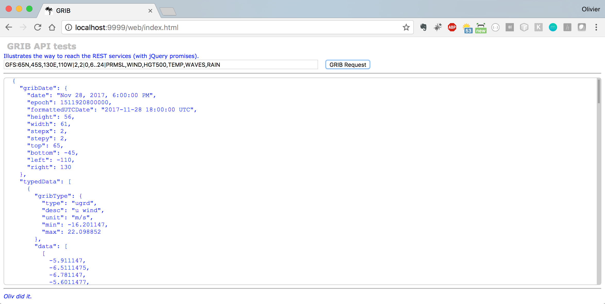

## GRIB Reader
_And_ routing.

The GRIB part is assumed by `JGRIB` (sibling of this module, copied from [JGRIB](https://jgrib.sourceforge.net/))

The server generates a json document, as in `poc.GRIBBulk`, representing the GRIB file's data.
The rendering is (to be) done on the client (HTML5/CSS/ES6) over a map. See in `RESTNavServer/web`.

And later, add the faxes.

Run `./runGRIBserver.sh`

Then reach <http://localhost:1234/web/index.html> :

  <!-- TODO replace this screenshot -->

### Routing
Among others, CLI routing:
```
$ ./run.routing.sh --from-lat 37.122 --from-lng -122.5 --to-lat -9.75 --to-lng -139.10 --start-time "2017-10-16T07:00:00" --grib-file "./GRIB_2017_10_16_07_31_47_PDT.grb" --polar-file "./samples/CheoyLee42.polar-coeff" --output-type "GPX" --speed-coeff 0.75 --verbose false
```

### TODO
- GRIB Request generator ?
- Routing
- Other grib providers than `saildocs`. 
  - See <https://opengribs.org/en/gribs> 
  - See <https://www.zygrib.org/>
  - See <http://ma-meteo-marine.com/fr/>
