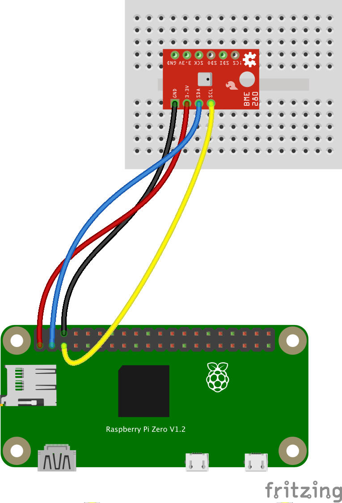

# A Python BME280 server
## A use-case

This shows the implementation of a pure Python server to get to the data emitted by a BME280.

It provides
- A server (python part) that 
  - serves REST and HTTP requests
  - reads the BME280 on a regular basis
  - stores BME280 data up to one week
- Web resources, served by the server above, to display the data in a user-friendly way.

---

## From Scratch
### You will need
- A Raspberry Pi (a Zero W here)
- A breadboard
- A BME280
- Jumper wires
- A power supply for the Raspberry Pi
- A laptop
- A network (your home WiFi would do)


### Create a fresh SD Card
TODO Use the Raspi Imager to configure the Raspberry Pi sd card.  
Enable SSH, I2C

### Create a dedicated folder on the Raspberry Pi
From the laptop terminal, assuming that the address of the Raspberry Pi is `192.168.1.38` (replace with the actual one)
```
$ ssh pi@192.168.1.38
```
You're now connected on the Raspberry Pi
```
$ mkdir BME280
```
### Upload the required resources
From the laptop where the repo was cloned:
```
$ cd pure.python.bme280
$ scp -r . pi@192.168.1.38:~/BME280
```
### Wiring of the BME280
Depending on where you got the BME280 from, its shape may vary (Sparkfun here, also available Adafruit, AliBaba, etc).
But the contact names (`GND`, `3V3`, `SDA`, `SCL`) remain the same.  


### Check the I2C availability
On the Raspberry Pi:
```
$ sudo i2cdetect -y 1
     0  1  2  3  4  5  6  7  8  9  a  b  c  d  e  f
00:          -- -- -- -- -- -- -- -- -- -- -- -- -- 
10: -- -- -- -- -- -- -- -- -- -- -- -- -- -- -- -- 
20: -- -- -- -- -- -- -- -- -- -- -- -- -- -- -- -- 
30: -- -- -- -- -- -- -- -- -- -- -- -- -- -- -- -- 
40: -- -- -- -- -- -- -- -- -- -- -- -- -- -- -- -- 
50: -- -- -- -- -- -- -- -- -- -- -- -- -- -- -- -- 
60: -- -- -- -- -- -- -- -- -- -- -- -- -- -- -- -- 
70: -- -- -- -- -- -- 76 --                         
```
> Note: Here the address is `0x76`, as on the AliBaba BME280 I got. An Adafruit or Sparkfun would say `0x77`.

### To do once: install required python modules
On the Raspberry Pi:
```
$ sudo pip3 install adafruit-circuitpython-bme280
```


