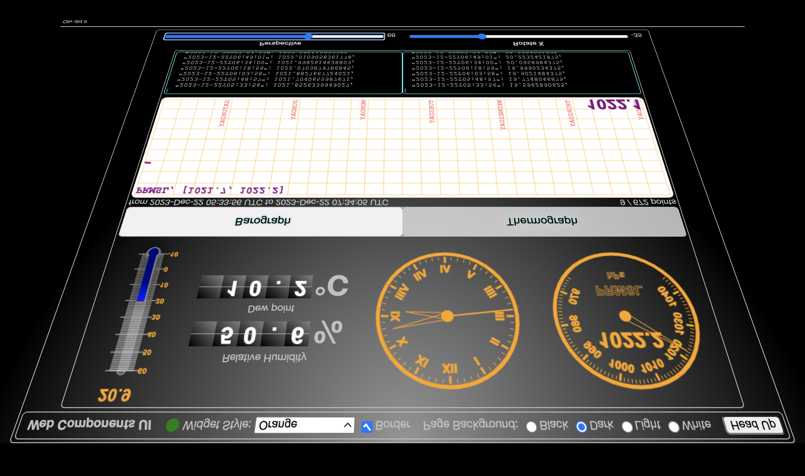

# A pure Python BME280 server
## A use-case
A barograph (like [this](https://www.naudet.com/barometre-enregistreur-c102x2375473)) is a very useful instrument if you're interested in weather forecast.  
But it can be pretty expensive...  
Here we want to show how to implement one with a Raspberry Pi Zero W, and an inexpensive sensor like a BME280.

---

This module shows the implementation of a pure Python server to get to the data emitted by a BME280.

It provides
- A server (python part) that 
  - serves REST and HTTP requests
  - reads the BME280 on a regular basis
  - stores BME280 data up to one week
- Web resources, served by the server above, to display the data in a user-friendly way.

---

## From Scratch
### You will need
- A Raspberry Pi (a Zero W would fit, here)
- A micro SD card for the Raspberry Pi
- A breadboard
- A BME280 sensor
- Jumper wires
- A power supply for the Raspberry Pi
- A laptop
- A network with Internet access (your home WiFi would do)

> _**A Note**_: you will have to type some commands in a terminal, as shown below.  
> Some are quite cryptic, as you'll see...  
> Be aware that whatever starts with a `$` tells you that this is something _**you**_ have to type.  
> If you see `$ mkdir BME280`, it tells you to type _only_ `mkdir BME280`.  
> If a line does not begin with a `$`, it means it is the output of the command you've typed; 
> this is what you should see if all goes well (like for the `i2cdetect` command you'll see below, for example).

### Create a fresh SD Card
From the laptop, use the [Raspberry Pi Imager](https://www.raspberrypi.com/news/raspberry-pi-imager-imaging-utility/) to configure the Raspberry Pi sd card.  
Do not forget to
- Enable SSH, I2C
- Setup the network you're on, to be able to reach the Raspberry Pi when the SD card is ready.

### Create a dedicated folder on the Raspberry Pi
From the laptop terminal, assuming that the address of the Raspberry Pi is `192.168.1.38` (replace with the actual one)
```
$ ssh pi@192.168.1.38
```
You're now connected on the Raspberry Pi
```
$ mkdir BME280
```
### Upload the required resources
On the laptop (or on the Raspberry Pi, actually), clone just the part of the repo you're interested in:
```
$ mkdir BME280
$ git clone --depth 1 https://github.com/OlivierLD/ROB.git
$ cd ROB
$ git filter-branch --prune-empty --subdirectory-filter raspberry-sailor/RaspberryPythonServers/python/pure.python.bme280 HEAD
```
The `ROB` folder should now contain at least all we need to move ahead.

From the laptop where the repo was cloned, from the `pure.python.bme280` (if you've cloned the full repos) of from the
`ROB` folder (if you've done the above, to clone only what we need here):
```
$ scp -r . pi@192.168.1.38:~/BME280
```
### Wiring of the BME280
Depending on where you got the BME280 from, its shape may vary (Sparkfun here, also available Adafruit, AliBaba, etc).
But the contact names (`GND`, `3V3`, `SDA`, `SCL`) remain the same.  


### Check the I2C availability
On the Raspberry Pi:
```
$ sudo i2cdetect -y 1
     0  1  2  3  4  5  6  7  8  9  a  b  c  d  e  f
00:          -- -- -- -- -- -- -- -- -- -- -- -- -- 
10: -- -- -- -- -- -- -- -- -- -- -- -- -- -- -- -- 
20: -- -- -- -- -- -- -- -- -- -- -- -- -- -- -- -- 
30: -- -- -- -- -- -- -- -- -- -- -- -- -- -- -- -- 
40: -- -- -- -- -- -- -- -- -- -- -- -- -- -- -- -- 
50: -- -- -- -- -- -- -- -- -- -- -- -- -- -- -- -- 
60: -- -- -- -- -- -- -- -- -- -- -- -- -- -- -- -- 
70: -- -- -- -- -- -- 76 --                         
```
> Note: Here the address is `0x76`, as on the AliBaba BME280 I got. An Adafruit or Sparkfun would say `0x77`.

### To do once: install required python modules
On the Raspberry Pi:
```
$ sudo pip3 install adafruit-circuitpython-bme280
```

### Run the server app
```
$ python3 REST_and_WEB_BME280_server.py --machine-name:$(hostname -I | awk '{ print $1 }') --port:8080 --verbose:false [--address:0x76]
```

### Finally
From anywhere on the same network, you can reach, in a browser, <http://192.168.1.38:8080/web/index.html>  

Even on such a small board as the Raspberry Pi Zero (W), you can have such a rich Web UI.  
Remember that the rendering of a Web UI is done _on the client side_. The Raspberry Pi only serves the
resources required on the client.

## Bonuses
### Head-up display
As you would notice in the picture above, we have two sliders at the bottom of the page.  
This is for a Head-Up display (enabled when you hit the `Head Up` button at the top right).  
When activated, this allows you to see the screen, reflected on a windshield for example.  

To have an idea:

|              This               |       Would display that       |
|:-------------------------------:|:------------------------------:|
|  |  |

### The Raspberry Pi emits its own network
Let's say you're at sea, far away from any 4G antenna... There is no Internet, _but_ you may be
able to create your own boat's network.  
> Details coming...

### 3D printed enclosure(s) for your work
- See [here](https://github.com/OlivierLD/3DPrinting/blob/master/OpenSCAD/RPiDevBoards/NavStations/README.md)

---
