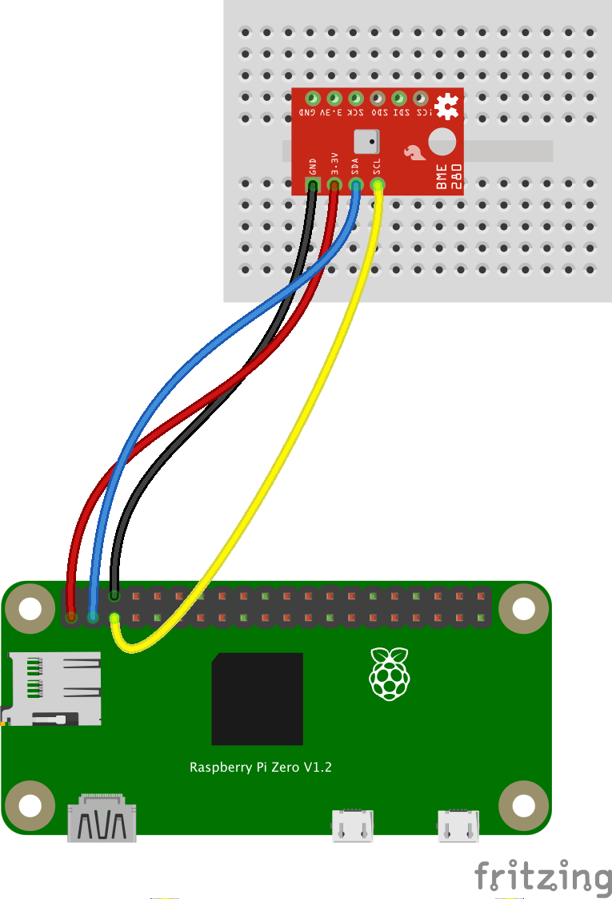

# Un serveur BME280, en Python
(en [anglais](./README.md))  

Un barographe (comme [ceux-l&agrave;](https://www.naudet.com/barometre-enregistreur-c102x2375473)) est un instrument tr&egrave;s utile pour les pr&eacute;visions m&eacute;t&eacute;o.  
Mais &ccedil;a peut &ecirc;tre cher...  
On esp&egrave;re ici montrer comment en faire un, avec un Raspberry Pi Zero W, et un capteur bon march&eacute; comme le BME280.

---

Ce module est une impl&eacute;mentation d'un serveur en Python pour acc&eacute;der aux donn&eacute;es &eacute;mises par un BME280.

Ce qui fournit les fonctionnalit&eacute;s suivantes :
- Un serveur (en Python) qui 
  - g&egrave;re des requ&ecirc;tes REST et HTTP
  - lit reguli&egrave;rement le BME280
  - stocke jusqu'&agrave; une semaine de donn&eacute;es du BME280 (une donn&eacute;e tous les quarts d'heure)
- Une interface web, g&eacute;r&eacute;e par le serveur ci-dessus, pour afficher les donn&eacute;es d'une mani&egrave;re graphique et agr&eacute;able.

---

## En partant de z&eacute;ro
### Il vous faudra
- Un Raspberry Pi (le mod&egrave;le Zero W convient ici)
- Une carte SD micro, pour le Raspberry Pi
- Une breadboard
- Un capteur BME280
- Des cables, jumpers
- Une alim pour le Raspberry Pi
- Un laptop
- Un r&eacute;seau avec un acc&egrave;s Internet (celui que vous avez &agrave; la maison fait l'affaire)

> _**Attention**_: vous allez avoir &agrave; taper des commandes dans un terminal, comme indiqu&eacute; ci-dessous.  
> Il y en a qui sont un peu cryptiques, comme vous le verrez...  
> Notez bien que quand une ligne commence par `$`, c'est pour signifier que c'est une commande que _**vous**_ devez taper.  
> Ainsi, si vous voyez `$ mkdir BME280`, &ccedil;a veut dire que vous ne devez taper _que_ `mkdir BME280`.  
> Si une ligne ne commence pas par `$`, &ccedil;a signifie qu'il s'agit du r&eacute;sultat de la commande que vous avez tap&eacute;e ; 
> et que vous devriez voir aussi (comme pour la commande `i2cdetect` que vous verrez ci-dessous, par exemple).

### Cr&eacute;ez une nouvelle carte SD
&Agrave; partir du laptop, utilisez le [Raspberry Pi Imager](https://www.raspberrypi.com/news/raspberry-pi-imager-imaging-utility/) pour configurer la carte SD destin&eacute;e au Raspberry Pi.  
N'oubliez pas
- D'activer SSH, I2C
- De d&eacute;finir les param&egrave;tres du r&eacute;seau, afin d'&ecirc;tre capable d'acc&eacute;der au Raspberry Pi avec SSH, lorsque la carte SD sera pr&ecirc;te.

### Cr&eacute;ez un r&eacute;pertoire sp&eacute;cifique sur le Raspberry Pi
Dans un terminal sur le laptop, en supposant que l'adresse IP du Raspberry Pi est `192.168.1.38` (&agrave; remplacer par la v&ocirc;tre)
```
$ ssh pi@192.168.1.38
```
Vous voil&agrave; connect&egrave; au Raspberry Pi
```
$ mkdir BME280
```
### T&eacute;l&eacute;chargez les resources requises
Sur le laptop (ou sur le Raspberry Pi, en fait), ne clonez que la partie du repo qui nous int&eacute;resse :
```
$ mkdir BME280
$ git clone --depth 1 https://github.com/OlivierLD/ROB.git
$ cd ROB
$ git filter-branch --prune-empty --subdirectory-filter raspberry-sailor/RaspberryPythonServers/python/pure.python.bme280 HEAD
```
Le r&eacute;pertoire `ROB` doit maintenant contenir tout ce qu'il nous faut pour continuer.

Du laptop o&ugrave; le repo a &eacute;t&eacute; clon&eacute;, du r&eacute;pertoire `pure.python.bme280` (si vous avez clon&eacute; tout le repo) ou
du r&eacute;pertoire `ROB` (si vous avez ex&eacute;cut&eacute; la commande ci-dessus, pour ne cloner que ce qu'il faut):
```
$ scp -r . pi@192.168.1.38:~/BME280
```
### Cablage du BME280
En fonction du fournisseur de votre BME280, son aspect peut varier (Sparkfun ici, aussi disponible chez Adafruit, AliBaba, etc).
Mais le nom des contacts (`GND`, `3V3`, `SDA`, `SCL`) reste le m&ecirc;me.  


### V&eacute;rifiez l'adresse I2C
Sur le Raspberry Pi:
```
$ sudo i2cdetect -y 1
     0  1  2  3  4  5  6  7  8  9  a  b  c  d  e  f
00:          -- -- -- -- -- -- -- -- -- -- -- -- -- 
10: -- -- -- -- -- -- -- -- -- -- -- -- -- -- -- -- 
20: -- -- -- -- -- -- -- -- -- -- -- -- -- -- -- -- 
30: -- -- -- -- -- -- -- -- -- -- -- -- -- -- -- -- 
40: -- -- -- -- -- -- -- -- -- -- -- -- -- -- -- -- 
50: -- -- -- -- -- -- -- -- -- -- -- -- -- -- -- -- 
60: -- -- -- -- -- -- -- -- -- -- -- -- -- -- -- -- 
70: -- -- -- -- -- -- 76 --                         
```
> Notez qu'ici l'adresse est `0x76`, comme sur un BME280 de chez AliBaba. Un capteur de chez Adafruit ou Sparkfun dirait `0x77`.

### &Agrave; faire la premi&egrave;re fois : installer les modules Python n&eacute;cessaires
Sur le Raspberry Pi :
```
$ sudo pip3 install adafruit-circuitpython-bme280
```

### D&eacute;marrer le serveur
```
$ python3 REST_and_WEB_BME280_server.py --machine-name:$(hostname -I | awk '{ print $1 }') --port:8080 --verbose:false [--address:0x76]
```
Ou si on veut qu'il tourne tout seul&nbsp;:
```
$ nohup python3 REST_and_WEB_BME280_server.py --machine-name:$(hostname -I | awk '{ print $1 }') --port:8080 --verbose:false [--address:0x76] > bmp.log 2>&1 &
```

### Et enfin
De n'importe o&ugrave; sur le m&ecirc;me r&eacute;seau, dans un navigateur, allez sur <http://192.168.1.38:8080/web/index.html>  

M&ecirc;me avec un comoposant aussi petit que le Raspberry Pi Zero (W), on peut obtenir ce genre d'interface.  
Souvenez-vous que l'affichage d'une interface web est faite _sur et par le client_. Le Raspberry Pi se contente de fournir
au client les resources dont il a besoin pour cet affichage.

### Note
La page web utilise des requ&ecirc;te REST pour obtenir les donn&eacute;es du serveur.    
On peut obtenir la liste des operations disponibles en tapant :
```
$ curl -X GET http://192.168.1.36:8080/json-data/oplist
```
On peut positionner la valeur de `verbose` &agrave; `true` ou `false` :
```
$ curl -X POST http://192.168.1.36:8080/json-data/verbose?value=false|true 
```

## Bonus
### Head-up display
Comme on le voit sur l'image ci-dessus, on a deux sliders en bas de la page.    
Ils sont l&agrave; pour Head-Up display (qu'on active en cliquant le bouton `Head Up` en haut a droite).  
Ainsi, on peut regarder l'&eacute;cran reflet&eacute; dans un pare-brise, par exemple.  

Pour avoir une id&eacute;e :

|              Ceci               |          Affiche cela          |
|:-------------------------------:|:------------------------------:|
|  |  |

### Le Raspberry Pi emet son propre r&eacute;seau
Imaginons que vous soyez en mer, loin de toute antenne 4G... Il n'y a pas d'Internet, _mais_ vous avez
la possibilit&eacute; de cr&eacute;er votre propre r&eacute;seau &agrave; partir du Raspberry Pi.  
> Details coming...

### Des bo&icirc;tes imprim&eacute;es en 3D pour prot&eacute;ger votre travail
- Voyez [ici](https://github.com/OlivierLD/3DPrinting/blob/master/OpenSCAD/RPiDevBoards/NavStations/README.md)

---
