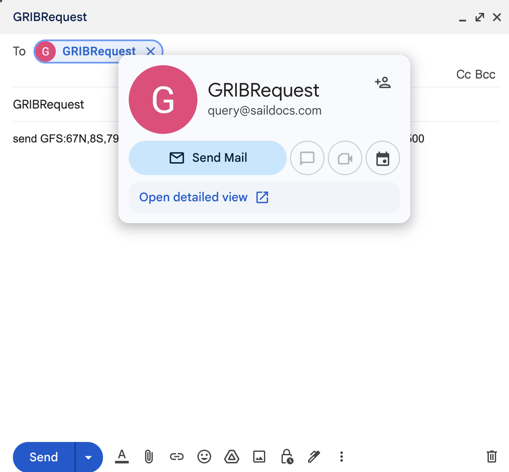
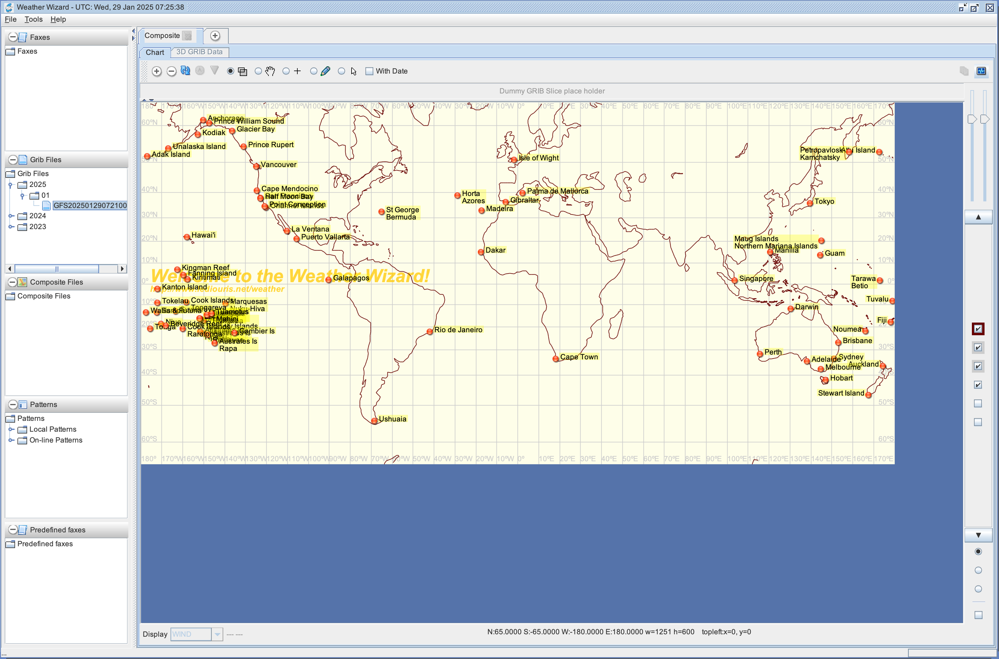
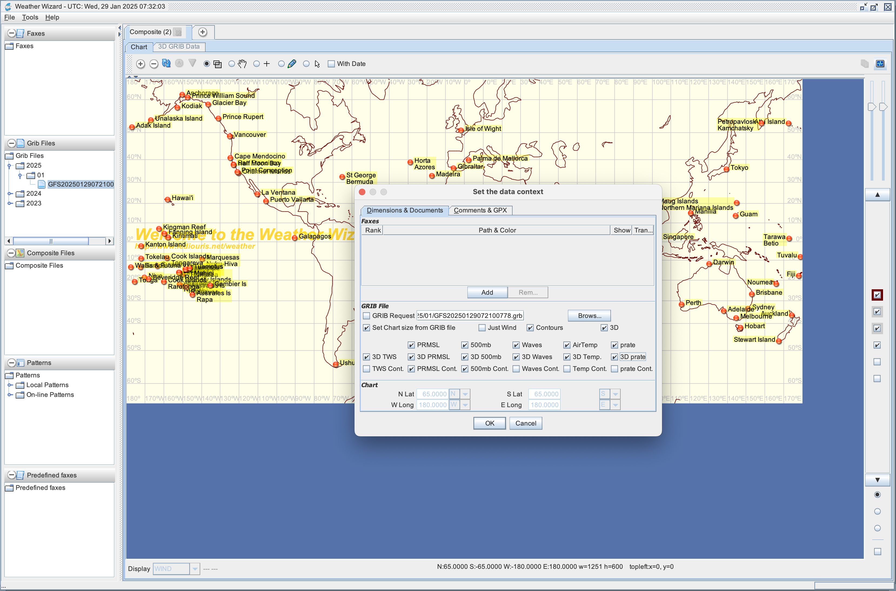
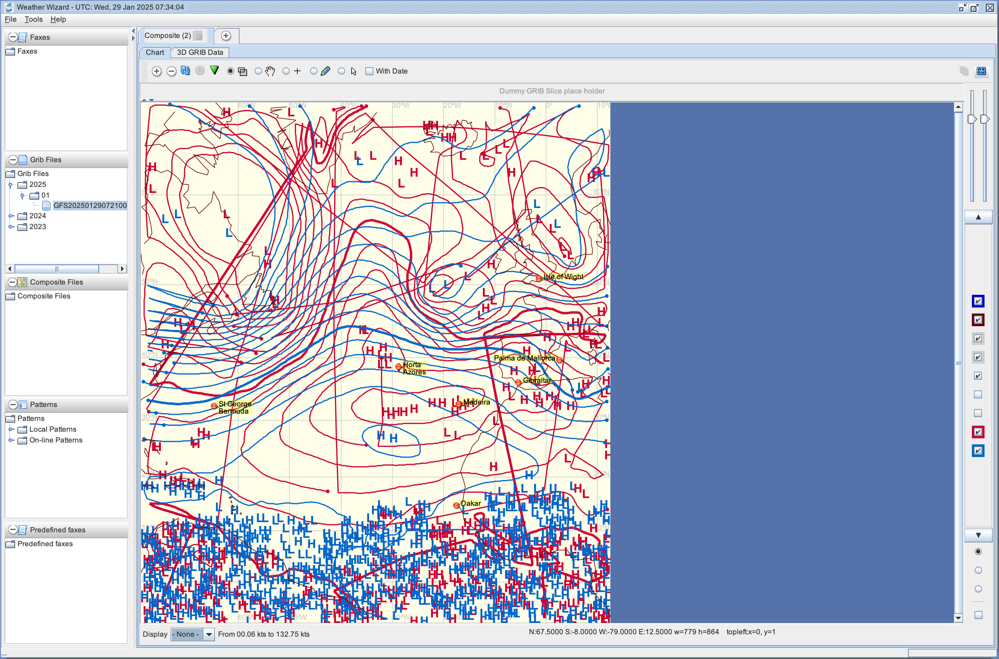
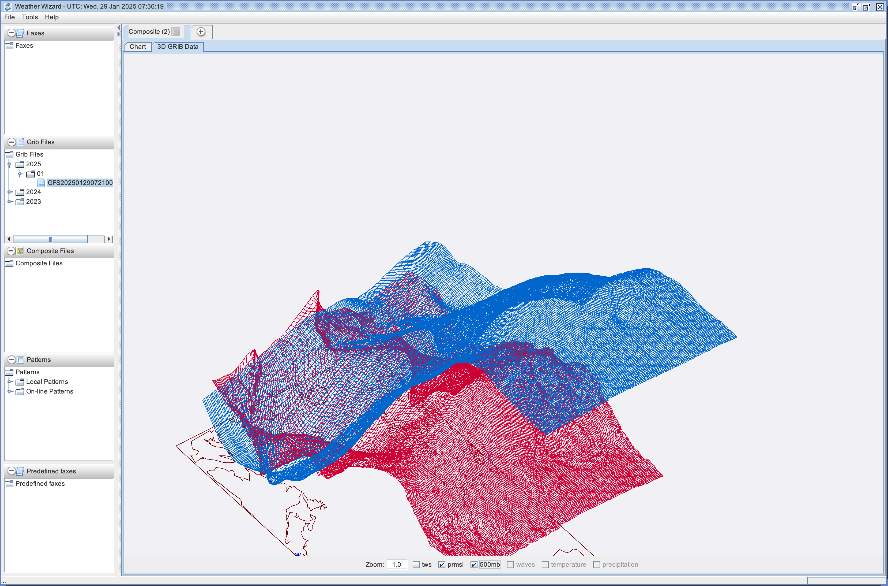

# Weather Wizard

Runs with the Metal Look and Feel, by default.  
To keep the system Look and Feel, use `-Dkeep.system.lnf=true` at runtime.
## WiP. 🏗️ Being ported and upgraded.

**TODO**: Use the `routing` module.

This project depends on several other projects. 

Latest version is currently 5.0.0.0.

Written in Java. As such, runs everywhere Java runs (Windows, Linux, Mac OS, etc)

It has been written because I was unable to find anything equivalent anywhere.
Paperback User Manual available at [Lulu.com](http://www.lulu.com/shop/olivier-le-diouris/weather-wizard-user-manual/paperback/product-20064234.html).

Please report unwanted behaviors, or address enhancement requests, to [me](mailto:olivier.lediouris@gmail.com?cc=olivier@lediouris.net&subject=Weather+Wizard).

## What it does, what it does not
This is *not* a GRIB viewer, *nor* a fax viewer. Such utilities already exist elsewhere.

The idea at the origin of this project is that one:

On a chart, with a given projection (*Mercator, Lambert, globe, satellite views, square, polar stereographic, and more*) you can *_superimpose_* several weather faxes (like surface analysis, 500mb analysis, wave height, sat pictures, etc) and GRIB Data (wind speed & direction, 500mb, PRMSL, etc).
The tool allows you to do this, store, and restore.

What it does with each fax to display:
- It makes it transparent (so other faxes in the same area can be seen as well). _This is optional, for example it is not necessary for satellite pictures, which will be displayed as they are, at the very bottom layer._
- It changes the color. _Optional as well, same as above._
- It rotates it if necessary
- It resizes it. _You can even change the width/height ratio._
- It puts it on the chart, at a specific location, based on projections, scales and offsets
Boat position, heading and track can also be added on the chart.

Each component can be hidden or shown on demand, simply by unchecking or checking a box.

Even fuzzy faxes (like the ones you sometimes receive at sea) can make sense.

Also implements some routing capabilities. A tool to elaborate your polars comes along with the project.

In short, the goal of the soft is to be able to view on the _same_ document:
- A chart
- Zero or one GRIB files
- Zero or more fax(es)
- If wanted, the boat position, and its track (from a GPS, or manually entered)

And to simplify your life - specially when sailing - all this is as automated as possible. You can recall an already used configuration in about one click (like display the same faxes and GRIBs as yesterday, but with today's data).

More details and screenshots are available on the [Weather Wizard site](http://weather.lediouris.net).

Contact [me](mailto:olivier.lediouris@gmail.com?cc=olivier@lediouris.net&subject=Weather+Wizard) for any further question(s).

## Quick walk thru

- Send the email to `query@saildocs.com` as mentioned in the [Weather Wizard site](http://weather.lediouris.net), like `GFS:67N,8S,79W,12E|0.5,0.5|0,3,6..72|WIND,PRESS,WIND500,HGT500`, _**in plain text**_.  

  <!--  -->
  
- When the GRIB is received, store it on your file system in a directory we'll use later. Here is it named `GFS20250129072100778.grb`.
- Run the script named `run-ww.sh`
  
- See in the GRIB folder (where you put the GRIB)
  
- and open it.
  
- Required contours can be seen.  
 _Note_: Contours (looking like faxes) are calculated from the GRIB data.
  
- As well as required 3D pictures
  

Many other options are available. Refer to the [manual](https://www.lediouris.net/donpedro/software/structure/datafiles/manual/WeatherWizardUserManual.2nd.edition.pdf) for details.

### Hints and tips
- Make a [desktop shortcut](https://askubuntu.com/questions/299052/how-to-execute-sh-script-from-a-desktop-shortcut) on Linux. And [that one](https://www.baeldung.com/linux/desktop-entry-files) too.  
- On Raspberry Pi, see [this](https://forums.raspberrypi.com/viewtopic.php?t=337131).

--- 
